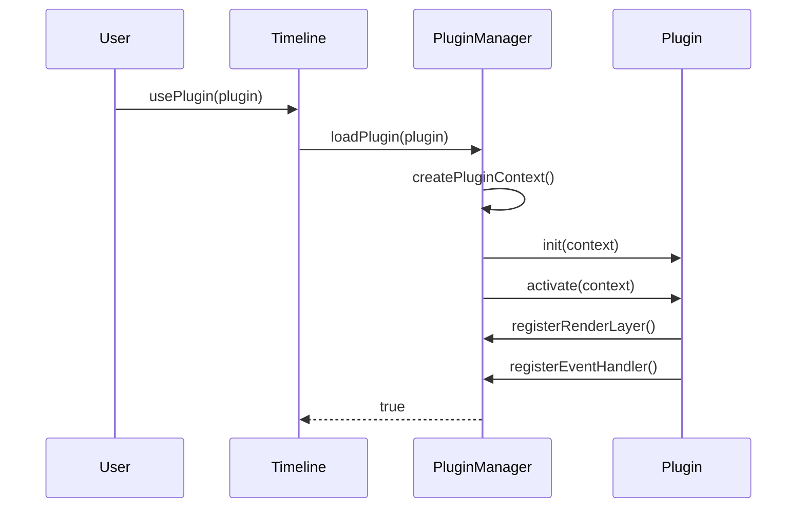

# 时间轴画布完整架构

## 系统概览

时间轴画布是一个基于 Canvas 和 TypeScript 构建的强大时间轴组件，采用**模块化架构**设计，核心特点是**插件化系统**和**状态模式交互**。

## 完整架构图

```mermaid
graph TB
    %% 应用层
    subgraph "应用层"
        APP[应用程序]
        USER[用户交互]
    end

    %% 核心层
    subgraph "Timeline 核心"
        TL[Timeline<br/>主控制器]

        subgraph "管理器层"
            PM[PluginManager<br/>插件管理]
            RM[RenderManager<br/>渲染管理]
            SM[StateManager<br/>状态管理]
            EM[EventIndexManager<br/>事件索引]
            VM[ViewportManager<br/>视口管理]
            LM[Logger<br/>日志管理]
            EH[ErrorHandler<br/>错误处理]
        end

        subgraph "处理器层"
            MH[MouseHandler<br/>鼠标处理]
            WH[WheelHandler<br/>滚轮处理]
        end

        subgraph "状态模式"
            IS[InteractionState<br/>交互状态]
            IDLE[IdleState<br/>空闲状态]
            DRAG[DraggingState<br/>拖拽状态]
            RESIZE[ResizingState<br/>调整大小]
            SCROLL[ScrollingState<br/>滚动状态]
            INDICATOR[TimeIndicatorDragState<br/>指示器拖拽]
        end
    end

    %% 渲染系统
    subgraph "渲染系统"
        RP[RenderPipeline<br/>渲染管道]

        subgraph "渲染层"
            TIMELINE_R[TimelineRenderer<br/>时间轴]
            TRACKS_R[TracksRenderer<br/>轨道]
            GUIDELINES_R[GuideLinesRenderer<br/>参考线]
            INDICATOR_R[IndicatorRenderer<br/>指示器]
            INTERACTION_R[InteractionRenderer<br/>交互]
            SCROLLBAR_R[ScrollbarRenderer<br/>滚动条]
        end

        subgraph "渲染上下文"
            RC[RenderContext<br/>渲染上下文]
            RT[Renderer Types<br/>渲染器类型]
        end
    end

    %% 插件系统
    subgraph "插件系统"
        PLUGIN_API[PluginAPI<br/>插件接口]
        PLUGIN_CTX[PluginContext<br/>插件上下文]

        subgraph "插件类型"
            THEME_P[主题插件]
            RENDER_P[渲染插件]
            EVENT_P[事件插件]
            TOOL_P[工具插件]
            EXTENSION_P[扩展插件]
        end

        subgraph "内置插件"
            DARK[DarkThemePlugin]
            LIGHT[LightThemePlugin]
            CONTEXT_MENU[ContextMenuPlugin]
            PERFORMANCE[PerformanceOverlayPlugin]
            EVENT_MEDIA[EventMediaPlugin]
            EVENT_TOOLTIP[EventTooltipPlugin]
            MUTEX_GUARD[MutexGuardPlugin]
        end
    end

    %% 数据层
    subgraph "数据层"
        CONFIG[TimelineConfig<br/>配置]
        STATE[TimelineState<br/>状态]
        TYPES[类型定义]
        UTILS[工具函数]
    end

    %% 连接关系
    APP --> TL
    USER --> MH
    USER --> WH

    TL --> PM
    TL --> RM
    TL --> SM
    TL --> EM
    TL --> MH
    TL --> WH

    MH --> IS
    IS --> IDLE
    IS --> DRAG
    IS --> RESIZE
    IS --> SCROLL
    IS --> INDICATOR

    RM --> RP
    RP --> TIMELINE_R
    RP --> TRACKS_R
    RP --> GUIDELINES_R
    RP --> INDICATOR_R
    RP --> INTERACTION_R
    RP --> SCROLLBAR_R

    PM --> PLUGIN_API
    PLUGIN_API --> PLUGIN_CTX
    PLUGIN_CTX --> THEME_P
    PLUGIN_CTX --> RENDER_P
    PLUGIN_CTX --> EVENT_P
    PLUGIN_CTX --> TOOL_P
    PLUGIN_CTX --> EXTENSION_P

    THEME_P --> DARK
    THEME_P --> LIGHT
    RENDER_P --> CONTEXT_MENU
    RENDER_P --> PERFORMANCE
    EVENT_P --> EVENT_MEDIA
    EVENT_P --> EVENT_TOOLTIP
    TOOL_P --> MUTEX_GUARD

    CONFIG --> TL
    STATE --> TL
    TYPES --> TL
    UTILS --> TL

    %% 样式定义
    classDef app fill:#f5f5f5,stroke:#666,stroke-width:1px
    classDef core fill:#e3f2fd,stroke:#1976d2,stroke-width:2px
    classDef manager fill:#e8f5e8,stroke:#388e3c,stroke-width:2px
    classDef handler fill:#fff3e0,stroke:#f57c00,stroke-width:2px
    classDef state fill:#f3e5f5,stroke:#7b1fa2,stroke-width:2px
    classDef render fill:#e1f5fe,stroke:#0288d1,stroke-width:2px
    classDef plugin fill:#fce4ec,stroke:#c2185b,stroke-width:2px
    classDef data fill:#fafafa,stroke:#9e9e9e,stroke-width:1px
    classDef builtin fill:#fff8e1,stroke:#ffa000,stroke-width:2px

    class APP,USER app
    class TL core
    class PM,RM,SM,EM,VM,LM,EH manager
    class MH,WH handler
    class IS,IDLE,DRAG,RESIZE,SCROLL,INDICATOR state
    class RP,TIMELINE_R,TRACKS_R,GUIDELINES_R,INDICATOR_R,INTERACTION_R,SCROLLBAR_R,RC,RT render
    class PLUGIN_API,PLUGIN_CTX,THEME_P,RENDER_P,EVENT_P,TOOL_P,EXTENSION_P plugin
    class CONFIG,STATE,TYPES,UTILS data
    class DARK,LIGHT,CONTEXT_MENU,PERFORMANCE,EVENT_MEDIA,EVENT_TOOLTIP,MUTEX_GUARD builtin
```



## 核心架构详解

### 1. Timeline 主控制器

**职责**: 整个系统的协调中心，管理所有子组件

```typescript
class Timeline {
  // 核心依赖
  private pluginManager: PluginManager;
  private renderManager: RenderManager;
  private stateManager: StateManager;
  private mouseHandler: MouseHandler;
  private wheelHandler: WheelHandler;

  // 公共API
  public usePlugin(plugin: any): Promise<boolean>;
  public addEvent(
    trackIndex: number,
    startTime: number,
    endTime: number,
    title: string
  ): void;
  public setTimeIndicator(seconds: number): boolean;
  public draw(): void;
}
```

### 2. 管理器层架构

#### PluginManager - 插件管理器

```typescript
class PluginManager {
  private plugins: Map<string, PluginEntry> = new Map();
  private eventHandlers: Map<string, Function[]> = new Map();
  private renderLayers: Map<string, RenderLayer> = new Map();

  async loadPlugin(plugin: TimelinePlugin): Promise<boolean>;
  async unloadPlugin(pluginId: string): Promise<boolean>;
  emitEvent(event: string, ...args: any[]): void;
  validateEvent(event: string, ...args: any[]): boolean;
}
```

#### RenderManager - 渲染管理器

```typescript
class RenderManager {
  private renderPipeline: RenderPipeline;
  private dirtyLayers: Set<LayerType> = new Set();

  public draw(): void;
  public markDirty(layers: LayerType[]): void;
  public setCanvasSize(width: number, height: number): void;
}
```

#### StateManager - 状态管理器

```typescript
class StateManager {
  public state: TimelineState;

  // 管理复杂的应用状态
  setStatus(text: string, onStatusChange?: (text: string) => void): void;
}
```

### 3. 交互系统 - 状态模式

#### MouseHandler - 状态模式实现

```typescript
class MouseHandler {
  private currentState: InteractionState;

  public handleMouseDown(e: MouseEvent): void;
  public handleMouseMove(e: MouseEvent): void;
  public handleMouseUp(e?: MouseEvent): void;

  private transitionTo(newState: InteractionState | null): void;
}
```

#### 交互状态类型

- **IdleState**: 空闲状态，等待用户交互
- **DraggingState**: 事件拖拽状态
- **ResizingState**: 事件调整大小状态
- **ScrollingState**: 滚动条拖拽状态
- **TimeIndicatorDragState**: 时间指示器拖拽状态

### 4. 渲染系统架构

#### RenderPipeline - 渲染管道

```typescript
class RenderPipeline {
  private renderers: Map<LayerType, Renderer> = new Map();
  private renderOrder: LayerType[] = [
    "background",
    "timeline",
    "tracks",
    "guideLines",
    "indicator",
    "interaction",
    "scrollbar",
    "overlay",
  ];

  public render(context: RenderContext, options?: RenderOptions): RenderStats;
}
```

#### 渲染层类型

```typescript
type LayerType =
  | "background" // 背景层
  | "timeline" // 时间轴层
  | "tracks" // 轨道层
  | "guideLines" // 参考线层
  | "indicator" // 指示器层
  | "interaction" // 交互层
  | "scrollbar" // 滚动条层
  | "overlay"; // 覆盖层
```

### 5. 插件系统集成

#### 插件生命周期



#### 插件扩展点

1. **渲染扩展**: 通过 `registerRenderLayer` 添加自定义渲染层
2. **事件扩展**: 通过 `registerEventHandler` 拦截和处理事件
3. **主题扩展**: 通过修改 `config.colors` 改变外观
4. **工具扩展**: 添加新的交互工具和功能

## 数据流架构

### 1. 用户交互数据流

```
用户操作 → DOM事件 → MouseHandler → 当前状态处理 → 状态转换 → Timeline状态更新 → 标记脏图层 → 重新渲染
```

### 2. 插件集成数据流

```
插件加载 → PluginManager初始化 → 创建PluginContext → 插件激活 → 注册扩展点 → 集成到相应系统
```

### 3. 渲染数据流

```
RenderManager.draw() → 插件背景层 → RenderPipeline → 核心渲染层 → 插件覆盖层 → Canvas更新
```

## 设计模式应用

### 1. 状态模式 (State Pattern)

- **应用**: 鼠标交互处理
- **优势**: 消除复杂的条件判断，每个状态逻辑独立封装

### 2. 策略模式 (Strategy Pattern)

- **应用**: 渲染器系统
- **优势**: 可插拔的渲染策略，易于扩展新渲染层

### 3. 观察者模式 (Observer Pattern)

- **应用**: 插件事件系统
- **优势**: 松耦合的事件通知机制

### 4. 工厂模式 (Factory Pattern)

- **应用**: PluginContext 创建
- **优势**: 统一的插件上下文创建流程

## 性能优化策略

### 1. 渲染优化

- **脏标记系统**: 只重新渲染变化的图层
- **RAF 节流**: 鼠标移动事件使用 requestAnimationFrame 节流
- **缓存机制**: 视口计算、事件索引等计算结果缓存

### 2. 内存优化

- **插件资源管理**: 自动清理插件注册的资源
- **事件索引**: 优化事件查找性能
- **对象复用**: 避免不必要的对象创建

### 3. 扩展性优化

- **插件懒加载**: 按需加载插件功能
- **模块化设计**: 各组件独立，支持树摇优化
- **接口抽象**: 清晰的扩展接口定义

## 架构特点总结

### 1. 高度模块化

- 每个组件职责单一，易于测试和维护
- 清晰的依赖关系，降低耦合度

### 2. 可扩展性强

- 插件系统支持多种扩展方式
- 状态模式支持新的交互状态
- 渲染管道支持新的渲染层

### 3. 性能优秀

- 精细的渲染优化
- 高效的交互处理
- 智能的资源管理

### 4. 开发者友好

- 清晰的架构设计
- 完善的类型定义
- 丰富的内置功能示例

这个架构设计体现了现代前端工程的最佳实践，为时间轴画布提供了强大的功能和良好的可维护性。
