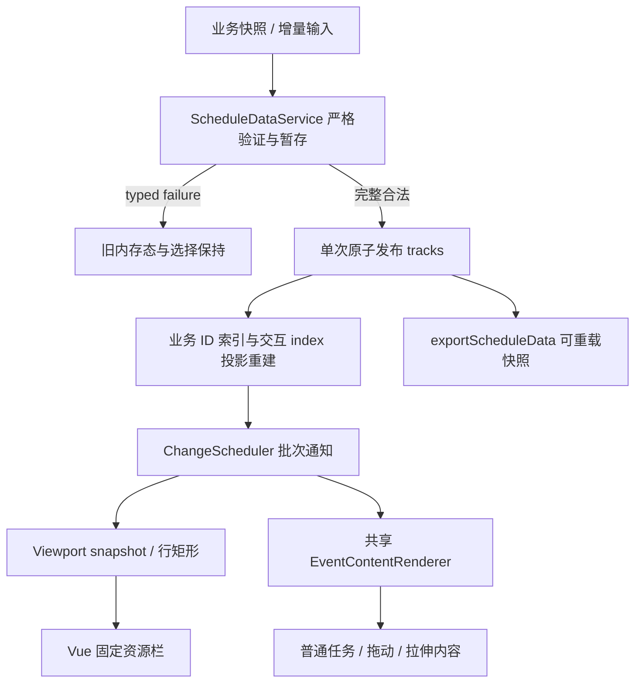

# 里程碑一：资源排程查看接入实施计划

> 状态：实施计划，不表示当前 checkout 已完成任何工作包。
> 基线日期：2026-09-11；计划成文日期：2026-09-12。
> 基线 revision：`1b67eb7e9d5e8b0b63e49439ed27f3ee5d34f697`。
> 缺陷等级：能力缺口以 CONFIRMED 记录；视觉/竞态影响为 UNVERIFIED_RISK，未赋现网缺陷等级。
> 计划路径：`devnote/plans/resource-scheduling-m1-development-plan.md`。
> 执行账本：`devnote/plans/resource-scheduling-m1-execution-ledger.md`，首轮执行创建。
> 上游合同：[仓库规则](../../AGENTS.md)、[当前数据 API](../../docs/zh/api/timeline/data-management.md)、[当前配置](../../docs/zh/guide/configuration.md)、[插件渲染契约](../../docs/zh/plugins/plugin-development/rendering.md)。
> 接入反馈：仓库外 `/Volumes/project_home/RO/frontend/hyadum-ui/docs/design/timeline-canvas-production-feedback.md`，2026-09-11 核对；执行不依赖访问该仓库，本计划已纳入本里程碑合同。
> 后续依赖：[里程碑二](resource-scheduling-m2-development-plan.md)。

## 目标与非目标

交付固定行高的资源排程查看能力：产线 A1/A2/A3/A4，日内 08:00–18:00，每行多工单，固定左栏显示名称/状态/利用率；任务内容可显示工单号、数量、完成百分比和告警；只读可点击；后台增量刷新保持业务身份及选中态。

目标由 C-01–C-10 定义。统一任务内容渲染同时覆盖已有同步拖动/拉伸路径，为后续编辑里程碑提供基础，但此阶段示例默认只读。核心继续采用相对秒数与 Canvas；示例用午夜为零点，08:00=28800、18:00=64800，避免误引入日期/时区适配层。

非目标：异步提交、后端业务校验、自动排产、物料算法、日期/夜班适配、非工作时间折叠、可变行高、树形分组、列宽拖动、重叠堆叠、生产服务部署、npm 发布。不得升级旧 `id: number` 为联合类型，不将 Vue 引入核心运行时依赖，不改变同轨默认防重叠、只读交互、吸附和时间单位。

## 当前 checkout 基线与调查依据

| 项目 | 事实与证据 |
| --- | --- |
| Revision / branch | `1b67eb7e9d5e8b0b63e49439ed27f3ee5d34f697` / `main`；执行时重新采集，不能假定仍一致 |
| Dirty tracked / untracked | 调查开始时 tracked diff 为空；唯一 untracked 为 `AGENTS.md`，属于既有输入，不修改、不删除、不自动纳入实现提交 |
| Submodule / 局部指令 | `git submodule status` 无输出；仓库内发现根 `AGENTS.md`，未发现更深层 AGENTS/CLAUDE 指令；执行时重新发现 |
| 工作树指纹 | 初始 `git status --short` SHA-256：`b5a510b51f59eedc90c512bccebe0533313ed84e13ce91a6cb6fdfedffccc178`；tracked diff 为空字节 SHA-256：`e3b0c44298fc1c149afbf4c8996fb92427ae41e4649b934ca495991b7852b855` |
| 指令指纹 | 初始 `AGENTS.md` SHA-256：`bd1aa32b1a3297daa1c388643b8426fb418c6eb790d096cabb307201b277aeb9` |
| 版本与工具链 | timeline-canvas `1.5.0`；pnpm `10.34.5`；Node engines `^22.22.2 \|\| ^24.15.0 \|\| >=26.0.0`；CI 使用 Node `24.20.0` |
| 本机调查环境 | Node `v24.11.1`，pnpm `10.34.5`；Node 不满足 engines，只作调查证据，不计受支持环境验收 |
| 已运行基线 | 2026-09-11：`pnpm -C packages/timeline test:run`，26 文件 / 146 测试通过；`pnpm typecheck` 通过但有 engine warning |
| 未运行基线 | lint、全仓 coverage、build、docs build、MCP package 验证及真实浏览器场景均未运行；不存在这些 gate 已通过的声明 |
| 既存失败 | 上述已运行命令未发现测试失败；其余 gate 的既存失败状态为 `UNKNOWN`，W0 建立证据 |
| 文档与合同来源 | 根 README_CN、docs/zh/api/timeline、docs/zh/guide、插件文档、源码及测试；未发现 Accepted ADR、专用 architecture/spec、路线/phase plan、贡献指南、Makefile/Justfile，记为 N/A |
| 测试与运行环境 | `vite-plus/test` + jsdom；mock Canvas 不能证明真实像素或浏览器生命周期。未发现专用浏览器 E2E/benchmark runner；浏览器验收按本文手工/可用浏览器工具步骤记录 |
| 持久化与外部依赖 | 组件内存态，无数据库、durable queue 或服务端实现；docs 为 Rspress，已配置 Vue 3 预览，MCP 工具为下游消费者 |

新增计划文件属于本次文档输出；首轮实现须把它们与既有 `AGENTS.md` 一起记录为输入基线。不要把计划写入造成的指纹变化解释成产品修改。任何无法归因的 overlapping diff 先停止对应工作包，保留原文件。

可重复调查命令（根目录执行）：

```sh
git status --short
git rev-parse HEAD
git branch --show-current
git diff --stat
git diff HEAD -- packages/timeline docs packages/mcp-service packages/user-mcp-service
git submodule status
rg --files --hidden -g '*AGENTS.md' -g '*CLAUDE.md' -g '!node_modules' -g '!.git'
node --version
pnpm --version
```

本计划中的新 API、文件、测试名称均为目标设计，不能作为当前已有能力引用。`CONFIRMED` 仅用于源码可直接确定的现状；端到端视觉、竞态和性能影响未复现时使用 `UNVERIFIED_RISK`。本次为能力建设，不把未实现的新合同倒推为现网 P1 缺陷。

## 已确认路径与目标路径

| 事实级别 | 当前路径与责任 | 缺口 / 后续证据 |
| --- | --- | --- |
| CONFIRMED | `Timeline.loadData → EventMutationService.loadData → state.tracks → EventIndexManager → ChangeScheduler → RenderManager`；同步内存变更，无持久化 | 导入先清空，按轨道长度生成 number id；无公开业务 ID 输入、原子严格导入与导出接口 |
| CONFIRMED | `cloneEvent` 显式列举字段；回调依赖它复制事件 | 只加接口字段而不改 clone 会丢业务 ID，T-ID 验证 |
| CONFIRMED | `EventsRenderer.renderEvents` 画背景→旧媒体 hook→选中框→默认文字；`InteractionRenderer` 另画拖动文字 | 两条内容路径未统一；自定义插件视觉不一致属于 UNVERIFIED_RISK，先 T-RENDER |
| CONFIRMED | `TracksRenderer` 用 timelineHeight + firstTrackTopMargin + i*(trackHeight+trackMargin) - scrollY 定位行；`ViewportManager/Controller` 管边界与缩放 | 无面向外部资源栏的完整订阅/行几何 API |
| CONFIRMED | `DraggingState` 同步修改 start/end 并跨轨道 splice/push；`ResizingState` 同步改时间 | M1 维持同步行为，必须把业务 ID 索引更新纳入所有这类写路径 |
| CONFIRMED | `PluginAPI.registerEventHandler(event: string, handler: (...args: unknown[]) => unknown)` | 已知事件载荷无 map 约束 |
| UNVERIFIED_RISK | selected/highlight/contextMenu/resize 等多处保存 index；批次增删会使位置变化 | 通过真实公开 API 和 hit-test 的 T-UPSERT 复现，不只测独立 Map |



目标入口只接受业务数据；ScheduleDataService 负责验证/复制/暂存，身份索引负责定位，ChangeScheduler 负责批次派生与通知，渲染器只消费逻辑像素几何。失败发生在 publish 前；成功后查询、命中、选择和渲染必须看到同一份数据。Vue 不维护第二套轨道几何公式。

## 目标合同与 Requirement Coverage Matrix

### C-01：业务身份与旧接口兼容

- Given：旧 1.5.0 无业务 ID 输入，以及带 businessId 的资源/事件。
- When：分别加载、点击、跨轨道同步移动、分割及查询。
- Then：number id 类型不变；businessId 字符串/数字原样保留，回调 clone 不丢失；同一事件跨轨道身份不变。
- And not：以数组索引作为业务身份、把 1 与 "1" 合并、trim/截断业务 ID。
- Failure：新严格入口返回 invalid_input/duplicate_business_id；失败前后状态相同。
- Evidence：T-ID / G0、G2、G10 / 导入与回调 JSON、旧类型 fixture。

### C-02：原子导入、导出与元数据

- Given：4 资源 40 工单，轨道 customData 含名称/状态/利用率。
- When：严格 loadScheduleData，再 exportScheduleData，再载入新实例；另输入重复 ID/非法时间。
- Then：合法业务 ID、事件内容、轨道元数据往返不变；duration 由起止推导；无效整批不改变旧态。
- And not：半份导入、静默跳过错误任务、将运行时临时状态写进导出。
- Failure：Result typed error；不触发成功回调，不改变选择/指针/索引。
- Evidence：T-DATA / G0、G10 / 序列化往返与失败前后快照。

### C-03：按业务 ID 增量更新与删除

- Given：选中 WO-26091，另有相邻事件及稳定资源。
- When：重复 upsert 同一事件，跨轨道，再更新进度，删除邻项与被选项。
- Then：不重复创建；仍定位同一业务事件；邻项删除不使选择漂移；被选项删除清空相关态；高亮按 ID 生效。
- And not：重新 loadData 刷新、使用旧 index 写入另一个事件、保留悬空 index。
- Failure：不存在返回 not_found；批次任一无效则全批不写。
- Evidence：T-UPSERT / G0、G11 / 重放三次与索引查询。

### C-04：统一事件内容绘制

- Given：含双行文字/进度/告警的 renderer，启用同步编辑。
- When：普通、选中、拖动、左/右拉伸、短任务与越界裁剪。
- Then：每个可见任务内容走同一入口；状态区分明确；文字/进度不越 clip；边框/手柄仍由核心绘制。
- And not：拖动改回默认标题、默认与自定义内容重复、将 DPR 乘两次。
- Failure：绘制异常隔离并恢复 ctx；默认内容回退；其他任务仍可画。
- Evidence：T-RENDER / G0、G9 / DPR 1/2 图像与命中记录。

### C-05：视口与坐标同步

- Given：固定左栏、纵向溢出、timelineHeight/trackMargin/startPaddingTime 非零。
- When：滚轮、拖滚动条、缩放、setCanvasSize、轨道增删与重载。
- Then：同一逻辑帧左栏行与任务行偏差不超过 1 CSS px；timeToX/xToTime 互逆；未知资源为 null。
- And not：左栏横向滚动、猜测 backing-store 坐标、缓存过期行位置。
- Failure：无效坐标参数返回 null；订阅异常不阻断其他订阅；取消后不回调。
- Evidence：T-VIEW / G0、G9 / 各触发器几何表。

### C-06：新增与常用插件事件强类型

- Given：内置已知事件 map 与自定义字符串扩展。
- When：使用正确/错误事件载荷注册并调用插件。
- Then：已知 render:event:media、validate:event:move 有正确 tuple；错误载荷编译失败；自定义事件仍可注册。
- And not：通过宽松 string overload 绕过已知键类型、复制 any 局部载荷。
- Failure：编译期拒绝已知键错误；未知扩展仍维持 unknown 边界。
- Evidence：T-TYPES / G10 / 正负类型 fixture。

### C-07：Vue 资源排程示例

- Given：合成 4 行 40 工单，08:00–18:00，容器支持 resize。
- When：打开示例、点击工单、选择后增量更新、横纵滚动。
- Then：左侧显示资源信息；任务显示工单号/数量/百分比/告警；查看模式不能移动/拉伸但可点击详情。
- And not：让外部 Vue 代码直接改 timeline.state、用标题查业务身份。
- Failure：加载失败显示 typed code/可展示原因，原画面保留。
- Evidence：T-DEMO / G5、G9 / 浏览器交互证据。

### C-08：订阅与示例卸载清理

- Given：反复挂载卸载 20 次，媒体插件与视口订阅开启。
- When：取消订阅、await destroy、再触发 resize/scroll/DPR 变化。
- Then：无旧实例回调/绘制/观察器；新实例只响应一次；取消函数幂等。
- And not：旧实例事件串到新实例、把依赖 GC 的观察当清理证明。
- Failure：destroy 重复调用保持原幂等约定；处理销毁 Promise 拒绝。
- Evidence：T-LIFECYCLE / G0、G9、G11 / 计数及实际浏览器记录。

### C-09：可复现测量与交付证据

- Given：固定种子的 4x40 与 100 行总 10000 工单数据。
- When：记录加载、拖动、缩放、增量刷新、挂载销毁。
- Then：输出机器/浏览器/DPR/数据布局/版本、首屏时间、帧耗时 p50/p95、更新耗时与内存观察；旧场景可比。
- And not：用平均 FPS 宣称达标、将 100x10000 误当 100 行总 10000、编造性能阈值。
- Failure：无法获取内存 API 写不支持并附 heap/实例计数替代证据，不报 0 泄漏。
- Evidence：T-BENCH / G9 / 基线与最终测量表。

### C-10：范围及回归边界

- Given：1.5.0 无新增配置调用方和所有旧插件。
- When：构建/类型/包验证并走原拖动、吸附、只读、媒体路径。
- Then：旧接口类型/返回形状/默认行为保持；新 API 和 Vue 示例仅增量加入；双语文档一致。
- And not：加入 M2、日期/重叠新语义，改 MCP 协议，发布或写生产数据。
- Failure：无法兼容触发停止条件，不静默发布 major 语义。
- Evidence：T-LEGACY / G0–G8、G10 / diff、package/type fixture。

| 需求 | 主合同 | 当前缺口 | 目标行为 | Wave | 红测试 | 最终证据 |
| --- | --- | --- | --- | --- | --- | --- |
| R-01 稳定业务身份、旧数值 ID | C-01 | 输入/clone/操作未贯通 | 身份贯通且旧类型不变 | W1/W2 | T-ID | G0/G10 + 跨行回调 |
| R-02 元数据及导入导出 | C-02 | 轨道无元数据，导入非严格原子 | 完整往返，错误零写入 | W1/W2 | T-DATA | JSON 往返与快照 |
| R-03 增量、查询、删除、高亮 | C-03 | 索引定位 | 按业务 ID 操作，选择不漂移 | W1/W2 | T-UPSERT | 三次重放与 hit-test |
| R-04 内容扩展与交互一致 | C-04 | 两套文字路径 | 共用入口和 clip | W1/W3 | T-RENDER | G9 DPR 图像 |
| R-05 固定左栏同步 | C-05 | 无公共布局协议 | 订阅与坐标互转 | W1/W3 | T-VIEW | G9 几何表 |
| R-06 类型化扩展 | C-06 | 字符串/unknown 载荷 | 已知键精确类型 | W1/W3 | T-TYPES | G10 负例 |
| R-07 Vue 查看示例 | C-07 | 无资源排程工作流 | 08–18、40 工单、点击详情 | W1/W4 | T-DEMO | G5/G9 |
| R-08 卸载清理 | C-08 | 新订阅尚不存在 | 20 次无重复响应 | W1/W4 | T-LIFECYCLE | G11 与浏览器 |
| R-09 性能测量 | C-09 | 无专项可复现报告 | 两组数据可重复测量 | W0/W4 | T-BENCH Oracle | 前后环境与数据表 |
| R-10 保留与禁止项 | C-10 | 新合同引入兼容风险 | 原 API、插件、Canvas、秒制保持；非目标不进入 | W0–W5 | T-LEGACY | 全仓 gate 与 diff |

## API 设计决策与全局不变量

### 业务身份与数据入口

采用 1.x 可加性扩展：`TimelineEvent.id`、`Track.id` 仍为 number，其既有生成语义不在本里程碑重新定义。增加 `BusinessId = string | number` 与可选 `businessId`；Track 增加可选 `customData: Record<string, unknown>`。业务 ID 是独立命名空间，事件在实例内全局唯一，资源在实例内唯一；资源与事件可以同名。字符串按原值比较，不 trim/normalize；数字必须 finite，`1` 与 `"1"` 不相同，数值 `-0` 与 `0` 按 JS 数值相等规则视为同一 ID。空字符串无效。不使用 `String(id)` 当唯一键。

旧 `LoadDataFormat` 的轨道/事件添加可选 businessId，轨道添加 customData；`cloneEvent`、公开回调与导出显式保留 businessId。未传新字段时保持旧 loadData 的全量替换/清选中行为。输入传入业务 ID 时先校验身份类型和全批唯一性，再进入旧时间解析；非法身份返回 false 且不清空旧数据。不借此改变旧时间兼容解析与跳过无效事件规则。

新严格排程入口拒绝含糊时间，不复用旧 addEvent 的第三参数可能解释为 duration 的分支。目标公共形状：

```ts
type BusinessId = string | number;
type ScheduleErrorCode =
  | 'invalid_input' | 'duplicate_business_id' | 'not_found'
  | 'missing_business_id' | 'destroyed';
type ScheduleResult<T> =
  | { ok: true; value: T }
  | { ok: false; error: { code: ScheduleErrorCode; path?: string; message: string } };
interface ScheduleEventInput {
  businessId: BusinessId;
  startTime: number;
  endTime: number;
  title: string;
  description?: string;
  color?: string;
  readonly?: boolean;
  customData?: Record<string, unknown>;
  media?: TimelineEvent['media'];
}
interface ScheduleTrackInput {
  businessId: BusinessId;
  customData?: Record<string, unknown>;
  events: ScheduleEventInput[];
}
interface ScheduleDataFormat {
  tracks: ScheduleTrackInput[];
  timeIndicatorPosition?: number;
}
interface ScheduleEventLocation {
  trackIndex: number;
  eventIndex: number;
  resourceBusinessId: BusinessId;
  event: TimelineEvent;
}
interface ScheduleEventUpsert {
  resourceBusinessId: BusinessId;
  event: ScheduleEventInput;
}
// Timeline 新方法；全部从包根导出关联类型。
// loadScheduleData(data: ScheduleDataFormat): ScheduleResult<void>
// exportScheduleData(): ScheduleResult<ScheduleDataFormat>
// getEventByBusinessId(id: BusinessId): ScheduleEventLocation | null
// getTrackByBusinessId(id: BusinessId): { trackIndex: number; track: Track } | null
// updateEventByBusinessId(id: BusinessId, patch: ScheduleEventPatch): ScheduleResult<void>
// upsertScheduleEvents(items: ScheduleEventUpsert[]): ScheduleResult<void>
// deleteEventByBusinessId(id: BusinessId): ScheduleResult<void>
// highlightEventByBusinessId(id: BusinessId): ScheduleResult<void>
// updateTrackByBusinessId(id: BusinessId, patch: { customData?: Record<string, unknown> }): ScheduleResult<void>
```

`ScheduleEventPatch` 为 `Partial<Omit<ScheduleEventInput, 'businessId'>>`，不允许 id/businessId/duration 改写；起止取合并后的值验证。`customData` 顶层整体替换，未提供则保留；不自动深合并。upsert 是完整业务事件替换：未提供的 optional 字段恢复默认/移除，旧运行时 number id 与业务身份保持；插入则沿用现有内部数字分配。resourceBusinessId 必须已存在，不自动创建设备。重复同一业务 ID 的批次直接失败，不使用最后一条覆盖来掩盖来源歧义。

严格数据校验：数组/对象形状正确；tracks 至少包含一条带业务 ID 的资源，资源 events 可为空；空 tracks 返回 invalid_input，不能补出无业务身份的虚构资源；必填 ID；title 为非空字符串但不自动修改文字；起止 finite，start>=config.startTime，end>start，end<=config.endTime+endPaddingTime，duration 派生并遵循现有浮点精度工具。允许合法的已有重叠数据被查看，不在导入强加新的排程业务约束；交互默认防重叠仍独立执行。严格入口 customData 支持可 JSON 往返的值，拒绝循环、函数、非有限数字及无法序列化对象，失败 path 指向字段；这一限制只在新序列化边界，不收紧旧 runtime customData。media images 保持原格式；waveform Float32Array 导出为 number[]，验证有限数值，不持久化缓存/Path2D/Bitmap。

export 不包含数值 id、选中态、滚动、缓存或拖动状态；没有 businessId 的 legacy 事件/轨道返回 missing_business_id，不偷偷生成业务身份。严格 load 为原子全量替换并清空交互选择，与 loadData 一致；保留选择的刷新必须用 upsert/patch。无需构建自动 diff 全量快照的第二套 reconciler。

查询返回与内存隔离的快照，外部改返回对象不能写回；大媒体数据快照复制策略必须记录，不能把 waveform 可写引用伪装成完全隔离。业务身份索引是 `tracks` 的 derived projection，必须覆盖 load/add/update/delete/split/跨轨道/自动轨道路径。旧 `updateEvent` 若带 businessId 也需在写前校验重复；number id 更新兼容保留，不能影响业务查找。分割第一段保留业务 ID，第二段清除 businessId，回调明确可由业务通过旧 updateEvent 的可选 businessId 字段重新赋值（写入前做唯一性校验）；不复制出两个相同业务 ID。排程查看示例关闭 split，后续异步编辑另有更严格限制。

所有结构变更先记录被选中/高亮/菜单/悬停对应事件对象或业务身份，再解析新 index；不存在则清空，不能只修正 selectedEvent 忽略其它指针。服务入口和交互路径共用索引失效入口。直接写 public state 的外部代码不具备新索引一致性保证，公共文档明确通过方法写入。

### 统一任务内容渲染契约

新增可选 `TimelineOptions.renderEventContent`，未配置时共用默认内容绘制。新增 `EventContentRenderContext`：ctx、event、track、trackIndex/eventIndex、`rect`、`clipRect`、`phase: 'normal' | 'drag' | 'resize'`、selected/highlighted/readonly、dpr，以及 `drawDefaultContent(): void`。所有数据只读；event 是当前候选显示值，track 是当前候选资源；M1 不引入 pending。

rect 是以 Canvas 左上角为原点的 CSS px 矩形，已扣 scrollX/Y，包含 eventVerticalPadding，宽度由 duration*secondWidth*zoomLevel 决定。clipRect 为事件内容与轨道可绘制视口交集，排除固定时间轴及滚动条区域。拖动 phase 的 rect 使用实际拖动预览位置，不能误用原轨道位置。调用入口前 save + clip，finally restore；绘制器异常以固定错误码记录并回退默认内容，不输出整份 customData。回退不能画第二份媒体；drawDefaultContent 每次调用上下文至多执行一次。

调用顺序：背景 → 旧媒体 hook（保留原参数顺序）→ 自定义内容或默认内容 → 选中边框/手柄/时长等交互装饰。旧媒体 hook 在新共享路径每个可见表示执行一次，拖动时源实体不再重复绘制。原层 hook 的 next 链和主题不改。媒体插件缓存身份与 clone/候选显示值关系必须用 EventMediaPlugin 回归证明，不能每帧制造无界缓存条目。允许定制内容但不允许 callback 改变核心命中矩形或跳过 readOnly。

### 视口、坐标与资源栏

新增 `getViewport(): TimelineViewportSnapshot`、`subscribeViewport(listener): () => void`、`getTrackRectByBusinessId(id): TrackRect | null`、`timeToX(time): number | null`、`xToTime(x): number | null`。

snapshot 至少有逻辑 width/height、dpr、scrollX/Y、zoomLevel、trackHeight/trackMargin、timelineHeight/firstTrackTopMargin、contentRect、可见行索引范围及 revision。TrackRect 包含 businessId、trackIndex、完整 rect、visibleRect（完全不可见时 null）。已存在但离屏的行仍返回完整 rect；未知 ID 返回 null。坐标映射不 clamp：视口外值允许返回负坐标/视口外时间，NaN/Infinity 返回 null。

公式复用 `utils/canvas.ts` 与 TracksRenderer：x=startPaddingTime+(time-startTime)*secondWidth*zoomLevel-scrollX；y=timelineHeight+firstTrackTopMargin+index*(trackHeight+trackMargin)-scrollY。startPaddingTime 在当前绘制公式中是左侧逻辑偏移，不在该 API 中重新解释为秒。

订阅注册立即同步收到当前快照，随后每个绘制帧最多通知一次，先完成派生布局与滚动 clamp 再通知；显式批次只通知最终状态。getViewport 同步返回最新结果，通知延迟不影响读取。统一接入 scroll:x/y、zoom:change、canvas:resize、tracks:add/remove、data:load、config:endTime 及尺寸/DPR变更；行高被宿主改配置并调用 adjustCanvasSize 时也必须更新。仅事件进度变化不制造无意义的 viewport revision。订阅异常彼此隔离，取消与 destroy 清除挂起通知和引用。

### 类型、示例与可观测边界

新增类型从 `src/index.ts` 导出。已知插件事件 map 使用参数 tuple，与现有 emitEvent 的实参一致；旧媒体事件多参数不私自改成对象。validate:event:move 必含 toTrackIndex。注册、移除和内部发射约束一致；自定义 string 扩展保留，但不能让已知键落到宽泛 overload 绕过校验。对变量 event:string 的动态路径仍为 unknown 扩展，文档明确其类型保证上限。

Vue 3 示例放在 `docs/public/components/ResourceSchedule.ts`，用 defineComponent/h 实现可编译的 Vue 组件；Rspress React 宿主 `ResourceScheduleHost.tsx` 仅负责 createApp/unmount。相关 `.ts` 纳入 `tsconfig.docs.json`，无需引入 vue-tsc 或新增运行时依赖。示例沿用现有 TimelinePlayground 的仓库源码 import 路径参与 docs 构建，公共复制示例使用包根 `timeline-canvas` import；SSR 阶段不访问 window/document/Canvas，实例化只在宿主 effect / Vue mounted 内发生。双语 guide 页面导入宿主；Vue 示例逻辑不依赖 React，接入方能单独使用。DOM 左栏与 canvas 共享容器顶部，按 snapshot 设置裁剪/行位置，不再维护独立纵向滚动值。资源名称等文本用 Vue text 节点，不用 innerHTML。

canonical fact 为内存 tracks 与业务输入，选择/index/几何/媒体缓存为派生。新数据操作成功全量发布或零写入，不存在 partial success。批次重放同一 ID 幂等；回调触发与旧对应操作一致，一次逻辑更新最多一次成功回调，程序更新不伪装成人工移动。无后端 retry/durable journal/跨进程恢复（N/A：组件只有内存）。页面重启由业务重新 load，导出/重载是本阶段恢复验证。

日志只记 code、必要字段路径和计数，不记录原始事件、customData、媒体 URL 查询凭证。无认证/授权层（N/A：本地绘制库）；readonly 为交互规则，不是后端权限边界。strict 数据导出限制不得反向收紧 legacy API。

## 影响边界矩阵

| 模块/边界 | 当前职责 | 允许变化 | 必须保持 | 合同 | 验证 |
| --- | --- | --- | --- | --- | --- |
| core/Timeline、EventMutationService、TrackManager | 公共入口与内存变更 | 新严格服务、业务 ID 查询/更新 | 旧数字 ID/签名/同步返回 | C-01–03 | G0/G10 |
| utils/object、类型/包导出 | clone 与公开形状 | 保留业务字段与新类型 | 不丢 customData/media | C-01/02/06 | clone、types |
| EventIndexManager、新业务索引、StateManager | 命中/派生选择 | 业务定位及结构变更同步 | 不把 index 当 stable ID | C-03 | hit-test |
| handlers/states | 同步拖动/拉伸 | 索引通知、共享显示状态 | 不引入 M2 提交流程 | C-03/04/10 | pointer/snap 回归 |
| renderers/layers/core、媒体插件 | Canvas 多层绘制 | 共享内容与 clip | 主题、媒体、层 hook、DPR | C-04 | G0/G9 |
| ViewportManager/Controller、CanvasController、ChangeScheduler | 尺寸/滚动/通知 | snapshot、统一订阅 | 原滚动/缩放语义 | C-05/08 | 几何与清理 |
| PluginManager / plugins/types | 扩展注册/发射 | 已知 tuple 类型 | 自定义 string 扩展 | C-06 | G10 |
| docs Vue/React 宿主、TS config | 文档 UI | 隔离 Vue 示例及类型覆盖 | 核心零 Vue 依赖 | C-07/08 | G2/G5/G9 |
| MCP CLI/模板 | 下游消费 | 只验证，不改协议 | scaffold/package 合同 | C-10 | G6/G7 |
| durable store、backup、worker | N/A：无 DB/worker | 内存导出/重载验证 | 不增加 durable 系统 | C-02/10 | 往返 |
| 权限、安全、telemetry | readonly、状态文本、Logger | 固定错误码，合成 fixture | 不记录业务 raw payload | C-07/10 | 故障日志检查 |
| migration / external adapter | 旧 API + Vue | 可加 businessId、双语迁移说明 | 不发布、不连生产服务 | C-01/10 | 旧调用 fixture |

## Wave 0：锁定兼容合同和可比基线

### 目标与合同

- 覆盖合同：C-01–C-10。
- 可观测结果：合同和受支持环境基线可复用。
- 明确不处理：生产代码、测试行为、依赖和版本变更。

### Entry gate

- [ ] 完整读取本计划、根 AGENTS.md；无前置里程碑。
- [ ] 实际 dirty/untracked、相关 diff 和输入合同指纹已记录。
- [ ] 本 Wave fixture、上游合同与验证环境可用；前置证据未 stale。

### Allowed files

- `devnote/plans/resource-scheduling-m1-execution-ledger.md`
- `devnote/plans/evidence/resource-scheduling-m1/**`

### Forbidden changes

生产代码、测试行为、依赖和版本变更；禁止修改无关生产文件、既有 AGENTS.md、发布状态、真实业务数据及外部系统。只允许更新本计划相关 sidecar/evidence，不勾选没有实现证据的 checklist。

### 红测试与基线

| Test/Oracle | Trigger | Expected old failure | Wrong failure |
| --- | --- | --- | --- |
| B-ENV | node --version + manifest | 调查 Node 不满足 engines；使用支持 runtime 后解除 | 隐藏 engine warning |
| B-BASE | G0–G8 与现有示例采样 | 新增接口不存在为现状，不能判整个仓库失败 | 把新需求缺失记成既有 CI 故障 |

### 实施工作包

| Package | Symbol/path | Contract | Failure behavior | Targeted validation |
| --- | --- | --- | --- | --- |
| W0.1 | 仓库指令、manifest、CI、状态采集 | C-10 | 指纹漂移归因后再继续 | 调查命令 + G8；`git diff --check` |
| W0.2 | 旧 API/媒体/指针调用方与测量 fixture 设计 | C-01/04/09 | 真实浏览器不可用记录 UNKNOWN | G0–G8；记录旧示例浏览器路径；`pnpm -C packages/timeline test:run`；`pnpm lint`；`pnpm typecheck`；`pnpm test:coverage`；`pnpm build`；`pnpm docs:build`；`pnpm -C packages/mcp-service test:package`；`pnpm -C packages/user-mcp-service test:package` |

### 验证命令

| Command | Provenance | Expected result | Required/conditional |
| --- | --- | --- | --- |
| `pnpm -C packages/timeline test:run` | G0：timeline manifest | 退出码 0；所选合同满足 | required |
| `pnpm lint` | G1：root manifest / CI | 退出码 0；所选合同满足 | required |
| `pnpm typecheck` | G2：root manifest / CI | 退出码 0；所选合同满足 | required |
| `pnpm test:coverage` | G3：root manifest / CI | 退出码 0；所选合同满足 | required |
| `pnpm build` | G4：root manifest / CI | 退出码 0；所选合同满足 | required |
| `pnpm docs:build` | G5：root manifest / CI | 退出码 0；所选合同满足 | required |
| `pnpm -C packages/mcp-service test:package` | G6：CI / package manifest | 退出码 0；所选合同满足 | required |
| `pnpm -C packages/user-mcp-service test:package` | G7：CI / package manifest | 退出码 0；所选合同满足 | required |
| `git diff --check` | G8：AGENTS 文档/diff gate | 退出码 0；所选合同满足 | required |
| `pnpm docs:dev` + 实际浏览器操作 | G9：root manifest；URL 取实际终端输出 | W0 环境/旧页面基线；新 UI 未实现不作为失败 | discovery |

W0 固定 ID 采用 businessId 的可加性方案；如上游 Accepted spec 与此冲突，停止修改计划合同，不自行改为 major。记录 4x40 和 100 行总 10000 的 seed、时间分布、容器尺寸及采样步骤；新的基准执行工具到 W4 才实现。

### Evidence

执行时逐项写入 ledger，本计划不填伪造结果：

- Behavior before：当前可重复输入和可见输出。
- Red failure：命中合同的断言与原因；W0/W5 使用调查或回归 Oracle。
- Behavior after：目标输出及对应合同。
- Files changed：完整路径与允许范围比对。
- Commands passed：精确命令、时间、退出码及 fingerprint。
- Commands failed：完整失败原因；没有则记 none。
- Commands not run：未运行 required/conditional 项及状态上限。
- API/storage/UI/restart evidence：公开输入输出、UI 截图/步骤、重载结果；组件无 durable store。
- External dependency evidence：实际浏览器/适配器环境；未连接生产服务，不能外推。
- Secret/redaction evidence：使用合成工单，无认证头、原始异常体或生产 payload。

### Exit gate

- [ ] 本 Wave Oracle 命中正确路径，工作包目标验证全部完成；实现 Wave 对应合同由红转绿。
- [ ] happy path、失败、取消/超时及重载的适用路径有证据，N/A 有理由。
- [ ] required 命令达成本 Wave 预期；没有通过 skip/ignored 隐藏失败。
- [ ] 实际修改符合 Allowed files，旧回归未出现未解释失败。
- [ ] Evidence 与账本已更新；下一动作明确到下一工作包或下一 Wave 首包。

### Stop conditions

上游合同冲突；红测失败原因不正确；无法归因的重叠修改；需要扩大 API/依赖/Forbidden changes；兼容或回滚策略缺失；所需真实验收环境不可用。环境缺口记录状态上限，不伪造通过。

### Handoff

完成时将本 Wave 状态和 fingerprint 写入 ledger，再解锁下一 Wave；未完成时记录当前工作包、最后有效命令、失败原因与唯一 `next_action`，按固定执行状态协议交接。

## Wave 1：获得真实缺口红测和类型 Oracle

### 目标与合同

- 覆盖合同：C-01–C-08/C-10。
- 可观测结果：每个实现合同有正确红测，原 146 测试状态清楚。
- 明确不处理：生产运行时代码和依赖更改。

### Entry gate

- [ ] 前一 Wave 在当前 checkout 为 complete。
- [ ] 实际 dirty/untracked、相关 diff 和输入合同指纹已记录。
- [ ] 本 Wave fixture、上游合同与验证环境可用；前置证据未 stale。

### Allowed files

- `devnote/plans/resource-scheduling-m1-execution-ledger.md`
- `devnote/plans/evidence/resource-scheduling-m1/**`
- `packages/timeline/tests/**`
- `packages/timeline/tsconfig.contract-tests.json`
- `packages/timeline/package.json`（仅 typecheck 串入新增 gate）

### Forbidden changes

生产运行时代码和依赖更改；禁止修改无关生产文件、既有 AGENTS.md、发布状态、真实业务数据及外部系统。只允许更新本计划相关 sidecar/evidence，不勾选没有实现证据的 checklist。

### 红测试与基线

| Test/Oracle | Trigger | Expected old failure | Wrong failure |
| --- | --- | --- | --- |
| T-ID/T-DATA/T-UPSERT | 旧 loadData 传 businessId，再触发公开查询/回调/增量路径 | 字段未贯通、接口缺失由 capability assertion 明确报告 | 静态 import 不存在导致 suite 无法加载 |
| T-RENDER/T-VIEW | 真实 Timeline + mock Canvas pointer/scroll 入口 | 拖动未调用自定义内容；无布局订阅能力 | 只调用假 renderer stub |
| T-TYPES/T-LIFECYCLE | 编译 fixture 与挂载清理场景 | 类型漏约束或功能能力缺失被精确识别 | tsconfig 未包含 fixture |

### 实施工作包

| Package | Symbol/path | Contract | Failure behavior | Targeted validation |
| --- | --- | --- | --- | --- |
| W1.1 | tests/contracts + tsconfig.contract-tests.json | C-01/06/10 | 原工具不能过滤时先 discovery，不 skip | G10 配置覆盖证据；`pnpm exec tsc -p packages/timeline/tsconfig.contract-tests.json --noEmit` |
| W1.2 | 新增 schedule-data.spec.ts / event-content.spec.ts / viewport-subscription.spec.ts | C-01–05 | 运行时动态能力断言先报明确合同缺失，后续接实 API | G0 红测清单；`pnpm -C packages/timeline test:run` |
| W1.3 | 新增 schedule-lifecycle.spec.ts 与旧行为 fixture | C-07/08/10 | 无浏览器部分仅写步骤，不能假称 UI 红测已跑 | G0、G10；`pnpm -C packages/timeline test:run`；`pnpm exec tsc -p packages/timeline/tsconfig.contract-tests.json --noEmit` |

### 验证命令

| Command | Provenance | Expected result | Required/conditional |
| --- | --- | --- | --- |
| `pnpm -C packages/timeline test:run` | G0：timeline manifest | 正确红断言/类型 Oracle，失败必须绑定合同；旧基线测试保持绿 | required |
| `git diff --check` | G8：AGENTS 文档/diff gate | 退出码 0；所选合同满足 | required |
| `pnpm exec tsc -p packages/timeline/tsconfig.contract-tests.json --noEmit` | G10：M1 W1 新增类型 gate | 正确红断言/类型 Oracle，失败必须绑定合同；旧基线测试保持绿 | required |

类型 fixture 随对应实现 Wave 增量加入可编译契约；W1 先建立旧公开类型正负例与针对现有宽泛类型的红 Oracle，未来新类型的测试规格记录在账本，不能提前 import 不存在的类型导致所有后续 G2 无法运行。runtime capability 红测仍保留全部未来合同；不得用这一规则回避已实现合同的类型负例。

新增入口未存在时，用运行时 `typeof` capability assertion 验证缺失，避免静态 import 失败成为唯一红证据；已有路径必须用 public loadData/鼠标输入/回调复现。源码类型出现后再换为直接导入并保留行为断言。W1 把 T-ID 等编号映射到具体 test name 和文件，不保留只有编号的伪证据。

### Evidence

执行时逐项写入 ledger，本计划不填伪造结果：

- Behavior before：当前可重复输入和可见输出。
- Red failure：命中合同的断言与原因；W0/W5 使用调查或回归 Oracle。
- Behavior after：目标输出及对应合同。
- Files changed：完整路径与允许范围比对。
- Commands passed：精确命令、时间、退出码及 fingerprint。
- Commands failed：完整失败原因；没有则记 none。
- Commands not run：未运行 required/conditional 项及状态上限。
- API/storage/UI/restart evidence：公开输入输出、UI 截图/步骤、重载结果；组件无 durable store。
- External dependency evidence：实际浏览器/适配器环境；未连接生产服务，不能外推。
- Secret/redaction evidence：使用合成工单，无认证头、原始异常体或生产 payload。

### Exit gate

- [ ] 本 Wave Oracle 命中正确路径，工作包目标验证全部完成；实现 Wave 对应合同由红转绿。
- [ ] happy path、失败、取消/超时及重载的适用路径有证据，N/A 有理由。
- [ ] required 命令达成本 Wave 预期；没有通过 skip/ignored 隐藏失败。
- [ ] 实际修改符合 Allowed files，旧回归未出现未解释失败。
- [ ] Evidence 与账本已更新；下一动作明确到下一工作包或下一 Wave 首包。

### Stop conditions

上游合同冲突；红测失败原因不正确；无法归因的重叠修改；需要扩大 API/依赖/Forbidden changes；兼容或回滚策略缺失；所需真实验收环境不可用。环境缺口记录状态上限，不伪造通过。

### Handoff

完成时将本 Wave 状态和 fingerprint 写入 ledger，再解锁下一 Wave；未完成时记录当前工作包、最后有效命令、失败原因与唯一 `next_action`，按固定执行状态协议交接。

## Wave 2：业务数据原子发布与稳定定位

### 目标与合同

- 覆盖合同：C-01/C-02/C-03/C-10。
- 可观测结果：严格导入导出、增量与业务查询在真实交互后仍一致。
- 明确不处理：内容/布局渲染、异步提交、旧时间解析重写。

### Entry gate

- [ ] 前一 Wave 在当前 checkout 为 complete。
- [ ] 实际 dirty/untracked、相关 diff 和输入合同指纹已记录。
- [ ] 本 Wave fixture、上游合同与验证环境可用；前置证据未 stale。

### Allowed files

- `devnote/plans/resource-scheduling-m1-execution-ledger.md`
- `devnote/plans/evidence/resource-scheduling-m1/**`
- `packages/timeline/src/{types/**,index.ts,utils/object.ts}`
- `packages/timeline/src/core/{Timeline.ts,managers/EventMutationService.ts,managers/TrackManager.ts,managers/EventIndexManager.ts,managers/StateManager.ts,managers/ChangeScheduler.ts}`
- 新 `packages/timeline/src/core/managers/{ScheduleDataService,BusinessIdentityIndex}.ts`
- `packages/timeline/src/handlers/{TimelineInteractionAPI.ts,states/**}`（仅身份/结构变更一致性）
- `packages/timeline/tests/**`

### Forbidden changes

内容/布局渲染、异步提交、旧时间解析重写；禁止修改无关生产文件、既有 AGENTS.md、发布状态、真实业务数据及外部系统。只允许更新本计划相关 sidecar/evidence，不勾选没有实现证据的 checklist。

### 红测试与基线

| Test/Oracle | Trigger | Expected old failure | Wrong failure |
| --- | --- | --- | --- |
| T-ID/T-DATA | 业务 ID + nested customData + waveform 往返 | ID 丢失或重复/非法批次改变原状态 | 只测新 parser 不调用 Timeline |
| T-UPSERT | 跨行→重复刷新→删除邻项→高亮 | 重复事件/索引漂移/误更新 | 仅检查数组长度不验证命中及回调 |

### 实施工作包

| Package | Symbol/path | Contract | Failure behavior | Targeted validation |
| --- | --- | --- | --- | --- |
| W2.1 | types、cloneEvent、BusinessIdentityIndex | C-01 | 身份冲突零写入；不改 number id | G0 T-ID + G10；`pnpm -C packages/timeline test:run tests/schedule-data.spec.ts tests/object-utils.spec.ts tests/event-index-manager.spec.ts tests/timeline.integration.spec.ts tests/track-manager.spec.ts`；`pnpm exec tsc -p packages/timeline/tsconfig.contract-tests.json --noEmit` |
| W2.2 | ScheduleDataService / loadScheduleData / exportScheduleData | C-02 | 验证全部完成后 publish；clone 失败 typed error | G0 T-DATA；`pnpm -C packages/timeline test:run tests/schedule-data.spec.ts tests/object-utils.spec.ts tests/event-index-manager.spec.ts tests/timeline.integration.spec.ts tests/track-manager.spec.ts` |
| W2.3 | 按 ID patch/upsert/delete/highlight + Track metadata update | C-03 | not_found/invalid_input 批次零写入 | G0 T-UPSERT；`pnpm -C packages/timeline test:run tests/schedule-data.spec.ts tests/object-utils.spec.ts tests/event-index-manager.spec.ts tests/timeline.integration.spec.ts tests/track-manager.spec.ts` |
| W2.4 | DraggingState/分割/旧更新路径身份索引与指针同步 | C-01/03/10 | 新段不复用业务 ID，悬空指针清空 | G0 旧交互 + G10；`pnpm -C packages/timeline test:run tests/schedule-data.spec.ts tests/object-utils.spec.ts tests/event-index-manager.spec.ts tests/timeline.integration.spec.ts tests/track-manager.spec.ts`；`pnpm exec tsc -p packages/timeline/tsconfig.contract-tests.json --noEmit` |

### 验证命令

| Command | Provenance | Expected result | Required/conditional |
| --- | --- | --- | --- |
| `pnpm -C packages/timeline test:run tests/schedule-data.spec.ts tests/object-utils.spec.ts tests/event-index-manager.spec.ts tests/timeline.integration.spec.ts tests/track-manager.spec.ts` | G0-target：manifest + runner --help 文件过滤，新增文件见 W1 | 退出码 0；所选合同满足 | required |
| `pnpm typecheck` | G2：root manifest / CI | 退出码 0；所选合同满足 | required |
| `git diff --check` | G8：AGENTS 文档/diff gate | 退出码 0；所选合同满足 | required |
| `pnpm exec tsc -p packages/timeline/tsconfig.contract-tests.json --noEmit` | G10：M1 W1 新增类型 gate | 退出码 0；所选合同满足 | required |

严格查询/导出必须不暴露可写数据引用。覆盖 legacy 输入无 businessId、混用 string/number、分割后导出 missing_business_id、原子失败不触发成功回调。重放和结构更新合同至少三次连续通过。

### Evidence

执行时逐项写入 ledger，本计划不填伪造结果：

- Behavior before：当前可重复输入和可见输出。
- Red failure：命中合同的断言与原因；W0/W5 使用调查或回归 Oracle。
- Behavior after：目标输出及对应合同。
- Files changed：完整路径与允许范围比对。
- Commands passed：精确命令、时间、退出码及 fingerprint。
- Commands failed：完整失败原因；没有则记 none。
- Commands not run：未运行 required/conditional 项及状态上限。
- API/storage/UI/restart evidence：公开输入输出、UI 截图/步骤、重载结果；组件无 durable store。
- External dependency evidence：实际浏览器/适配器环境；未连接生产服务，不能外推。
- Secret/redaction evidence：使用合成工单，无认证头、原始异常体或生产 payload。

### Exit gate

- [ ] 本 Wave Oracle 命中正确路径，工作包目标验证全部完成；实现 Wave 对应合同由红转绿。
- [ ] happy path、失败、取消/超时及重载的适用路径有证据，N/A 有理由。
- [ ] required 命令达成本 Wave 预期；没有通过 skip/ignored 隐藏失败。
- [ ] 实际修改符合 Allowed files，旧回归未出现未解释失败。
- [ ] Evidence 与账本已更新；下一动作明确到下一工作包或下一 Wave 首包。

### Stop conditions

上游合同冲突；红测失败原因不正确；无法归因的重叠修改；需要扩大 API/依赖/Forbidden changes；兼容或回滚策略缺失；所需真实验收环境不可用。环境缺口记录状态上限，不伪造通过。

### Handoff

完成时将本 Wave 状态和 fingerprint 写入 ledger，再解锁下一 Wave；未完成时记录当前工作包、最后有效命令、失败原因与唯一 `next_action`，按固定执行状态协议交接。

## Wave 3：内容绘制与布局扩展贯通

### 目标与合同

- 覆盖合同：C-04/C-05/C-06/C-08/C-10。
- 可观测结果：自定义内容在各交互阶段一致，资源栏可以稳定订阅。
- 明确不处理：重叠堆叠、新 DOM 核心、日期适配、修改旧层 hook 参数。

### Entry gate

- [ ] 前一 Wave 在当前 checkout 为 complete。
- [ ] 实际 dirty/untracked、相关 diff 和输入合同指纹已记录。
- [ ] 本 Wave fixture、上游合同与验证环境可用；前置证据未 stale。

### Allowed files

- `devnote/plans/resource-scheduling-m1-execution-ledger.md`
- `devnote/plans/evidence/resource-scheduling-m1/**`
- `packages/timeline/src/{types/**,index.ts,utils/defaults.ts,utils/canvas.ts,plugins/types.ts}`
- `packages/timeline/src/renderers/**`
- 新 `packages/timeline/src/renderers/core/EventContentRenderer.ts`
- `packages/timeline/src/core/{Timeline.ts,managers/ViewportManager.ts,managers/ViewportController.ts,managers/CanvasController.ts,managers/ChangeScheduler.ts,managers/RenderManager.ts,managers/PluginManager.ts}`
- `packages/timeline/src/plugins/builtin/{EventMediaPlugin,MutexGuardPlugin}.ts`（仅类型与共享绘制适配）
- `packages/timeline/tests/**`

### Forbidden changes

重叠堆叠、新 DOM 核心、日期适配、修改旧层 hook 参数；禁止修改无关生产文件、既有 AGENTS.md、发布状态、真实业务数据及外部系统。只允许更新本计划相关 sidecar/evidence，不勾选没有实现证据的 checklist。

### 红测试与基线

| Test/Oracle | Trigger | Expected old failure | Wrong failure |
| --- | --- | --- | --- |
| T-RENDER | phase normal/drag/resize 与短条/DPR 2 | 自定义内容缺失或 clip/默认重复 | mock 根本未记录 save/clip/restore |
| T-VIEW | 四类滚动路径、resize、add/remove/load | 通知漏发或行位置过期 | 只有公式单测 |
| T-TYPES | 错 toTrackIndex 类型、错 media tuple | 已知键通过 string overload 绕过 | 依赖 unresolved 类型的编译失败 |

### 实施工作包

| Package | Symbol/path | Contract | Failure behavior | Targeted validation |
| --- | --- | --- | --- | --- |
| W3.1 | EventContentRenderer + 两个 layer renderer | C-04 | ctx finally restore，异常一次默认回退 | G0 T-RENDER/媒体回归；`pnpm -C packages/timeline test:run tests/event-content.spec.ts tests/viewport-subscription.spec.ts tests/renderers.spec.ts tests/event-media-plugin.spec.ts tests/plugin-manager.spec.ts tests/schedule-lifecycle.spec.ts` |
| W3.2 | Viewport snapshot/行矩形/坐标 API + Scheduler flush | C-05/08 | null 输入结果与订阅异常隔离 | G0 T-VIEW/T-LIFECYCLE；`pnpm -C packages/timeline test:run tests/event-content.spec.ts tests/viewport-subscription.spec.ts tests/renderers.spec.ts tests/event-media-plugin.spec.ts tests/plugin-manager.spec.ts tests/schedule-lifecycle.spec.ts` |
| W3.3 | PluginEventMap 注册/卸载/emit typing | C-06 | 已知错误编译失败且未知扩展可用 | G10 + G0 插件回归；`pnpm exec tsc -p packages/timeline/tsconfig.contract-tests.json --noEmit`；`pnpm -C packages/timeline test:run tests/event-content.spec.ts tests/viewport-subscription.spec.ts tests/renderers.spec.ts tests/event-media-plugin.spec.ts tests/plugin-manager.spec.ts tests/schedule-lifecycle.spec.ts` |

### 验证命令

| Command | Provenance | Expected result | Required/conditional |
| --- | --- | --- | --- |
| `pnpm -C packages/timeline test:run tests/event-content.spec.ts tests/viewport-subscription.spec.ts tests/renderers.spec.ts tests/event-media-plugin.spec.ts tests/plugin-manager.spec.ts tests/schedule-lifecycle.spec.ts` | G0-target：manifest + runner --help 文件过滤，新增文件见 W1 | 退出码 0；所选合同满足 | required |
| `pnpm typecheck` | G2：root manifest / CI | 退出码 0；所选合同满足 | required |
| `git diff --check` | G8：AGENTS 文档/diff gate | 退出码 0；所选合同满足 | required |
| `pnpm exec tsc -p packages/timeline/tsconfig.contract-tests.json --noEmit` | G10：M1 W1 新增类型 gate | 退出码 0；所选合同满足 | required |
| 本表 G0-target 或 G0 原命令分别连续执行三次 | G11：AGENTS 竞态/恢复门禁 | 三次全部成功；改变实现或失败后计数归零 | required |

geometry 从同一入口计算，事件 index 与 track 参数必须对应候选表示。on viewport callback 不得递归制造无限帧。真实像素验收留到 W4，但本 Wave 必须完成 public input→state→renderer 测试链。

### Evidence

执行时逐项写入 ledger，本计划不填伪造结果：

- Behavior before：当前可重复输入和可见输出。
- Red failure：命中合同的断言与原因；W0/W5 使用调查或回归 Oracle。
- Behavior after：目标输出及对应合同。
- Files changed：完整路径与允许范围比对。
- Commands passed：精确命令、时间、退出码及 fingerprint。
- Commands failed：完整失败原因；没有则记 none。
- Commands not run：未运行 required/conditional 项及状态上限。
- API/storage/UI/restart evidence：公开输入输出、UI 截图/步骤、重载结果；组件无 durable store。
- External dependency evidence：实际浏览器/适配器环境；未连接生产服务，不能外推。
- Secret/redaction evidence：使用合成工单，无认证头、原始异常体或生产 payload。

### Exit gate

- [ ] 本 Wave Oracle 命中正确路径，工作包目标验证全部完成；实现 Wave 对应合同由红转绿。
- [ ] happy path、失败、取消/超时及重载的适用路径有证据，N/A 有理由。
- [ ] required 命令达成本 Wave 预期；没有通过 skip/ignored 隐藏失败。
- [ ] 实际修改符合 Allowed files，旧回归未出现未解释失败。
- [ ] Evidence 与账本已更新；下一动作明确到下一工作包或下一 Wave 首包。

### Stop conditions

上游合同冲突；红测失败原因不正确；无法归因的重叠修改；需要扩大 API/依赖/Forbidden changes；兼容或回滚策略缺失；所需真实验收环境不可用。环境缺口记录状态上限，不伪造通过。

### Handoff

完成时将本 Wave 状态和 fingerprint 写入 ledger，再解锁下一 Wave；未完成时记录当前工作包、最后有效命令、失败原因与唯一 `next_action`，按固定执行状态协议交接。

## Wave 4：真实 Vue 工作流与恢复验收

### 目标与合同

- 覆盖合同：C-04/C-05/C-07/C-08/C-09/C-10。
- 可观测结果：资源排程示例在真实浏览器可用且有可重复测量。
- 明确不处理：新增依赖、核心功能临时绕过、生产工单/后端访问。

### Entry gate

- [ ] 前一 Wave 在当前 checkout 为 complete。
- [ ] 实际 dirty/untracked、相关 diff 和输入合同指纹已记录。
- [ ] 本 Wave fixture、上游合同与验证环境可用；前置证据未 stale。

### Allowed files

- `devnote/plans/resource-scheduling-m1-execution-ledger.md`
- `devnote/plans/evidence/resource-scheduling-m1/**`
- 新 `docs/public/components/{ResourceSchedule.ts,ResourceScheduleHost.tsx,resourceScheduleData.ts,resourceScheduleBenchmark.ts}`
- 新 `docs/{zh,en}/guide/resource-scheduling.mdx`
- `docs/{zh,en}/guide/usage.md`
- `tsconfig.docs.json`（仅纳入示例 .ts）
- `rspress.config.ts`（仅新增双语入口）
- `packages/timeline/tests/**`

### Forbidden changes

新增依赖、核心功能临时绕过、生产工单/后端访问；禁止修改无关生产文件、既有 AGENTS.md、发布状态、真实业务数据及外部系统。只允许更新本计划相关 sidecar/evidence，不勾选没有实现证据的 checklist。

### 红测试与基线

| Test/Oracle | Trigger | Expected old failure | Wrong failure |
| --- | --- | --- | --- |
| T-DEMO | 新页面真实打开；4 行 40 工单 | 旧仓库没有该工作流，功能 Oracle 不满足 | 只保存静态截图代替交互 |
| T-LIFECYCLE/T-BENCH | 20 次挂载/卸载与两组固定数据 | 旧接口无同步/测量能力；泄漏影响需实测 | 拿 heap 单点波动判泄漏根因 |

### 实施工作包

| Package | Symbol/path | Contract | Failure behavior | Targeted validation |
| --- | --- | --- | --- | --- |
| W4.1 | ResourceSchedule Vue 与 React host / 双语页面 | C-07 | typed load failure UI，unmount 清理 | G2/G4/G5/G9；`pnpm typecheck`；`pnpm build`；`pnpm docs:build` |
| W4.2 | DPR/滚动/短任务/同步编辑/20 次卸载场景 | C-04/05/08 | 偏差>1 CSS px 返回前一实现 Wave 修复 | G9 + G11；`pnpm -C packages/timeline test:run` |
| W4.3 | resourceScheduleBenchmark 固定 seed 与报告 | C-09 | 未知能力如内存 API 明确 unavailable | G9 基线/最终表 |

### 验证命令

| Command | Provenance | Expected result | Required/conditional |
| --- | --- | --- | --- |
| `pnpm -C packages/timeline test:run` | G0：timeline manifest | 退出码 0；所选合同满足 | required |
| `pnpm typecheck` | G2：root manifest / CI | 退出码 0；所选合同满足 | required |
| `pnpm build` | G4：root manifest / CI | 退出码 0；所选合同满足 | required |
| `pnpm docs:build` | G5：root manifest / CI | 退出码 0；所选合同满足 | required |
| `git diff --check` | G8：AGENTS 文档/diff gate | 退出码 0；所选合同满足 | required |
| `pnpm exec tsc -p packages/timeline/tsconfig.contract-tests.json --noEmit` | G10：M1 W1 新增类型 gate | 退出码 0；所选合同满足 | required |
| `pnpm docs:dev` + 实际浏览器操作 | G9：root manifest；URL 取实际终端输出 | 完成本 Wave 真实 UI 矩阵与环境记录 | required |
| 本表 G0-target 或 G0 原命令分别连续执行三次 | G11：AGENTS 竞态/恢复门禁 | 三次全部成功；改变实现或失败后计数归零 | required |

真实浏览器矩阵：同一浏览器 DPR 1/2；逻辑容器 960x480 与 1280x720；滚轮/拖滚动条、横向平移、Ctrl/Meta 缩放、容器 resize、增删资源、全量重载、选中后增量更新。资源删除/重排用合法严格全量快照，明确它会清空选择。逐项保存截图和 getViewport/getTrackRect 输出，比较左栏 row DOM top 与 Canvas 行 top。

示例查看模式点击显示详情；测试开关切到现有同步编辑只验渲染一致，不提供“保存成功”文案。所有悬挂观察器、订阅取消函数、Vue app 与 Timeline Promise 生命周期归宿明确。

测量先复用旧 checkout 基线数据，不能倒改生产树跑基线；可用 W0 记录或只读基线 checkout。没有同机同布局的旧测量时标记不可比较，仍交付当前绝对数据。帧采样输出 p50/p95 和样本数，不预设毫无产品依据的硬 FPS SLA；明显回归先复现和定位，再记录接受依据或 blocker。

### Evidence

执行时逐项写入 ledger，本计划不填伪造结果：

- Behavior before：当前可重复输入和可见输出。
- Red failure：命中合同的断言与原因；W0/W5 使用调查或回归 Oracle。
- Behavior after：目标输出及对应合同。
- Files changed：完整路径与允许范围比对。
- Commands passed：精确命令、时间、退出码及 fingerprint。
- Commands failed：完整失败原因；没有则记 none。
- Commands not run：未运行 required/conditional 项及状态上限。
- API/storage/UI/restart evidence：公开输入输出、UI 截图/步骤、重载结果；组件无 durable store。
- External dependency evidence：实际浏览器/适配器环境；未连接生产服务，不能外推。
- Secret/redaction evidence：使用合成工单，无认证头、原始异常体或生产 payload。

### Exit gate

- [ ] 本 Wave Oracle 命中正确路径，工作包目标验证全部完成；实现 Wave 对应合同由红转绿。
- [ ] happy path、失败、取消/超时及重载的适用路径有证据，N/A 有理由。
- [ ] required 命令达成本 Wave 预期；没有通过 skip/ignored 隐藏失败。
- [ ] 实际修改符合 Allowed files，旧回归未出现未解释失败。
- [ ] Evidence 与账本已更新；下一动作明确到下一工作包或下一 Wave 首包。

### Stop conditions

上游合同冲突；红测失败原因不正确；无法归因的重叠修改；需要扩大 API/依赖/Forbidden changes；兼容或回滚策略缺失；所需真实验收环境不可用。环境缺口记录状态上限，不伪造通过。

### Handoff

完成时将本 Wave 状态和 fingerprint 写入 ledger，再解锁下一 Wave；未完成时记录当前工作包、最后有效命令、失败原因与唯一 `next_action`，按固定执行状态协议交接。

## Wave 5：公共合同、兼容与最终交接

### 目标与合同

- 覆盖合同：C-01–C-10。
- 可观测结果：所有 required gate 与文档对应当前 checkout。
- 明确不处理：产品代码新功能、直接编辑 CHANGELOG/版本号、发布/push。

### Entry gate

- [ ] 前一 Wave 在当前 checkout 为 complete。
- [ ] 实际 dirty/untracked、相关 diff 和输入合同指纹已记录。
- [ ] 本 Wave fixture、上游合同与验证环境可用；前置证据未 stale。

### Allowed files

- `devnote/plans/resource-scheduling-m1-execution-ledger.md`
- `devnote/plans/evidence/resource-scheduling-m1/**`
- `docs/{zh,en}/api/timeline/{types,data-management,view-control,event-listeners}.md`
- `docs/{zh,en}/plugins/plugin-development/{api,events,rendering}.md`
- `docs/{zh,en}/guide/{configuration,resource-scheduling}.md*`
- `packages/timeline/{README.md,README_CN.md}`
- `.changeset/*.md`（仅新增 release note，不执行 version/publish）

### Forbidden changes

产品代码新功能、直接编辑 CHANGELOG/版本号、发布/push；禁止修改无关生产文件、既有 AGENTS.md、发布状态、真实业务数据及外部系统。只允许更新本计划相关 sidecar/evidence，不勾选没有实现证据的 checklist。

### 红测试与基线

| Test/Oracle | Trigger | Expected old failure | Wrong failure |
| --- | --- | --- | --- |
| T-LEGACY | 原 1.5.0 fixture + 打包导出 + 全仓 gate | 任一旧合同回归都不能交付 | 只跑新 spec |
| DOC-ORACLE | 按矩阵逐条找行为/类型/浏览器证据 | 缺失或 stale 证据阻止 complete | 计划状态作为实现证据 |

### 实施工作包

| Package | Symbol/path | Contract | Failure behavior | Targeted validation |
| --- | --- | --- | --- | --- |
| W5.1 | 双语 API/示例、兼容说明与 changeset | C-01–10 | 新 API 不写成旧版本已具备 | G1/G2/G4/G5/G8；`pnpm lint`；`pnpm typecheck`；`pnpm build`；`pnpm docs:build`；`git diff --check` |
| W5.2 | 完整测试与 artifact/浏览器复核 | C-01–10 | required failure 不豁免 | G0–G11；`pnpm -C packages/timeline test:run`；`pnpm lint`；`pnpm typecheck`；`pnpm test:coverage`；`pnpm build`；`pnpm docs:build`；`pnpm -C packages/mcp-service test:package`；`pnpm -C packages/user-mcp-service test:package`；`pnpm exec tsc -p packages/timeline/tsconfig.contract-tests.json --noEmit` |
| W5.3 | M1 ledger 完成清单与 M2 输入指纹 | C-10 | M2 仅在 M1 complete 后解锁 | coverage matrix 与 diff 审核 |

### 验证命令

| Command | Provenance | Expected result | Required/conditional |
| --- | --- | --- | --- |
| `pnpm -C packages/timeline test:run` | G0：timeline manifest | 退出码 0；所选合同满足 | required |
| `pnpm lint` | G1：root manifest / CI | 退出码 0；所选合同满足 | required |
| `pnpm typecheck` | G2：root manifest / CI | 退出码 0；所选合同满足 | required |
| `pnpm test:coverage` | G3：root manifest / CI | 退出码 0；所选合同满足 | required |
| `pnpm build` | G4：root manifest / CI | 退出码 0；所选合同满足 | required |
| `pnpm docs:build` | G5：root manifest / CI | 退出码 0；所选合同满足 | required |
| `pnpm -C packages/mcp-service test:package` | G6：CI / package manifest | 退出码 0；所选合同满足 | required |
| `pnpm -C packages/user-mcp-service test:package` | G7：CI / package manifest | 退出码 0；所选合同满足 | required |
| `git diff --check` | G8：AGENTS 文档/diff gate | 退出码 0；所选合同满足 | required |
| `pnpm exec tsc -p packages/timeline/tsconfig.contract-tests.json --noEmit` | G10：M1 W1 新增类型 gate | 退出码 0；所选合同满足 | required |
| `pnpm docs:dev` + 实际浏览器操作 | G9：root manifest；URL 取实际终端输出 | 完成本 Wave 真实 UI 矩阵与环境记录 | required |
| 本表 G0-target 或 G0 原命令分别连续执行三次 | G11：AGENTS 竞态/恢复门禁 | 三次全部成功；改变实现或失败后计数归零 | required |

如发现需要产品修复，回到负责该合同的实现 Wave，标记受影响证据 stale 并重跑；不在文档 Wave 藏生产补丁。交接必须列出最终 API、M1 revision + 未提交 diff 指纹、真实浏览器矩阵、remaining NON_BLOCKING 项和 M2 入口。

### Evidence

执行时逐项写入 ledger，本计划不填伪造结果：

- Behavior before：当前可重复输入和可见输出。
- Red failure：命中合同的断言与原因；W0/W5 使用调查或回归 Oracle。
- Behavior after：目标输出及对应合同。
- Files changed：完整路径与允许范围比对。
- Commands passed：精确命令、时间、退出码及 fingerprint。
- Commands failed：完整失败原因；没有则记 none。
- Commands not run：未运行 required/conditional 项及状态上限。
- API/storage/UI/restart evidence：公开输入输出、UI 截图/步骤、重载结果；组件无 durable store。
- External dependency evidence：实际浏览器/适配器环境；未连接生产服务，不能外推。
- Secret/redaction evidence：使用合成工单，无认证头、原始异常体或生产 payload。

### Exit gate

- [ ] 本 Wave Oracle 命中正确路径，工作包目标验证全部完成；实现 Wave 对应合同由红转绿。
- [ ] happy path、失败、取消/超时及重载的适用路径有证据，N/A 有理由。
- [ ] required 命令达成本 Wave 预期；没有通过 skip/ignored 隐藏失败。
- [ ] 实际修改符合 Allowed files，旧回归未出现未解释失败。
- [ ] Evidence 与账本已更新；下一动作明确到下一工作包或下一 Wave 首包。

### Stop conditions

上游合同冲突；红测失败原因不正确；无法归因的重叠修改；需要扩大 API/依赖/Forbidden changes；兼容或回滚策略缺失；所需真实验收环境不可用。环境缺口记录状态上限，不伪造通过。

### Handoff

完成时将本 Wave 状态和 fingerprint 写入 ledger，再解锁下一 Wave；未完成时记录当前工作包、最后有效命令、失败原因与唯一 `next_action`，按固定执行状态协议交接。

## 故障、兼容与恢复矩阵

| 故障/输入 | typed 状态 | 必需事实 / 用户可见结果 | 恢复与证据 |
| --- | --- | --- | --- |
| malformed/duplicate ID/NaN/非法时间/customData 不可序列化 | invalid_input / duplicate_business_id | 原 tracks、选择、索引不变；只显示安全原因 | 修正输入重新提交；T-DATA |
| legacy 无 ID | 原 loadData 成功；严格 export 为 missing_business_id | 旧查看行为保持 | 业务提供 ID 后用新入口；T-ID |
| 同 ID 增量重复/错资源 | 成功幂等 / not_found | 不产生重复，错资源整批不写 | 正确批次重放三次；T-UPSERT |
| renderer/订阅异常 | 固定 render/subscriber error code（内部诊断） | 默认内容回退/其他订阅继续 | 下帧可恢复，不泄露事件数据；T-RENDER |
| 取消订阅/销毁、旧 RAF 到达 | 幂等取消 / destroyed | 不再通知或写状态 | 新实例重载；T-LIFECYCLE |
| 导出→重载/旧消费者回滚 | 成功 / missing_business_id | 新业务字段往返；旧消费者忽略新增字段但不保证保存业务身份 | 保留原输入快照，旧调用走旧 API；不用新数据格式冒充旧格式 |
| 浏览器不可用、Node 不支持、构建依赖缺失 | BLOCKED，Wave 状态不超对应 gate 上限 | 不宣称像素/受支持环境完成 | 获取可用浏览器/runtime 后复验 |
| 网络 timeout/rate limit/provider partial | N/A：本阶段没有提交/网络数据源 | 图片加载失败按原媒体插件处理，不变更排程数据 | 媒体旧回归；业务提交留 M2 |
| 权限拒绝、磁盘满、进程 crash、数据库事务/迁移崩溃 | N/A：无 durable 写入/数据库 | 浏览器进程退出丢内存，不能恢复未导出状态 | 重建实例并重新加载业务输入；artifact 写入失败只阻断证据完成 |
| secret/raw error 泄露 | 固定错误码与安全字段路径 | 不输出认证头/原始 payload | 合成含敏感标记 fixture，断言日志不包含标记 |

升级策略：增量 API + optional 字段，旧 TS number id fixture 必须通过。回滚代码时旧调用继续工作；业务需要保留原服务端 ID 数据，因为旧版本不能提供新业务查询。没有数据库迁移（N/A），不做真实数据批量改写。严格格式的 schema 文档作为新合同，后续变更需明确版本兼容，不能静默添加会改变解析结果的字段解释。

## 测试和验收总矩阵

全部命令在仓库根运行。G1–G8 来源于根 manifest 与 `.github/workflows/timeline-ci.yml`；G0 来源于 timeline manifest。新测试文件仍由现有 `tests/**/*.spec.ts` 自动发现，不虚构新的 E2E 命令。

| Gate | 精确命令 / Oracle | 证明内容 | Required | 未运行时状态上限 |
| --- | --- | --- | --- | --- |
| G0 包测试 | `pnpm -C packages/timeline test:run` | 新合同测试与旧基线测试的实际回归结果；实施 Wave 可按表运行定向文件，最终全量 | 每个实现 Wave | implemented_unverified |
| G1 lint | `pnpm lint` | 现有 lint 范围和规则 | 最终 | implemented_unverified |
| G2 types | `pnpm typecheck` | 工作区与 docs 类型 | 每个实现 Wave | implemented_unverified |
| G3 全仓 coverage | `pnpm test:coverage` | 三包测试与原有 coverage 门槛 | 最终 | deterministic_green |
| G4 build | `pnpm build` | 包构建、声明导出与 docs/public/dist 复制 | 最终及 UI 验收前 | deterministic_green |
| G5 docs build | `pnpm docs:build` | 文档构建、示例打包、链接与类型引用 | 最终及 UI 验收前 | deterministic_green |
| G6 MCP package | `pnpm -C packages/mcp-service test:package` | 原 scaffold 包装合同 | 最终，先 G4 | deterministic_green |
| G7 user MCP package | `pnpm -C packages/user-mcp-service test:package` | 原使用者服务包合同 | 最终，先 G4 | deterministic_green |
| G8 diff | `git diff --check` | tracked whitespace；另检查新增 untracked 文档 | 每个 Wave | deterministic_green |
| G9 真实 UI | `pnpm docs:dev`，使用实际输出 URL 打开排程示例 | Canvas 绘制、DOM 对齐、点击拖动、卸载 | W4，不能用 jsdom 替代 | deterministic_green |
| G10 类型负例 | W1 发现并落地的独立类型 fixture 编译命令 | 错误参数、旧 number ID、事件 map 错误载荷被编译器拒绝 | W1 以后 required | implemented_unverified |
| G11 故障/恢复 | 各 Wave 指定定向命令连续执行三次；最终三次 G0，记录三次退出码 | 指定 race、cancel、增量重放、生命周期恢复 | W4 / 最终 | deterministic_green |

G10 当前没有专用 manifest script，属于 discovery work：现有 timeline tsconfig 仅 include `src`，`expectTypeOf` 出现在测试里不证明 tsc 已检查测试。W1 新建 `packages/timeline/tsconfig.contract-tests.json` 和 `tests/contracts/`，继承 timeline tsconfig 的 strict 配置，显式设置 `rootDir: "."`、`noEmit: true`、`declaration: false`，include 覆盖 `src/**/*.ts` 与 `tests/contracts/**/*.ts`，避免继承 rootDir=src 导致 fixture 越界；根目录运行 `pnpm exec tsc -p packages/timeline/tsconfig.contract-tests.json --noEmit`。此命令是计划新增 gate，必须先证明配置覆盖 fixture，再将其接到 timeline `typecheck` script，禁止将整组无关测试的类型改写绑进专项。负例使用 `@ts-expect-error`，去掉目标类型约束时必须出现 unused directive 或对应断言失败。

安装仅在依赖缺失且包管理环境正常时使用 CI 的 `pnpm install --frozen-lockfile`；不顺手升级 Node 全局配置、依赖或 lockfile。选择已存在的受支持 Node；没有可用 runtime 则记录 blocker，不能沿用不受支持 Node 宣布最终验收。

命令证据需包含 UTC 时间、Node/pnpm 版本、退出码、revision、相关 diff 指纹和关键输出。任何 required 命令失败/未运行/被忽略都不能 complete。G4 会产生 ignored 构建文件，不提交生成 dist。G9 的浏览器/OS/版本、逻辑尺寸、DPR 必须实测填入账本，不声称覆盖未测平台。

## 全局停止条件、最终完成定义与恢复协议

停止条件：上游合同冲突；无法归因的重叠修改；需要改变禁止边界；红测只因模块缺失/fixture 错误而失败；required gate 失败且根因未知；API 格式变化没有兼容或回滚规范；需要未授权的真实业务数据、secret、外部写入、发布、push 或破坏性操作。已授权范围内可解决的问题继续处理，不把正常实现选择升级成额外审批。

禁止捷径：删除旧测试、弱化断言、改成 skip/ignored、降低 coverage 门槛、扩大 timeout 掩盖竞态、用 mock 结果替代真实 Canvas、把 Node engine warning 隐藏、把旧 checkout 的绿测移植为当前证据。接口或实现改变后，受影响证据立即 stale，连续验收计数归零。

最终完成定义：

- [ ] Requirement Coverage Matrix 每项恰有一个主合同，所有合同有可定位证据。
- [ ] W0–W5 全部在当前 checkout 为 `complete`，前后依赖未跳过。
- [ ] 所有 required gate 通过，无 failed/stale/not-run/ignored required 测试。
- [ ] happy path、失败、取消、超时、重载、销毁、兼容与回滚的适用合同通过。
- [ ] 公开 API、类型声明、索引、UI、日志和外部适配边界分别验收。
- [ ] 关键重复/竞态/恢复合同至少三次连续通过；不以一次平均 FPS 代替性能证据。
- [ ] 中英文公共文档与示例使用最终接口；实际变更均落在 Allowed files 内。
- [ ] 执行账本记录文件、成功/失败/未运行命令、ignored 测试、环境限制、下一动作。
- [ ] 真实业务服务 N/A 的边界已在最终报告说明，不宣称已完成 hyadum-ui 生产集成。

### Wave 状态与证据规则

```text
not_started -> red_confirmed -> implemented_unverified -> deterministic_green -> complete
实现或合同变化 -> implemented_unverified
失败 gate / 新 blocker / 红测失效 -> red_confirmed
```

只有前一 Wave `complete` 解锁后一 Wave。W0 的 red_confirmed 使用调查/基线 Oracle，不要求虚构产品红测；W1 通过记录正确红测即可完成该 Wave，其目标是证明缺口而非功能绿测。实现 Wave 必须把对应红测转绿。后续尚未实现的已确认红测可保持预期失败，但定向合同集必须通过；到 W5 G0 必须全绿。2026-09-12 已读取 `pnpm -C packages/timeline exec vp test run --help`，确认 runner 支持位置参数文件过滤与 `-t/--testNamePattern`。各 Wave 表列出精确文件过滤命令；未来 Wave 的预期红测仍保留，不能 skip/删除来制造全绿。

`blocked` 为执行标记而非 Wave 替代状态。真实浏览器未验收时最多 `deterministic_green`。同一 Wave 的工作包按编号串行，只有前一包的目标验证、allowed diff、Evidence 和账本均通过才开始下一包。

### 执行账本 schema

sidecar 在首轮执行时创建，计划生成时不伪造执行进度。以下 null 表示字段类型允许初始未采集；W0.1 结束前所有 checkout 指纹必须实际计算，不能保留 null。`plan_status` 初始 `not_started`，执行后改为 `executing`。

```yaml
schema_version: 1
plan_id: resource-scheduling-m1
updated_at: null
plan_status: not_started
checkout:
  revision: null
  status_sha256: null
  relevant_diff_sha256: null
  relevant_untracked_sha256: null
current_wave: W0
current_work_package: W0.1
wave_state: not_started
clean_acceptance_count: 0
last_completed_action: null
next_action: "读取 AGENTS.md 和本计划，采集 revision、dirty/untracked 与指纹"
required_gates: []
changed_files: []
failed_commands: []
not_run_commands: []
blockers: []
```

每条 gate 追加 `command、timestamp、exit_code、checkout_fingerprint、key_output、artifact_path、status`；status 为 passed/failed/not_run/stale。每个 Wave 与工作包分别保存状态及 Evidence 字段。指纹计算规则：status 原始字节、`git diff HEAD --binary` 相关产品/测试/配置/公共文档路径原始字节各取 SHA-256；相关 untracked 文件按路径排序，对每个文件记录内容 SHA-256 后汇总。排除会自修改的 ledger/evidence 日志内容，另记录其路径；不要排除未提交的生产文件。每个里程碑的全部 Allowed files 并集构成 relevant 范围，AGENTS 与计划作为独立合同输入记录内容 hash。

恢复顺序：

1. 重新读适用指令、实施计划、sidecar ledger 和相关上游合同。
2. 运行 `git status --short`、`git rev-parse HEAD`，检查未跟踪文件内容及相关 diff。
3. 比较 checkout fingerprint，标记受影响旧证据 stale；无关改动也需记录归因。
4. 找首个未 complete Wave、首个未完成工作包，验证前置状态仍成立。
5. 从账本 `next_action` 恢复，一次只推进一个工作包。
6. 修改后先定向 gate，再更新账本；不可只改状态而没有命令证据。

### 首轮执行指令

```text
完整读取根 AGENTS.md、本实施计划与计划列出的上游合同。读取指定 sidecar ledger；不存在时按计划 schema 创建初始账本。记录实际 checkout revision、dirty/untracked、相关 diff 和合同指纹。
从 W0.1 开始，严格串行推进工作包和 Wave。前一工作包目标验证和 Exit gate 未满足，不开始下一项。生产实现前获得命中真实路径的红测试；实现后执行定向验证，再完成 API、类型、UI、恢复与真实浏览器验收。
存在可安全执行的下一步且未触发 Stop conditions 时继续推进。遇到硬限制先把唯一下一动作、证据和失败写入账本，返回 HANDOFF_REQUIRED。只有最终完成定义全部满足才能返回 COMPLETE。不要修改另一里程碑未授权的实现，也不要发布或 push。
```

### 中断续作指令

```text
不依赖此前聊天摘要。重新读取 AGENTS.md、本计划与指定 ledger，运行 git status --short 和 git rev-parse HEAD，重新计算 checkout fingerprint；发生漂移先标记受影响证据 stale。
定位首个未 complete Wave 和未完成工作包，从 next_action 恢复。按红测、实现、定向验证、合同验收、账本更新顺序推进，一次一个工作包。只能以 COMPLETE、BLOCKED 或 HANDOFF_REQUIRED 结束，并输出全部固定字段。
```

执行轮次结束固定输出：

```text
EXECUTION_STATUS: HANDOFF_REQUIRED | BLOCKED | COMPLETE
PLAN_ID: resource-scheduling-m1
CHECKOUT_FINGERPRINT: 账本记录的实际指纹
CURRENT_WAVE: 账本当前 Wave
CURRENT_WORK_PACKAGE: 账本当前工作包
WAVE_STATE: 实际状态
CONTRACTS_PROVEN: 合同编号及证据路径
EVIDENCE_ADDED: 本轮证据
FAILED_GATES: 失败命令或 none
NOT_RUN_GATES: 未运行命令或 none
BLOCKERS: 阻塞与解除条件或 none
NEXT_EXACT_ACTION: 一条可执行动作；全部完成时 none
LEDGER_PATH: devnote/plans/resource-scheduling-m1-execution-ledger.md
```
