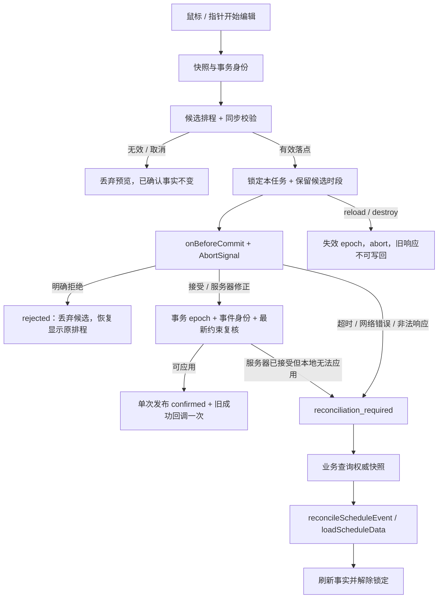

# 里程碑二：可靠排程编辑与异步提交实施计划

> 状态：实施计划，不表示当前 checkout 已完成任何工作包。
> 基线日期：2026-09-11；计划成文日期：2026-09-12。
> 基线 revision：`1b67eb7e9d5e8b0b63e49439ed27f3ee5d34f697`，以“当前 checkout 基线”表与执行时 git 输出为准。
> 缺陷等级：回调/同步写入路径为 CONFIRMED；异步回滚/竞态影响为 UNVERIFIED_RISK，需先红测。
> 计划路径：`devnote/plans/resource-scheduling-m2-development-plan.md`。
> 执行账本：`devnote/plans/resource-scheduling-m2-execution-ledger.md`，首轮执行创建。
> 上游合同：[里程碑一](resource-scheduling-m1-development-plan.md)、[仓库规则](../../AGENTS.md)、[当前事件回调](../../docs/zh/api/timeline/event-listeners.md)、[当前数据 API](../../docs/zh/api/timeline/data-management.md)。
> 接入反馈：仓库外 `/Volumes/project_home/RO/frontend/hyadum-ui/docs/design/timeline-canvas-production-feedback.md`；本计划已纳入相关编辑合同，不要求执行模型修改该仓库。

## 目标与非目标

在 M1 的稳定业务 ID、统一内容渲染和资源布局之上，交付可选择启用的排程编辑协议：查看时允许点击，编辑时允许拖动/跨资源移动/左右拉伸；同步校验给出拒绝原因；落点后提交服务端；明确区分接受、拒绝、服务器修正、网络未知与权威核对。

用户工作流：WO-26091 从 A1 09:00–10:00 移至 A3 11:00–12:00。等待保存时显示候选排程及 pending 标识；明确拒绝后仍为 A1 原时间；接受后确认 A3 新时间；服务器修正到 11:15–12:15 时采用修正值。超时结果未知时显示“保存结果待确认”，阻止同任务继续编辑，查询权威结果后再解除。

C-11–C-20 为目标。M1 必须在实际 checkout 为 complete 才能开始 M2 实现，M2 W0 重建基线，不直接复用 1.5.0 的历史通过报告。没有 hook 的旧调用方继续执行原同步路径；新协议只在显式配置 scheduleEditing 后启用。

非目标：服务端权限/设备/物料算法、生产数据库或幂等表、自动重试队列、离线排程、刷新后恢复未提交操作、批量原子排产、异步 split/add/delete、自动创建业务产线、日期适配、允许重叠/容量排产、协作实时同步、发布或 hyadum-ui 生产接入。不会自动向外部服务发送数据；生产 URL 与认证由接入方配置。

## 当前 checkout 基线与调查依据

| 项目 | 事实与证据 |
| --- | --- |
| Revision / branch | `1b67eb7e9d5e8b0b63e49439ed27f3ee5d34f697` / `main`；执行时重新采集，不能假定仍一致 |
| Dirty tracked / untracked | 调查开始时 tracked diff 为空；唯一 untracked 为 `AGENTS.md`，属于既有输入，不修改、不删除、不自动纳入实现提交 |
| Submodule / 局部指令 | `git submodule status` 无输出；仓库内发现根 `AGENTS.md`，未发现更深层 AGENTS/CLAUDE 指令；执行时重新发现 |
| 工作树指纹 | 初始 `git status --short` SHA-256：`b5a510b51f59eedc90c512bccebe0533313ed84e13ce91a6cb6fdfedffccc178`；tracked diff 为空字节 SHA-256：`e3b0c44298fc1c149afbf4c8996fb92427ae41e4649b934ca495991b7852b855` |
| 指令指纹 | 初始 `AGENTS.md` SHA-256：`bd1aa32b1a3297daa1c388643b8426fb418c6eb790d096cabb307201b277aeb9` |
| 版本与工具链 | timeline-canvas `1.5.0`；pnpm `10.34.5`；Node engines `^22.22.2 \|\| ^24.15.0 \|\| >=26.0.0`；CI 使用 Node `24.20.0` |
| 本机调查环境 | Node `v24.11.1`，pnpm `10.34.5`；Node 不满足 engines，只作调查证据，不计受支持环境验收 |
| 已运行基线 | 2026-09-11：`pnpm -C packages/timeline test:run`，26 文件 / 146 测试通过；`pnpm typecheck` 通过但有 engine warning |
| 未运行基线 | lint、全仓 coverage、build、docs build、MCP package 验证及真实浏览器场景均未运行；不存在这些 gate 已通过的声明 |
| 既存失败 | 上述已运行命令未发现测试失败；其余 gate 的既存失败状态为 `UNKNOWN`，W0 建立证据 |
| 文档与合同来源 | 根 README_CN、docs/zh/api/timeline、docs/zh/guide、插件文档、源码及测试；未发现 Accepted ADR、专用 architecture/spec、路线/phase plan、贡献指南、Makefile/Justfile，记为 N/A |
| 测试与运行环境 | `vite-plus/test` + jsdom；mock Canvas 不能证明真实像素或浏览器生命周期。未发现专用浏览器 E2E/benchmark runner；浏览器验收按本文手工/可用浏览器工具步骤记录 |
| 持久化与外部依赖 | 组件内存态，无数据库、durable queue 或服务端实现；docs 为 Rspress，已配置 Vue 3 预览，MCP 工具为下游消费者 |

新增计划文件属于本次文档输出；首轮实现须把它们与既有 `AGENTS.md` 一起记录为输入基线。不要把计划写入造成的指纹变化解释成产品修改。任何无法归因的 overlapping diff 先停止对应工作包，保留原文件。

可重复调查命令（根目录执行）：

```sh
git status --short
git rev-parse HEAD
git branch --show-current
git diff --stat
git diff HEAD -- packages/timeline docs packages/mcp-service packages/user-mcp-service
git submodule status
rg --files --hidden -g '*AGENTS.md' -g '*CLAUDE.md' -g '!node_modules' -g '!.git'
node --version
pnpm --version
```

本计划中的新 API、文件、测试名称均为目标设计，不能作为当前已有能力引用。`CONFIRMED` 仅用于源码可直接确定的现状；端到端视觉、竞态和性能影响未复现时使用 `UNVERIFIED_RISK`。本次为能力建设，不把未实现的新合同倒推为现网 P1 缺陷。

## M1 接入基线与已确认端到端路径

M1 接入要求：businessId 可查询且 clone 保留；严格原子 load/upsert/export；渲染入口支持 normal/drag/resize；公共视口订阅；类型 fixture 编译 gate；Vue 示例完成真实浏览器验收。M2 W0 记录 M1 ledger 的 revision + relevant diff hash、公开声明文件和浏览器证据。若 M1 修改了目标命名但语义等价，先以实际 API 更新本计划路径/名称并复核映射；语义冲突进入 blocker，不用猜测补齐。

| 标签 | Current flow / 源码位置 | 输入→输出 / 副作用 / 失败 |
| --- | --- | --- |
| CONFIRMED | IdleMouseDownRouter → DraggingState.handleMouseMove | 鼠标/指针→同步 canMoveEvent→直接改 event.startTime/endTime；跨轨道 splice/push；无后端提交 |
| CONFIRMED | DraggingState.handleMouseUp | 清拖动态前回调 onEventMove；包含修改后 event/fromTrackIndex，没有完整 before |
| CONFIRMED | ResizingState.handleMouseMove/Up | 实时改 start/duration/end，释放触发 onEventUpdate(type=resize)，未提供 oldEvent |
| CONFIRMED | Timeline.canMoveEvent → PluginManager.validateEvent | 时间边界/资源范围/重叠先判定；再同步 boolean 插件校验，无拒绝原因类型 |
| CONFIRMED | StateManager / EventIndexManager / ChangeScheduler | 所有排程事实和交互临时状态均在内存；索引/选择/渲染为派生；无持久化事务 |
| CONFIRMED | Timeline.destroy → InteractionManager.destroy / RenderManager.dispose / PluginManager.destroy | 生命周期释放已经存在；尚无 pending Promise/controller 的释放契约 |
| UNVERIFIED_RISK | 在同步写入路径外简单包装 Promise | 失败恢复可能覆盖新编辑，旧 response 可能写回重载后任务；需实际 public API + deferred Promise 红测 |



目标责任：EditTransactionController 管事务身份/快照/状态结算；同步 validator 只做当前输入和本地业务约束；CommitCoordinator 管 Promise/timeout/epoch/通知一次性；既有数据服务负责确认后原子发布与索引投影；共享渲染器消费候选或已确认事实。HTTP 属于接入适配器，核心不解析业务服务器 raw body、凭证或工艺字段。

## 目标合同与 Requirement Coverage Matrix

### C-11：统一编辑快照

- Given：已配置 scheduleEditing，事件和源/目标资源有业务 ID。
- When：移动跨资源、左拉伸、右拉伸与无位移点击。
- Then：change 有 operationId、action、before/after 完整脱离引用的事件快照及资源 ID；前快照是开始操作时事实；点击/无变化不提交。
- And not：鼠标释放后才推算 before、数组索引当提交身份、鼠标每帧产生请求。
- Failure：快照无法复制则 validation_failed 且零提交/零写入。
- Evidence：T-CHANGE / G0、G10 / 前后快照和调用次数。

### C-12：同步校验与原因

- Given：存在时间边界、readonly、同轨重叠、互斥插件与业务校验。
- When：拖动候选与最终落点校验。
- Then：内置错误有 code/reason；业务可拒绝目标资源；快速校验只同步运行；旧 boolean 插件仍生效。
- And not：通过新回调放宽核心已拒绝条件、validate 返回 Promise 仍放行、每帧访问后端。
- Failure：validation_failed 安全原因；drop 无效不调用 commit。
- Evidence：T-VALIDATE / G0/G10 / 原因及零网络次数。

### C-13：接受、明确拒绝与修正

- Given：有效 change，onBeforeCommit Promise 可控。
- When：分别 accepted、rejected、accepted+correction 返回。
- Then：接受发布一次；拒绝原资源/时间仍正确且清 pending；修正以服务端给出的资源/起止发布；duration 一致。
- And not：拒绝时覆盖其他已更新事件、成功回调先于确认、修正后再自动请求一次。
- Failure：非法/无法应用服务器响应进入 reconciliation_required，不冒充 rejected。
- Evidence：T-SETTLE / G0/G9 / 数据/选择/回调时序。

### C-14：同事件互斥与跨事件预约

- Given：A pending，B 是另一事件。
- When：再编辑 A、编辑 B 至空闲位置/原位置/候选位置，交换响应顺序。
- Then：A 被 busy 拒绝；B 空闲可提交；原与候选占用都不能被 B 抢占；每次确认后重新校验当前数据和预约。
- And not：按全局锁冻结所有任务、按旧 index 更新 B、两个任务最终重叠。
- Failure：busy 或 reservation_conflict；未知态继续占位直到权威核对。
- Evidence：T-CONCURRENCY / G11 / 三次不同 settle 顺序。

### C-15：取消、超时与未知结果

- Given：预览中或已有未完成提交。
- When：pointercancel/Escape、timeout、网络异常、同步 throw、非合法结果。
- Then：提交前取消零调用并恢复；提交后无法证明未写的失败进入 reconciliation_required；超时 abort 信号并解除视觉 pending，保留编辑锁。
- And not：将 fetch AbortError 当后端未提交、无限 pending、自动重试重复保存。
- Failure：固定 timeout/transport_error/invalid_response reason code；业务核对后才解锁。
- Evidence：T-UNCERTAIN / G0/G9/G11 / timer、状态和晚响应。

### C-16：生命周期和权威恢复

- Given：pending/unknown 时有 reload、destroy、权威单事件恢复。
- When：成功 loadScheduleData、失败加载、reconcileScheduleEvent、删除/重建同 ID、旧 Promise 晚返回。
- Then：合法权威输入使旧 operation 失效；非法输入不取消原事务；销毁立即阻止回写与后续回调；新实例不被旧响应污染。
- And not：先 abort 再验证坏快照、晚响应重建已删事件、使用同业务 ID 就认为是同一代。
- Failure：invalid_input 保留事务；destroy 无 post-destroy 回调；reconcile 校验失败仍锁定。
- Evidence：T-RECOVER / G0/G9/G11 / epoch 与重载记录。

### C-17：回调及显示语义兼容

- Given：新协议开/关、旧插件/点击/同步 API。
- When：一次拖动/拉伸/拒绝/无位移及回调重入。
- Then：新模式仅 accepted 发一次旧成功回调并附 before；状态回调独立区分 pending/accepted/rejected/unknown/cancelled/invalidated；旧模式仍同步。
- And not：新旧回调各保存一次、读写还未稳定时通知、用户回调异常阻断清理。
- Failure：回调异常隔离且记安全诊断；不造成二次结算或悬挂锁。
- Evidence：T-CALLBACK / G0/G10/G11 / 精确顺序与次数。

### C-18：编辑示例与真实传输

- Given：M1 Vue 示例，合成本地 HTTP 服务可延迟与查询状态。
- When：切编辑模式，移动/拉伸，切接受/拒绝/修正/延迟/断连情形。
- Then：显示候选内容、pending/待核对/拒绝原因；本地 HTTP 接受后断响应可通过查询恢复；编辑开关和详情可用。
- And not：以纯 Promise mock 替代所有外部边界验收、使用生产 URL/凭证。
- Failure：HTTP 失败可见但不显示 raw body；核对失败继续锁定，不假称成功。
- Evidence：T-HTTP/T-EDIT-DEMO / G9、本地服务步骤 / 网络与 UI 证据。

### C-19：事务释放与运行成本

- Given：并发事务、20 次挂载卸载、4x40 与 100 行总 10000。
- When：重复提交/拒绝/核对/重载/销毁。
- Then：timer/AbortController/reservation/快照按终态清理，unknown 仅保留核对所需状态；无旧回调；延迟与帧成本有记录。
- And not：永久保留所有历史 before/after/响应、保存 raw payload、用提高 timeout 掩盖泄漏。
- Failure：不可测内存指标记录 unavailable；明确计数与功能清理证据。
- Evidence：T-CLEANUP / G0/G9/G11 / 循环计数与测量。

### C-20：范围、兼容与安全

- Given：M1 已通过，旧 1.5.0 输入，新增 API 可选。
- When：全仓 gate、双语文档、导出、错误与 diff 审核。
- Then：未配置协议不改变同步行为；M1 public 类型/ID/渲染/视口合同保持；导出只有已确认事实；业务规则/生产存储仍在适配层。
- And not：发布、push、生产数据访问、默认启用异步、把 readonly 当服务器授权。
- Failure：合同冲突停止；无授权外部边界记 N/A；不弱化旧测试。
- Evidence：T-REGRESSION / G0–G11 / 包/类型/日志/diff。

| 需求 | 主合同 | 当前缺口 | 目标行为 | Wave | 红测试 | 最终证据 |
| --- | --- | --- | --- | --- | --- | --- |
| R-11 before/after 与资源身份 | C-11 | 移动无 before、拉伸未传 oldEvent | 开始时快照与一致动作载荷 | W1/W2 | T-CHANGE | 快照/类型 |
| R-12 快速校验与原因 | C-12 | boolean 无原因 | 同步 typed 校验 | W1/W2 | T-VALIDATE | 断言与调用次数 |
| R-13 异步接受/拒绝/修正 | C-13 | 没有提交结算 | 接受原子发布、拒绝恢复显示 | W1/W3 | T-SETTLE | 数据/回调/截图 |
| R-14 pending 与并发规则 | C-14 | 无事务锁与预约 | 同任务互斥、其他任务可编辑 | W1/W3 | T-CONCURRENCY | 三次 settle 序列 |
| R-15 取消/超时/未知 | C-15 | 无状态区分 | 未知需核对，无自动重试 | W1/W3 | T-UNCERTAIN | fake timer + HTTP |
| R-16 reload/destroy/权威恢复 | C-16 | 无异步 epoch 隔离 | 旧请求不写回，坏快照不破坏 pending | W1/W3 | T-RECOVER | generation/实例隔离 |
| R-17 回调兼容与状态显示 | C-17 | 无统一通知语义 | 只确认后成功通知一次 | W1/W2/W3 | T-CALLBACK | 精确时序 |
| R-18 编辑 Vue 示例 | C-18 | 只有 M1 查看/同步预览 | 本地 HTTP 演示完整失败恢复 | W1/W4 | T-HTTP/T-EDIT-DEMO | 网络与真实 UI |
| R-19 清理与成本 | C-19 | 新资源生命周期待实现 | 挂载/提交后释放与测量 | W1/W4 | T-CLEANUP | 计数/浏览器报告 |
| R-20 保留与禁止边界 | C-20 | 新协议可能污染旧默认 | 可选扩展、M1 不回归、无发布/生产写入 | W0–W5 | T-REGRESSION | 全仓 gate/diff |

## 公共 API 与编辑事务设计

### 开关与类型合同

以下为目标 API，M2 W0 将类型名与 M1 已完成导出对齐，不能把目标接口作为基线现状。默认 `scheduleEditing` 未配置；配置对象必须同时提供 onBeforeCommit，不能出现“开启后没有保存端点但显示成功”。构造时非法配置抛出明确配置错误，尚未注册监听/观察器前失败，避免半初始化实例。

```ts
interface SchedulePlacement {
  resourceBusinessId: BusinessId;
  startTime: number;
  endTime: number;
}
interface ScheduleEditSnapshot {
  resourceBusinessId: BusinessId;
  event: Readonly<TimelineEvent>;
}
interface ScheduleChange {
  operationId: string;
  eventBusinessId: BusinessId;
  action: 'move' | 'resize';
  resizeEdge?: 'left' | 'right';
  before: ScheduleEditSnapshot;
  after: ScheduleEditSnapshot;
}
type ScheduleValidationResult =
  | { allowed: true }
  | { allowed: false; code: string; reason: string };
type ScheduleCommitResult =
  | { accepted: true; placement?: SchedulePlacement }
  | { accepted: false; code?: string; reason: string };
interface ScheduleEditingOptions {
  validate?: (change: Readonly<ScheduleChange>) => ScheduleValidationResult;
  onBeforeCommit: (
    change: Readonly<ScheduleChange>,
    context: { signal: AbortSignal }
  ) => Promise<ScheduleCommitResult>;
  commitTimeoutMs?: number;
}
// TimelineOptions.scheduleEditing?: ScheduleEditingOptions
// TimelineOptions.onScheduleCommitStateChange?: (data: ScheduleCommitStateData) => void
// Timeline.getScheduleEditState(id: BusinessId): ScheduleEditState | null
// Timeline.reconcileScheduleEvent(
//   id: BusinessId,
//   snapshot: { resourceBusinessId: BusinessId; event: ScheduleEventInput } | null,
//   options: { operationId: string }
// ): ScheduleResult<void>
```

before/after 为独立快照，不引用可写的 tracks/customData/media 数组。类型 Readonly 仅是表层约束，运行时复制保证挂钩或回调改 payload 不改原事实；内部保存的快照也不能与外部传入 hook 的快照共用可写对象。after.event 的业务 ID 和 number id 与 before 相同，duration=end-start，resizeEdge 只在 resize 存在；move 不接受 change 中额外的 resizeEdge。快照生成只在动作开始、最终落点和必要通知发生，不每帧深复制所有大媒体。同步 validate 的候选数据也不允许写入事实；需结合测量选择只读候选投影与复制边界，不能用共享可写引用换取速度。

operationId 在实例/生命周期之间不碰撞，标识一次用户意图；预览和提交沿用同一个 operationId，无变化和取消不创建网络操作。内部另有 datasetEpoch 和 event generation，响应应用条件为 operationId/epoch/generation 均匹配当前事务；不只比较 eventBusinessId，因为同 ID 删除后重建不是旧事件。

commitTimeoutMs 默认 30000，必须为有限正数且不超过宿主 timer 可表示的 2147483647 毫秒；超出时配置错误，不静默溢出为即时 timeout。此上限属于宿主定时器表示约束，不是排程领域规则。这是可配置的客户端等待上限，不代表业务工单有效期，也不是后端“未保存”证明。超时不自动重试。服务端幂等可使用 operationId；本库只保证单次调用及本地去重，不承诺跨刷新 exactly-once。

`ScheduleEditState` 建议 discriminated union：idle、preview、pending、reconciliation_required；非 idle 携带 operationId 与 action，pending/unknown 携带候选 placement 与 reasonCode（unknown 必填）。返回 null 表示未知事件；已存在无事务为 idle。`ScheduleCommitStateData` 状态为 pending、accepted、rejected、cancelled、validation_failed、reconciliation_required、invalidated、reconciled；包含 operationId、eventBusinessId、action、before/after 及必要安全 reason。accepted 的 after 为最终服务器修正后的值；reconciled 删除的 after 为 null，类型上必须区分该分支。

状态接口从包根导出，不把内部 AbortController/Promise/timer 暴露或序列化。M1 的 ScheduleErrorCode 增加 busy、reconciliation_required、invalid_server_result、stale_operation 等新错误码时，更新所有目标类型 fixture；不改旧 boolean API 返回形状。

### 已确认事实与候选显示

仅在 scheduleEditing 模式，鼠标移动不直接改 tracks。开始编辑捕获 before；候选 start/end/目标资源写入独立 draft。普通内容 renderer 和 InteractionRenderer 通过共享的 display projection 取得候选事件及资源；原任务不重复显示。resize 也必须消费 draft，不能让 EventsRenderer 继续读原时间导致拉伸不动。

tracks、getEventByBusinessId、exportScheduleData 始终返回已确认事实；pending 候选只通过渲染上下文和 getScheduleEditState 暴露。accepted 后一次性发布新 placement 并更新业务索引/命中/选择；rejected/cancelled 仅移除 draft，所以无需把陈旧完整 before 覆盖回 tracks。UI 可以“恢复原位置”，内部以原事实未被提前覆盖来保证正确性。

M1 `EventContentRenderContext` 增加 `commitState: 'idle' | 'pending' | 'reconciliation_required'` 和可选 operationId，phase 仍保留 normal/drag/resize 语义；pending 位于候选落点且 phase='normal'，selected/readonly 保持。渲染期间不把锁实现为改业务 event.readonly，否则导出/回滚会污染数据。pending 和 unknown 条仍可点击详情；在候选显示位置做 hit-test，返回原业务身份和其已确认索引，随后 busy 校验拒绝二次拖动。原位置不画条，但保留排程占用。

选中态以事件身份跟随候选和确认落点；拒绝回原资源，但仅当当前选中的仍为该事件才调整 selectedTrack；用户等待期间改选其他事件时不抢回焦点。hover/resize handles/context menu 等必须遵守 pending/unknown 限制。辅助线基于明确的确认+预约投影，不因 invisible original 与 draft 双重计算发生跳动。

未配置 scheduleEditing 时继续使用原同步变更路径，M2 不强制全库改成 draft 模式。共享工具可复用，但 legacy 行为的差异必须被 T-REGRESSION 捕获。

### 同步校验顺序与失败信息

1. 实例未销毁、全局/事件可编辑，事件与资源有业务 ID。
2. 同任务没有 pending/unknown；目标资源真实存在；scheduleEditing 模式不自动创建产线。
3. 起止有限、minEventDuration、start/end/endPaddingTime 等既有时间约束。
4. 已确认事件与 pending/unknown 候选预约区间无同轨重叠。相邻 end==start 不重叠。
5. 旧 validate:event:move 插件同步 boolean 验证。
6. 新 scheduleEditing.validate 返回结构化允许/拒绝。

核心固定 code 至少包含 readonly、missing_business_id、busy、invalid_time、invalid_resource、overlap、reservation_conflict、plugin_rejected、validation_error。业务 code 不被解释成核心权限规则，reason 作为 text 显示。旧 boolean 插件 false 没有原因时用本地化通用原因，不能伪造设备能力/物料判断。

validate 抛错/返回非法结构/Promise 均为 validation_error；不向 onBeforeCommit 放行。核心检查结果不能被业务 allowed:true 覆盖。mousemove 校验仅本地；抬起重新校验最后候选，落点无效就丢弃当前编辑，不隐式提交上一个有效位置。没有实质 placement 变化时只执行原点击/选择语义，不提交空 change。

pointercancel、lostpointercapture、Escape 在 preview 时取消候选；pointerleave 结合当前 capture 规则处理，不能把有 capture 的正常出界误当丢失操作。全局 setReadOnly(true) 在 preview 时取消；pending 已发出的保存继续结算，不能因为切查看模式假定服务器没写。

### 提交、通知与重入

落点校验通过后，同一同步段内注册 transaction 和 candidate reservation，再通知 pending，最后调用 onBeforeCommit 一次。即使 pending 回调同步触发 reload/destroy，也要检查 epoch/存活状态后决定是否仍调用 hook。hook 同步抛错保守视为结果未知，因为外部函数可能先触发副作用再 throw。

接受普通结果：验证身份仍属于当前操作，校验最终 placement 并原子 publish；取消 timeout、释放预约/锁、清 draft，更新派生索引/选中态，通知 accepted，然后发送旧 onEventMove 或 onEventUpdate 一次。所有内部状态必须在用户回调前稳定。accepted 状态回调重入 reload/destroy 后，不发送过时旧成功回调；以 operation/epoch 存活检查为准。若需要保证跨两类回调的一致通知，采用不可变通知批次并规定 destroy 抑制后续通知，T-CALLBACK 明确覆盖。

拒绝结果：accepted:false 且 reason 为有效字符串，移除候选及预约，事实未变；状态 rejected + 安全原因；不发送旧成功回调。客户端不为 rejected 自动重试。

服务器修正只允许 resourceBusinessId/startTime/endTime，不能改事件身份、title/customData/业务进度。资源必须存在且起止合法；duration 重新推导，重新检查当前确认数据和其他预约。同一操作自己的原占位与候选预约在自检时排除。服务器返回 accepted 但本地因资源已变化/冲突不能应用时进入 reconciliation_required；不能返回 rejected 冒充服务端回滚，也不能静默把重叠排程写入。

旧 onEventMove 增加可选 oldEvent、fromResourceBusinessId/toResourceBusinessId；旧 onEventUpdate(type=resize) 实際提供 oldEvent。新模式成功回调在确认后，旧模式仍释放时同步；新状态回调不是第二个保存入口。split/update 等原 type 语义不混用为 move。任何用户 callback throw 都隔离清理、记录固定错误码，不触发补偿第二次保存。

### 同任务锁、跨任务预约与程序更新

同任务 pending/unknown 禁止再次 drag/resize/split/delete 或修改事件字段；M1 update/upsert 对该事件返回 busy/reconciliation_required，批次中任何被锁定事件导致整批零写入。旧 boolean updateEvent/updateEventData/deleteEvent 返回 false 并更新安全状态，void 入口按既有错误反馈方式 no-op。不存在“进度更新可偷偷越过锁”的例外；业务可暂存刷新，确认后重试，或用显式权威恢复入口。

其他事件可编辑，但 canonical before 占用和 candidate reservation 都参与防重叠。多个 pending 可位于同轨互不重叠时段，不锁整行。源/目标业务资源在 pending/unknown 被引用时不能通过普通 removeTrack 删除；资源元数据更新允许，资源身份和排程配置变更需单独检查。autoRemoveEmptyLastTrack 不删除被事务引用的资源。新模式禁用 autoAddTrack 的交互自动扩容、禁用 split（当前提交 action 不支持）；未配置模式保留原选项。

pending 时普通 setEndTime 若会使任一 before/candidate 越界，返回 false；纯放宽可执行。setReadOnly 仅影响新交互。新模式 upsert/patch 其他事件的 placement 需要检查 pending/unknown reservation，冲突 typed error，不偷偷越过预约。纯 metadata 更新不影响时间区间。loadScheduleData/loadData 成功整批替换为权威数据属于失效边界，见下一节。

确认时可重新检测当前约束；校验自身不释放预约到事实发布之间留下空窗。终态清理由统一 settle 函数维护“至多一次”，不分散到 Promise.then/catch、timeout 和 destroy 的多套逻辑。直接外部改 state/config 不属于新事务保证，文档明确使用公开 API；T-RECOVER 覆盖所有受支持写入口。

### 超时、未知结果与权威核对

一旦调用外部提交，timeout、网络断开、AbortError、未知异常、非法结果、无法应用的 accepted 响应都不能证明后端未保存。这些进入 reconciliation_required，停止 pending spinner，展示待核对原因，保留 before + candidate 预约和同任务锁。请求 abort 为资源清理信号，不能当远端事务撤销。晚到的原 Promise 结果不再自动写回 unknown 状态，必须由明确权威恢复结束，避免先核对新事实后又应用旧响应。

`reconcileScheduleEvent(id, snapshot, { operationId })` 接受业务查询到的权威当前事件；id 必须对应当前存在事件，否则返回 not_found，不作为新增事件入口；新建/删除后重建由严格 load/upsert 完成。operationId 必须匹配该事件当前 pending/unknown 事务；查询开始时捕获该值，调用时不再读取一个更新的 operationId 来冒充匹配。旧查询晚返回或事务已终结时返回 stale_operation 且零写入；正常 idle 状态的业务刷新走 M1 数据入口。snapshot.event.businessId 必须与 id 完全相同，目标资源存在、时间/数据合法。验证完成后先作废该事件旧 operation，使用数据服务原子替换/移动事件，再释放预约/锁并通知 reconciled；snapshot=null 表示权威删除。其他事务有受影响的候选预约时，保留其事务身份并把它标为 reconciliation_required，不能覆盖其结果或默默“拒绝”已发出的保存；失效范围写入通知。普通严格 load 不参与业务冲突裁决，权威数据允许展示已有冲突；本地后续编辑仍防重叠，Vue 明确显示冲突/待核对状态。单事件恢复与整批权威导入均需保持该规则一致。

`loadScheduleData`（以及 legacy loadData 成功替换）先完成全部输入验证/暂存，再递增 datasetEpoch，作废所有 preview/pending/unknown 操作，abort 并释放预约，发布快照；不可在校验失败前取消当前事务。对于新模式，legacy load 的现有容错输入仍按 M1 规则判定最终成功/失败，但最终缺业务 ID 的事件只可查看，不可新编辑。失效通知为 invalidated，不发 move/update 成功回调。坏快照/重复 ID 失败保留现有事务与画面。

destroy 同步设置 destroyed、失效 epoch、abort/取消 timeout、清 draft/预约/监听，然后继续原异步插件销毁。不等待不响应 abort 的用户 Promise；任何销毁后的 resolve/reject 不写状态、不绘制、不通知。重复 destroy 复用原 Promise。整份权威快照的外部 fetch 顺序和服务端版本校验由接入方负责，库不能从无版本的 load 参数推断网络响应是否陈旧；示例的待核对恢复必须使用携带 operationId 的单事件入口，不能用未经排序的 GET→load 绕过保护。浏览器重启无内存事务恢复（N/A：没有 durable journal）；接入方重新查询服务器后 load。离线自动 replay 不在此范围。

## 全局不变量与影响边界

- canonical fact 为最近确认/权威导入的 tracks；draft、预约、选择、命中、视口、pending 状态都是内存 projection。
- 一次操作只调用一个 onBeforeCommit；本地结算至多一次；通知是否被 reload/destroy 抑制由 epoch 判断，不能在新数据上发旧成功通知。
- accepted/rejected/cancelled/invalidated 为本地终态；reconciliation_required 是保存结果未知且等待恢复的工作流状态，不标为成功/拒绝。partial success N/A：提交粒度为单事件 placement；无跨事件事务承诺。
- 同事件锁定，跨事件允许并发；候选/原占用防抢占；响应 ordering 按 operationId+epoch+generation，不按返回时间或 index。
- 原子发布失败不能留下半移动/两个副本/失效 selectedEvent；程序更新也走共享数据服务。
- public schema 扩展兼容 M1 与旧 1.5.0 无 hook 行为；导出仅确认数据、不输出事务/timer/signal。不增加持久化 schema、备份任务或跨进程 worker。
- 核心只读安全业务 reason/code，不记录 raw response、认证头、完整 customData 或服务器 stack；Vue 以 text 渲染 reason。权限、租户、设备能力及服务器幂等属于接入服务；readonly 不是授权。
- transport 异常不可自动推断 remote rollback；没有自动重试，也不根据 timeout 对服务端做二次补偿写入。

| 模块/边界 | 当前职责 | 允许变化 | 必须保持 | 合同 | 验证 |
| --- | --- | --- | --- | --- | --- |
| Timeline/types/index/defaults | 公共选项/回调 | 可选事务配置和查询/核对 | 旧默认同步与 M1 类型 | C-11/17/20 | G0/G10 |
| IdleMouseDownRouter/DraggingState/ResizingState/InteractionManager | 指针状态机 | opt-in draft、取消/提交路由 | 原鼠标/触摸 capture 与 readonly | C-11/12/15 | 真实事件链 |
| EditTransactionController / ScheduleCommitCoordinator（新） | N/A：新增职责 | 快照、状态结算、epoch、timeout、预约 | 单次提交/至多一次结算 | C-13–16 | race/恢复 |
| EventMutationService/ScheduleDataService/TrackManager | 数据发布 | busy 检查/权威恢复/原子确认 | M1 原子与身份合同 | C-13/14/16 | 索引/导出 |
| canMoveEvent/PluginManager | 本地碰撞/boolean 校验 | typed reason 适配、预约校验 | 旧插件不能被绕过 | C-12/14 | 互斥与新 validator |
| renderers/HitTestService/ChangeScheduler | 显示/命中/通知 | 候选显示、pending 点击、统一清理 | DPR、clip、左栏对齐 | C-13/17/18 | G9 |
| Logger/i18n/状态文本 | 可见提示 | 新本地化安全错误码 | 不输出异常体/业务 payload | C-15/20 | 日志 fixture |
| docs Vue 示例/本地 HTTP fixture | M1 查看 UI | 编辑、故障控制与查询核对 | 合成数据，无生产 auth | C-18/19 | HTTP+真实浏览器 |
| CLI/MCP | 下游指导/打包 | 回归验证，不改协议 | 原 package/scaffold | C-20 | G6/G7 |
| durable store/backup/restart | N/A：没有数据库/worker | 仅权威快照重建 | 不实现客户端持久化事务 | C-16/20 | reload/新实例 |
| external adapter / security | 核心不做网络/权限 | 用户 hook + AbortSignal；本地测试服务 | 无生产写入/secret | C-15/18/20 | HTTP fixture/脱敏 |
| migration/serialization | M1 API 与导出 | 可选字段，迁移文档 | number id/业务 ID 不改 | C-20 | 旧 types/往返 |

## Wave 0：确认 M1 完成并重建编辑基线

### 目标与合同

- 覆盖合同：C-11–C-20。
- 可观测结果：M1 的实际 API 与浏览器证据可用于本里程碑。
- 明确不处理：生产实现、测试行为、依赖与 M1 未验收工作。

### Entry gate

- [ ] M1 W0–W5 在当前 checkout 全部 complete 且证据仍有效。
- [ ] dirty/untracked、相关 diff、M1 合同与实现指纹已记录且没有未归因重叠。
- [ ] fixture、验证环境与上游 API 可用；前置证据仍有效。

### Allowed files

- `devnote/plans/resource-scheduling-m2-execution-ledger.md`
- `devnote/plans/evidence/resource-scheduling-m2/**`

### Forbidden changes

生产实现、测试行为、依赖与 M1 未验收工作；不修改既有 AGENTS.md、无关生产文件、用户数据、发布状态或外部系统。本里程碑 sidecar/evidence 只记录实际执行结果。

### 红测试与基线

| Test/Oracle | Trigger | Expected old failure | Wrong failure |
| --- | --- | --- | --- |
| B-M1 | 读取 M1 ledger、revision、相关 diff、required gates | 缺 M1 complete 即阻塞，不用历史 1.5.0 绿测替代 | 只看手填 complete 字段 |
| B-FLOW | 同步拖动/拉伸/指针取消与旧回调采样 | before 缺失/同步写入为基线，不假定异步行为已存在 | 把旧正常同步行为判故障 |

### 实施工作包

| Package | Symbol/path | Contract | Failure behavior | Targeted validation |
| --- | --- | --- | --- | --- |
| W0.1 | M1 ledger/API/类型/浏览器证据比对 | C-20 | 任一前置 stale 先回 M1 重验 | G0–G8/G10 + M1 evidence；`pnpm -C packages/timeline test:run`；`pnpm lint`；`pnpm typecheck`；`pnpm test:coverage`；`pnpm build`；`pnpm docs:build`；`pnpm -C packages/mcp-service test:package`；`pnpm -C packages/user-mcp-service test:package`；`pnpm exec tsc -p packages/timeline/tsconfig.contract-tests.json --noEmit` |
| W0.2 | handler→变更→显示→回调→destroy 路径审计 | C-11/15/17 | 调用方未知记 discovery 并完成后再进入 W1 | 源码定位与真实旧交互 Oracle |

### 验证命令

| Command | Provenance | Expected result | Required/conditional |
| --- | --- | --- | --- |
| `pnpm -C packages/timeline test:run` | G0：timeline manifest | 退出码 0；所选合同满足 | required |
| `pnpm lint` | G1：root manifest / CI | 退出码 0；所选合同满足 | required |
| `pnpm typecheck` | G2：root manifest / CI | 退出码 0；所选合同满足 | required |
| `pnpm test:coverage` | G3：root manifest / CI | 退出码 0；所选合同满足 | required |
| `pnpm build` | G4：root manifest / CI | 退出码 0；所选合同满足 | required |
| `pnpm docs:build` | G5：root manifest / CI | 退出码 0；所选合同满足 | required |
| `pnpm -C packages/mcp-service test:package` | G6：CI / package manifest | 退出码 0；所选合同满足 | required |
| `pnpm -C packages/user-mcp-service test:package` | G7：CI / package manifest | 退出码 0；所选合同满足 | required |
| `git diff --check` | G8：AGENTS 文档/diff gate | 退出码 0；所选合同满足 | required |
| `pnpm exec tsc -p packages/timeline/tsconfig.contract-tests.json --noEmit` | G10：M1 W1 新增类型 gate | 退出码 0；所选合同满足 | required |
| `pnpm docs:dev` + 实际浏览器操作 | G9：root manifest；URL 取实际终端输出 | W0 环境/旧页面基线；新 UI 未实现不作为失败 | discovery |

实际 M1 基线 revision 必须在 ledger 新增 milestone1 字段，连同 API 声明和 relevant_diff_sha256；不要把当前计划的历史基线改写成“已完成 M1”。本地 HTTP fixture 的端口/跨源策略/启动命令在 W4 建立，W0 记录 Node/browser 可用性。

### Evidence

执行时逐项填入 ledger，不将本计划作为实现证据：

- Behavior before：可重复输入、调度状态与可见行为。
- Red failure：对应断言与真正失败原因。
- Behavior after：合同成功、拒绝、未知和清理终态。
- Files changed：完整路径与 Allowed files 比对。
- Commands passed：精确命令、时间、退出码与 fingerprint。
- Commands failed：失败命令、关键输出或 none。
- Commands not run：required/conditional 项及状态上限。
- API/storage/UI/restart evidence：快照/回调时序/导出/重载/浏览器步骤；组件无 durable store。
- External dependency evidence：真实浏览器与本地 HTTP fixture；不得外推生产服务已验收。
- Secret/redaction evidence：异常/响应脱敏，合成任务无生产数据。

### Exit gate

- [ ] 每个工作包有正确 Oracle 和目标验证；实现 Wave 对应红测已转绿。
- [ ] success、failure、cancel/timeout、重载/销毁及该 Wave 适用竞态均有证据。
- [ ] required 命令满足本 Wave 目标；没有被 skipped/ignored 的 required 合同。
- [ ] 实际修改符合 Allowed files，旧同步路径与 M1 合同未出现未解释回归。
- [ ] ledger 与 Evidence 更新，下一动作唯一且可执行。

### Stop conditions

M1 未完成或 API 与本计划冲突；红测只有测试替身而未命中真实交互路径；工作树漂移无法归因；需要扩大公共协议或禁止边界；超时结果被当作后端拒绝；required 环境/权限不可用。记录 blocker 与解除条件，不将未验收状态写成 complete。

### Handoff

完成时先写入当前 fingerprint/证据并解锁下一 Wave；未完成时保留当前包、最后有效命令和唯一 next_action，输出固定执行状态字段。

## Wave 1：捕获状态、并发及恢复红测

### 目标与合同

- 覆盖合同：C-11–C-17/C-19/C-20。
- 可观测结果：有覆盖真实 public pointer 路径的可控失败序列。
- 明确不处理：生产代码、任意 timeout 放宽、测试 skip/ignored。

### Entry gate

- [ ] 前一 Wave 在当前 checkout 为 complete。
- [ ] dirty/untracked、相关 diff、M1 合同与实现指纹已记录且没有未归因重叠。
- [ ] fixture、验证环境与上游 API 可用；前置证据仍有效。

### Allowed files

- `devnote/plans/resource-scheduling-m2-execution-ledger.md`
- `devnote/plans/evidence/resource-scheduling-m2/**`
- `packages/timeline/tests/**`
- `packages/timeline/tsconfig.contract-tests.json`（仅扩展已有契约 fixture 覆盖）

### Forbidden changes

生产代码、任意 timeout 放宽、测试 skip/ignored；不修改既有 AGENTS.md、无关生产文件、用户数据、发布状态或外部系统。本里程碑 sidecar/evidence 只记录实际执行结果。

### 红测试与基线

| Test/Oracle | Trigger | Expected old failure | Wrong failure |
| --- | --- | --- | --- |
| T-CHANGE/T-VALIDATE | 跨行 move、左右 resize、无变化、readonly 和错误 validator | before 不完整或 typed 校验缺失 | 只构造 ScheduleChange 对象不走输入入口 |
| T-SETTLE/T-CONCURRENCY | A/B deferred Promise 分别逆序 settle | 没有 pending/预约协议或旧状态错误写入 | 靠固定 sleep 赌调度顺序 |
| T-UNCERTAIN/T-RECOVER/T-CALLBACK | 假时钟触发 timeout、load/destroy、callback reentry | 晚响应写回或 callback 次数/状态错误 | mock 直接修改期望 state |

### 实施工作包

| Package | Symbol/path | Contract | Failure behavior | Targeted validation |
| --- | --- | --- | --- | --- |
| W1.1 | schedule-edit.spec.ts / schedule-validation.spec.ts | C-11/12/17 | 能力缺失先显式 runtime assertion，不能 import fail | G0 正确红证据 + G10；`pnpm -C packages/timeline test:run`；`pnpm exec tsc -p packages/timeline/tsconfig.contract-tests.json --noEmit` |
| W1.2 | schedule-commit.spec.ts / schedule-concurrency.spec.ts | C-13/14/15 | deferred Promise + fake timers 控制结算，不真实等待30秒 | G0 红测清单；`pnpm -C packages/timeline test:run` |
| W1.3 | schedule-recovery.spec.ts / schedule-cleanup.spec.ts | C-16/19/20 | 真实 Timeline load/destroy/pointer public chain | G0/G10；`pnpm -C packages/timeline test:run`；`pnpm exec tsc -p packages/timeline/tsconfig.contract-tests.json --noEmit` |

### 验证命令

| Command | Provenance | Expected result | Required/conditional |
| --- | --- | --- | --- |
| `pnpm -C packages/timeline test:run` | G0：timeline manifest | 正确红断言/类型 Oracle，失败必须绑定合同；旧基线测试保持绿 | required |
| `git diff --check` | G8：AGENTS 文档/diff gate | 退出码 0；所选合同满足 | required |
| `pnpm exec tsc -p packages/timeline/tsconfig.contract-tests.json --noEmit` | G10：M1 W1 新增类型 gate | 正确红断言/类型 Oracle，失败必须绑定合同；旧基线测试保持绿 | required |

类型 fixture 随 W2/W3 的对应公开类型增量加入，不提前 import 尚未实现的未来类型导致 G2 整体失败；W1 建立 baseline 正负例与已存在类型缺口的 Oracle，未来目标类型规格写入账本，runtime capability 红测仍全部保留。

每个测试编号在账本展开为文件+test name。测试替身只替代外部 onBeforeCommit，不替代 EditTransactionController/数据服务/真实鼠标事件链。类型正负例覆盖 accepted 分支、错误 placement、validate 返回 Promise、businessId:string/number、legacy onEventMove 调用。

### Evidence

执行时逐项填入 ledger，不将本计划作为实现证据：

- Behavior before：可重复输入、调度状态与可见行为。
- Red failure：对应断言与真正失败原因。
- Behavior after：合同成功、拒绝、未知和清理终态。
- Files changed：完整路径与 Allowed files 比对。
- Commands passed：精确命令、时间、退出码与 fingerprint。
- Commands failed：失败命令、关键输出或 none。
- Commands not run：required/conditional 项及状态上限。
- API/storage/UI/restart evidence：快照/回调时序/导出/重载/浏览器步骤；组件无 durable store。
- External dependency evidence：真实浏览器与本地 HTTP fixture；不得外推生产服务已验收。
- Secret/redaction evidence：异常/响应脱敏，合成任务无生产数据。

### Exit gate

- [ ] 每个工作包有正确 Oracle 和目标验证；实现 Wave 对应红测已转绿。
- [ ] success、failure、cancel/timeout、重载/销毁及该 Wave 适用竞态均有证据。
- [ ] required 命令满足本 Wave 目标；没有被 skipped/ignored 的 required 合同。
- [ ] 实际修改符合 Allowed files，旧同步路径与 M1 合同未出现未解释回归。
- [ ] ledger 与 Evidence 更新，下一动作唯一且可执行。

### Stop conditions

M1 未完成或 API 与本计划冲突；红测只有测试替身而未命中真实交互路径；工作树漂移无法归因；需要扩大公共协议或禁止边界；超时结果被当作后端拒绝；required 环境/权限不可用。记录 blocker 与解除条件，不将未验收状态写成 complete。

### Handoff

完成时先写入当前 fingerprint/证据并解锁下一 Wave；未完成时保留当前包、最后有效命令和唯一 next_action，输出固定执行状态字段。

## Wave 2：建立 opt-in 预览、快照与同步校验

### 目标与合同

- 覆盖合同：C-11/C-12/C-17/C-20。
- 可观测结果：新模式不提前改确认数据，旧模式继续同步。
- 明确不处理：真实 HTTP、持久化、默认启用新协议、改变 legacy 同步语义。

### Entry gate

- [ ] 前一 Wave 在当前 checkout 为 complete。
- [ ] dirty/untracked、相关 diff、M1 合同与实现指纹已记录且没有未归因重叠。
- [ ] fixture、验证环境与上游 API 可用；前置证据仍有效。

### Allowed files

- `devnote/plans/resource-scheduling-m2-execution-ledger.md`
- `devnote/plans/evidence/resource-scheduling-m2/**`
- `packages/timeline/src/{types/**,index.ts,utils/defaults.ts,utils/object.ts,utils/i18n.ts}`
- `packages/timeline/src/handlers/**`
- `packages/timeline/src/core/{Timeline.ts,managers/StateManager.ts,managers/ChangeScheduler.ts,managers/HitTestService.ts,managers/PluginManager.ts}`
- 新 `packages/timeline/src/core/managers/EditTransactionController.ts`
- `packages/timeline/src/renderers/**`
- `packages/timeline/src/plugins/{types.ts,builtin/MutexGuardPlugin.ts}`（仅校验类型）
- `packages/timeline/tests/**`

### Forbidden changes

真实 HTTP、持久化、默认启用新协议、改变 legacy 同步语义；不修改既有 AGENTS.md、无关生产文件、用户数据、发布状态或外部系统。本里程碑 sidecar/evidence 只记录实际执行结果。

### 红测试与基线

| Test/Oracle | Trigger | Expected old failure | Wrong failure |
| --- | --- | --- | --- |
| T-CHANGE | 鼠标 move 后读取 export/query 与 renderer draft | 旧模式事实先改；新模式应只变 draft | 渲染位置未跟随却认为数据隔离成功 |
| T-VALIDATE | invalid drop、Promise validator、readonly、split/autoAddTrack | 应零提交并显示正确原因 | 业务 allowed:true 绕过 overlap |
| T-CALLBACK | 无变化点击、preview cancel、旧同步 move | 新模式误提交/旧模式改成异步 | 仅检查最终 event 不看调用顺序 |

### 实施工作包

| Package | Symbol/path | Contract | Failure behavior | Targeted validation |
| --- | --- | --- | --- | --- |
| W2.1 | types/defaults/EditTransactionController.begin/update/cancel | C-11 | 非法配置初始化前失败；快照失败零写 | G0 T-CHANGE + G10；`pnpm -C packages/timeline test:run tests/schedule-edit.spec.ts tests/schedule-validation.spec.ts tests/pointer-input.spec.ts tests/snapping-interactions.spec.ts tests/timeline.integration.spec.ts tests/event-content.spec.ts`；`pnpm exec tsc -p packages/timeline/tsconfig.contract-tests.json --noEmit` |
| W2.2 | canMoveEvent typed helper + scheduleEditing.validate | C-12 | 固定 code、旧 boolean 回退、安全 reason | G0 T-VALIDATE；`pnpm -C packages/timeline test:run tests/schedule-edit.spec.ts tests/schedule-validation.spec.ts tests/pointer-input.spec.ts tests/snapping-interactions.spec.ts tests/timeline.integration.spec.ts tests/event-content.spec.ts` |
| W2.3 | Dragging/Resizing/Idle/HitTest/display projection | C-11/17 | 取消清 draft、保持选中身份，旧路径独立 | G0 交互/M1 渲染回归；`pnpm -C packages/timeline test:run tests/schedule-edit.spec.ts tests/schedule-validation.spec.ts tests/pointer-input.spec.ts tests/snapping-interactions.spec.ts tests/timeline.integration.spec.ts tests/event-content.spec.ts` |
| W2.4 | oldEvent 与资源 ID 回调扩展 | C-17/20 | 保持无 hook 回调时机，clone 不漏字段 | G0 T-CALLBACK + G10；`pnpm -C packages/timeline test:run tests/schedule-edit.spec.ts tests/schedule-validation.spec.ts tests/pointer-input.spec.ts tests/snapping-interactions.spec.ts tests/timeline.integration.spec.ts tests/event-content.spec.ts`；`pnpm exec tsc -p packages/timeline/tsconfig.contract-tests.json --noEmit` |

### 验证命令

| Command | Provenance | Expected result | Required/conditional |
| --- | --- | --- | --- |
| `pnpm -C packages/timeline test:run tests/schedule-edit.spec.ts tests/schedule-validation.spec.ts tests/pointer-input.spec.ts tests/snapping-interactions.spec.ts tests/timeline.integration.spec.ts tests/event-content.spec.ts` | G0-target：manifest + runner --help 文件过滤，新增文件见 W1 | 退出码 0；所选合同满足 | required |
| `pnpm typecheck` | G2：root manifest / CI | 退出码 0；所选合同满足 | required |
| `git diff --check` | G8：AGENTS 文档/diff gate | 退出码 0；所选合同满足 | required |
| `pnpm exec tsc -p packages/timeline/tsconfig.contract-tests.json --noEmit` | G10：M1 W1 新增类型 gate | 退出码 0；所选合同满足 | required |

本 Wave 可用受控 resolved hook 验证提交入口路由，但完整 pending/settle 行为不能在未实现 W3 时标已完成。必须有服务未配置时完全沿用 legacy 入口的测试；禁止用临时全局 state 快照替换来模拟 draft。

### Evidence

执行时逐项填入 ledger，不将本计划作为实现证据：

- Behavior before：可重复输入、调度状态与可见行为。
- Red failure：对应断言与真正失败原因。
- Behavior after：合同成功、拒绝、未知和清理终态。
- Files changed：完整路径与 Allowed files 比对。
- Commands passed：精确命令、时间、退出码与 fingerprint。
- Commands failed：失败命令、关键输出或 none。
- Commands not run：required/conditional 项及状态上限。
- API/storage/UI/restart evidence：快照/回调时序/导出/重载/浏览器步骤；组件无 durable store。
- External dependency evidence：真实浏览器与本地 HTTP fixture；不得外推生产服务已验收。
- Secret/redaction evidence：异常/响应脱敏，合成任务无生产数据。

### Exit gate

- [ ] 每个工作包有正确 Oracle 和目标验证；实现 Wave 对应红测已转绿。
- [ ] success、failure、cancel/timeout、重载/销毁及该 Wave 适用竞态均有证据。
- [ ] required 命令满足本 Wave 目标；没有被 skipped/ignored 的 required 合同。
- [ ] 实际修改符合 Allowed files，旧同步路径与 M1 合同未出现未解释回归。
- [ ] ledger 与 Evidence 更新，下一动作唯一且可执行。

### Stop conditions

M1 未完成或 API 与本计划冲突；红测只有测试替身而未命中真实交互路径；工作树漂移无法归因；需要扩大公共协议或禁止边界；超时结果被当作后端拒绝；required 环境/权限不可用。记录 blocker 与解除条件，不将未验收状态写成 complete。

### Handoff

完成时先写入当前 fingerprint/证据并解锁下一 Wave；未完成时保留当前包、最后有效命令和唯一 next_action，输出固定执行状态字段。

## Wave 3：异步结算、预约互斥与权威恢复

### 目标与合同

- 覆盖合同：C-13–C-17/C-19/C-20。
- 可观测结果：接受/拒绝/未知/重载各路径都能终结或进入明确待核对态。
- 明确不处理：生产 fetch/auth、自动重试、后端补偿写入、持久化事务。

### Entry gate

- [ ] 前一 Wave 在当前 checkout 为 complete。
- [ ] dirty/untracked、相关 diff、M1 合同与实现指纹已记录且没有未归因重叠。
- [ ] fixture、验证环境与上游 API 可用；前置证据仍有效。

### Allowed files

- `devnote/plans/resource-scheduling-m2-execution-ledger.md`
- `devnote/plans/evidence/resource-scheduling-m2/**`
- 新 `packages/timeline/src/core/managers/ScheduleCommitCoordinator.ts`
- `packages/timeline/src/core/{Timeline.ts,managers/EditTransactionController.ts,managers/ScheduleDataService.ts,managers/EventMutationService.ts,managers/TrackManager.ts,managers/BusinessIdentityIndex.ts,managers/EventIndexManager.ts,managers/StateManager.ts,managers/ChangeScheduler.ts}`
- `packages/timeline/src/{types/**,index.ts,utils/defaults.ts,utils/i18n.ts,handlers/**,renderers/**}`
- `packages/timeline/tests/**`

### Forbidden changes

生产 fetch/auth、自动重试、后端补偿写入、持久化事务；不修改既有 AGENTS.md、无关生产文件、用户数据、发布状态或外部系统。本里程碑 sidecar/evidence 只记录实际执行结果。

### 红测试与基线

| Test/Oracle | Trigger | Expected old failure | Wrong failure |
| --- | --- | --- | --- |
| T-SETTLE | 接受/拒绝/修正/错误响应 | 旧实现无单次确认和服务器修正 | 只 await Promise 不检查原子索引/回调 |
| T-CONCURRENCY | A pending，B 占 before/after/空闲，逆序 settle | 同任务双请求/抢占候选/两次结算 | 把整实例锁住使并发测试失去意义 |
| T-UNCERTAIN/T-RECOVER | 超时→晚响应，坏load，好load，destroy，权威删除/重建 | 误当拒绝或旧结果复活事件 | 仅判 signal.aborted 不查写回 |
| T-CALLBACK/T-CLEANUP | pending/accepted 回调重入 reload/destroy/throw | 旧 callback 污染新状态/清理未执行 | 吞错后不检查 timer/预约数量 |

### 实施工作包

| Package | Symbol/path | Contract | Failure behavior | Targeted validation |
| --- | --- | --- | --- | --- |
| W3.1 | ScheduleCommitCoordinator start/settle + callback batch | C-13/17 | 状态稳定后通知；异常安全；无二次保存 | G0 T-SETTLE/T-CALLBACK；`pnpm -C packages/timeline test:run tests/schedule-commit.spec.ts tests/schedule-concurrency.spec.ts tests/schedule-recovery.spec.ts tests/schedule-cleanup.spec.ts tests/schedule-edit.spec.ts tests/schedule-validation.spec.ts` |
| W3.2 | 候选预约 + 所有受支持数据写入口 busy guard | C-14 | 冲突整批零写入，其他空闲事件可提交 | G0 T-CONCURRENCY；`pnpm -C packages/timeline test:run tests/schedule-commit.spec.ts tests/schedule-concurrency.spec.ts tests/schedule-recovery.spec.ts tests/schedule-cleanup.spec.ts tests/schedule-edit.spec.ts tests/schedule-validation.spec.ts` |
| W3.3 | timeout/abort/unknown + reconcileScheduleEvent | C-15/16 | 未知继续锁定，权威验证失败保留旧事务 | G0 T-UNCERTAIN/T-RECOVER；`pnpm -C packages/timeline test:run tests/schedule-commit.spec.ts tests/schedule-concurrency.spec.ts tests/schedule-recovery.spec.ts tests/schedule-cleanup.spec.ts tests/schedule-edit.spec.ts tests/schedule-validation.spec.ts` |
| W3.4 | datasetEpoch/generation/load/destroy/资源删除清理 | C-16/19 | 合法快照发布才失效；销毁不等悬挂 Promise | G0 T-RECOVER/T-CLEANUP；`pnpm -C packages/timeline test:run tests/schedule-commit.spec.ts tests/schedule-concurrency.spec.ts tests/schedule-recovery.spec.ts tests/schedule-cleanup.spec.ts tests/schedule-edit.spec.ts tests/schedule-validation.spec.ts` |
| W3.5 | 三次连续竞争/取消/恢复回归 | C-13–17/19/20 | 任何失败或代码变更计数归零 | G11 + G10；`pnpm -C packages/timeline test:run tests/schedule-commit.spec.ts tests/schedule-concurrency.spec.ts tests/schedule-recovery.spec.ts tests/schedule-cleanup.spec.ts tests/schedule-edit.spec.ts tests/schedule-validation.spec.ts`；`pnpm exec tsc -p packages/timeline/tsconfig.contract-tests.json --noEmit` |

### 验证命令

| Command | Provenance | Expected result | Required/conditional |
| --- | --- | --- | --- |
| `pnpm -C packages/timeline test:run tests/schedule-commit.spec.ts tests/schedule-concurrency.spec.ts tests/schedule-recovery.spec.ts tests/schedule-cleanup.spec.ts tests/schedule-edit.spec.ts tests/schedule-validation.spec.ts` | G0-target：manifest + runner --help 文件过滤，新增文件见 W1 | 退出码 0；所选合同满足 | required |
| `pnpm typecheck` | G2：root manifest / CI | 退出码 0；所选合同满足 | required |
| `git diff --check` | G8：AGENTS 文档/diff gate | 退出码 0；所选合同满足 | required |
| `pnpm exec tsc -p packages/timeline/tsconfig.contract-tests.json --noEmit` | G10：M1 W1 新增类型 gate | 退出码 0；所选合同满足 | required |
| 本表 G0-target 或 G0 原命令分别连续执行三次 | G11：AGENTS 竞态/恢复门禁 | 三次全部成功；改变实现或失败后计数归零 | required |

权威快照与 accepted 响应不同：accepted 要求能满足当前本地约束，不能应用则待核对；权威恢复反映服务器事实，可展示冲突并使受影响事务待核对，不捏造服务器拒绝。把这一差异写进独立测试，避免复用错误校验器。

### Evidence

执行时逐项填入 ledger，不将本计划作为实现证据：

- Behavior before：可重复输入、调度状态与可见行为。
- Red failure：对应断言与真正失败原因。
- Behavior after：合同成功、拒绝、未知和清理终态。
- Files changed：完整路径与 Allowed files 比对。
- Commands passed：精确命令、时间、退出码与 fingerprint。
- Commands failed：失败命令、关键输出或 none。
- Commands not run：required/conditional 项及状态上限。
- API/storage/UI/restart evidence：快照/回调时序/导出/重载/浏览器步骤；组件无 durable store。
- External dependency evidence：真实浏览器与本地 HTTP fixture；不得外推生产服务已验收。
- Secret/redaction evidence：异常/响应脱敏，合成任务无生产数据。

### Exit gate

- [ ] 每个工作包有正确 Oracle 和目标验证；实现 Wave 对应红测已转绿。
- [ ] success、failure、cancel/timeout、重载/销毁及该 Wave 适用竞态均有证据。
- [ ] required 命令满足本 Wave 目标；没有被 skipped/ignored 的 required 合同。
- [ ] 实际修改符合 Allowed files，旧同步路径与 M1 合同未出现未解释回归。
- [ ] ledger 与 Evidence 更新，下一动作唯一且可执行。

### Stop conditions

M1 未完成或 API 与本计划冲突；红测只有测试替身而未命中真实交互路径；工作树漂移无法归因；需要扩大公共协议或禁止边界；超时结果被当作后端拒绝；required 环境/权限不可用。记录 blocker 与解除条件，不将未验收状态写成 complete。

### Handoff

完成时先写入当前 fingerprint/证据并解锁下一 Wave；未完成时保留当前包、最后有效命令和唯一 next_action，输出固定执行状态字段。

## Wave 4：本地 HTTP 故障与真实编辑 UI 验收

### 目标与合同

- 覆盖合同：C-13–C-19/C-20。
- 可观测结果：真实浏览器可演示保存失败/未知核对与卸载清理。
- 明确不处理：生产 URL/凭证、真实工单、依赖升级、将服务器 fixture 变成生产后端。

### Entry gate

- [ ] 前一 Wave 在当前 checkout 为 complete。
- [ ] dirty/untracked、相关 diff、M1 合同与实现指纹已记录且没有未归因重叠。
- [ ] fixture、验证环境与上游 API 可用；前置证据仍有效。

### Allowed files

- `devnote/plans/resource-scheduling-m2-execution-ledger.md`
- `devnote/plans/evidence/resource-scheduling-m2/**`
- `docs/public/components/{ResourceSchedule.ts,ResourceScheduleHost.tsx,resourceScheduleData.ts,resourceScheduleBenchmark.ts}`
- 新 `docs/public/components/resourceScheduleTransport.ts`
- `docs/{zh,en}/guide/resource-scheduling.mdx`
- 新 `scripts/schedule-demo-server.mjs`
- `packages/timeline/tests/**`

### Forbidden changes

生产 URL/凭证、真实工单、依赖升级、将服务器 fixture 变成生产后端；不修改既有 AGENTS.md、无关生产文件、用户数据、发布状态或外部系统。本里程碑 sidecar/evidence 只记录实际执行结果。

### 红测试与基线

| Test/Oracle | Trigger | Expected old failure | Wrong failure |
| --- | --- | --- | --- |
| T-HTTP | local HTTP 保存成功后断响应，再查询 | 纯 mock 不能证明结果未知恢复，必须真实传输 | 以请求已 abort 推断数据没写 |
| T-EDIT-DEMO | DPR1/2 拖动/拉伸/查看切换 | 无 pending/原因/核对流程即失败 | 只测试按钮不测试真实指针 |
| T-CLEANUP | 20次 mount/unmount + 未 settle Promise | 销毁后 callback/旧 timer 引用仍存在 | 用最终 heap 增量单点猜测 |

### 实施工作包

| Package | Symbol/path | Contract | Failure behavior | Targeted validation |
| --- | --- | --- | --- | --- |
| W4.1 | schedule-demo-server.mjs + transport whitelist adapter | C-18/20 | HTTP故障安全映射，核心无 fetch | 本地服务 discovery命令 + 网络日志 |
| W4.2 | Vue 编辑开关/状态/拒绝/权威核对 UI | C-13/15/17/18 | 查询失败仍待核对；reason 仅文本 | G2/G4/G5/G9；`pnpm typecheck`；`pnpm build`；`pnpm docs:build` |
| W4.3 | 真实竞态/销毁/性能矩阵 | C-14/16/19 | 任何未测平台明确不覆盖 | G9/G11 + 本地 HTTP evidence；`pnpm -C packages/timeline test:run` |

### 验证命令

| Command | Provenance | Expected result | Required/conditional |
| --- | --- | --- | --- |
| `pnpm -C packages/timeline test:run` | G0：timeline manifest | 退出码 0；所选合同满足 | required |
| `pnpm typecheck` | G2：root manifest / CI | 退出码 0；所选合同满足 | required |
| `pnpm build` | G4：root manifest / CI | 退出码 0；所选合同满足 | required |
| `pnpm docs:build` | G5：root manifest / CI | 退出码 0；所选合同满足 | required |
| `git diff --check` | G8：AGENTS 文档/diff gate | 退出码 0；所选合同满足 | required |
| `pnpm exec tsc -p packages/timeline/tsconfig.contract-tests.json --noEmit` | G10：M1 W1 新增类型 gate | 退出码 0；所选合同满足 | required |
| `pnpm docs:dev` + 实际浏览器操作 | G9：root manifest；URL 取实际终端输出 | 完成本 Wave 真实 UI 矩阵与环境记录 | required |
| 本表 G0-target 或 G0 原命令分别连续执行三次 | G11：AGENTS 竞态/恢复门禁 | 三次全部成功；改变实现或失败后计数归零 | required |
| `node scripts/schedule-demo-server.mjs` | W4 新建 fixture 的目标启动命令，不是当前已有工具 | 本地地址可用；接受/拒绝/修正/写后断响应/查询已实测 | required |

新增本地 fixture 仅用 Node 标准库，绑定 127.0.0.1，内存保存合成工单，启动时输出实际地址；端口可配置且冲突给明确退出码。计划新增启动入口为 `node scripts/schedule-demo-server.mjs`，W4 创建后才是可用命令。支持保存 accepted/rejected/corrected、可控延迟、写成功后断开响应、查询权威事件/全量快照及重置合成数据。请求带 operationId，fixture 对相同 operationId+相同请求体返回同一结果，不同请求体返回冲突；生产幂等仍由真实服务负责。

示例以显式配置启用该本地 URL，默认可使用内存演示；不得自动连接猜测的生产地址。跨源 CORS 只允许实际 docs localhost origin；如浏览器策略不允许，先记录原因并使用本地同源可行路径，不关闭浏览器安全设置。HTTP fixture 的 code/status→accepted/rejected/unknown 映射需要白名单：明确业务拒绝结构才映射 accepted:false，5xx/无效JSON/连接断开为 unknown。只发送 operationId、eventBusinessId、action、before/after placement 与业务适配的版本字段，不发送整个 TimelineEvent/media/customData。

真实验收：A1 09–10→A3 11–12 的接受、拒绝、修正到11:15–12:15；左右拉伸；pending 再拖同任务；另任务空闲/冲突位置；setReadOnly；超时和写后断响应→GET权威恢复；坏/好 load；销毁后晚响应；同ID重建；DPR1/2；20次挂载。记录Network请求次数、请求的合成字段、query/export确认态、截图及通知时序。

只测本地 HTTP 即本里程碑适配边界完成；生产后端能力/物料/版本冲突真实验收仍 N/A，最终报告明确未连接。

### Evidence

执行时逐项填入 ledger，不将本计划作为实现证据：

- Behavior before：可重复输入、调度状态与可见行为。
- Red failure：对应断言与真正失败原因。
- Behavior after：合同成功、拒绝、未知和清理终态。
- Files changed：完整路径与 Allowed files 比对。
- Commands passed：精确命令、时间、退出码与 fingerprint。
- Commands failed：失败命令、关键输出或 none。
- Commands not run：required/conditional 项及状态上限。
- API/storage/UI/restart evidence：快照/回调时序/导出/重载/浏览器步骤；组件无 durable store。
- External dependency evidence：真实浏览器与本地 HTTP fixture；不得外推生产服务已验收。
- Secret/redaction evidence：异常/响应脱敏，合成任务无生产数据。

### Exit gate

- [ ] 每个工作包有正确 Oracle 和目标验证；实现 Wave 对应红测已转绿。
- [ ] success、failure、cancel/timeout、重载/销毁及该 Wave 适用竞态均有证据。
- [ ] required 命令满足本 Wave 目标；没有被 skipped/ignored 的 required 合同。
- [ ] 实际修改符合 Allowed files，旧同步路径与 M1 合同未出现未解释回归。
- [ ] ledger 与 Evidence 更新，下一动作唯一且可执行。

### Stop conditions

M1 未完成或 API 与本计划冲突；红测只有测试替身而未命中真实交互路径；工作树漂移无法归因；需要扩大公共协议或禁止边界；超时结果被当作后端拒绝；required 环境/权限不可用。记录 blocker 与解除条件，不将未验收状态写成 complete。

### Handoff

完成时先写入当前 fingerprint/证据并解锁下一 Wave；未完成时保留当前包、最后有效命令和唯一 next_action，输出固定执行状态字段。

## Wave 5：兼容、故障与完整交付门禁

### 目标与合同

- 覆盖合同：C-11–C-20。
- 可观测结果：编辑合同和 M1 回归全部在当前 checkout 可证明。
- 明确不处理：新生产功能、直接发布/改版本、删除旧测试、M1范围重设计。

### Entry gate

- [ ] 前一 Wave 在当前 checkout 为 complete。
- [ ] dirty/untracked、相关 diff、M1 合同与实现指纹已记录且没有未归因重叠。
- [ ] fixture、验证环境与上游 API 可用；前置证据仍有效。

### Allowed files

- `devnote/plans/resource-scheduling-m2-execution-ledger.md`
- `devnote/plans/evidence/resource-scheduling-m2/**`
- `docs/{zh,en}/api/timeline/{types,data-management,event-listeners}.md`
- `docs/{zh,en}/guide/{configuration,resource-scheduling}.md*`
- `docs/{zh,en}/plugins/plugin-development/events.md`
- `packages/timeline/{README.md,README_CN.md}`
- `.changeset/*.md`（仅新增 release note）

### Forbidden changes

新生产功能、直接发布/改版本、删除旧测试、M1范围重设计；不修改既有 AGENTS.md、无关生产文件、用户数据、发布状态或外部系统。本里程碑 sidecar/evidence 只记录实际执行结果。

### 红测试与基线

| Test/Oracle | Trigger | Expected old failure | Wrong failure |
| --- | --- | --- | --- |
| T-REGRESSION | 旧无 hook、M1所有API、媒体/缩放/指针/包构建 | 任何旧合同回归即失败 | 只跑异步新测试 |
| DOC-ORACLE | 逐合同找 current fingerprint 证据 | 没有 unknown/reconcile文档或真实HTTP证据阻止完成 | 把 accepted Promise mock等同生产保存 |

### 实施工作包

| Package | Symbol/path | Contract | Failure behavior | Targeted validation |
| --- | --- | --- | --- | --- |
| W5.1 | 双语协议/时序/错误/迁移/示例文档 | C-11–20 | 明确 pending display≠confirmed export、unknown≠rejected | G1/G2/G4/G5/G8；`pnpm lint`；`pnpm typecheck`；`pnpm build`；`pnpm docs:build`；`git diff --check` |
| W5.2 | 全仓 gate + 三次竞态/恢复复验 | C-11–20 | failed/stale/not_run required 均阻断 | G0–G11；`pnpm -C packages/timeline test:run`；`pnpm lint`；`pnpm typecheck`；`pnpm test:coverage`；`pnpm build`；`pnpm docs:build`；`pnpm -C packages/mcp-service test:package`；`pnpm -C packages/user-mcp-service test:package`；`pnpm exec tsc -p packages/timeline/tsconfig.contract-tests.json --noEmit` |
| W5.3 | 最终 ledger 与交付报告 | C-20 | 所有适用边界有证据，生产未连明确列出 | coverage matrix + diff + fixed status |

### 验证命令

| Command | Provenance | Expected result | Required/conditional |
| --- | --- | --- | --- |
| `pnpm -C packages/timeline test:run` | G0：timeline manifest | 退出码 0；所选合同满足 | required |
| `pnpm lint` | G1：root manifest / CI | 退出码 0；所选合同满足 | required |
| `pnpm typecheck` | G2：root manifest / CI | 退出码 0；所选合同满足 | required |
| `pnpm test:coverage` | G3：root manifest / CI | 退出码 0；所选合同满足 | required |
| `pnpm build` | G4：root manifest / CI | 退出码 0；所选合同满足 | required |
| `pnpm docs:build` | G5：root manifest / CI | 退出码 0；所选合同满足 | required |
| `pnpm -C packages/mcp-service test:package` | G6：CI / package manifest | 退出码 0；所选合同满足 | required |
| `pnpm -C packages/user-mcp-service test:package` | G7：CI / package manifest | 退出码 0；所选合同满足 | required |
| `git diff --check` | G8：AGENTS 文档/diff gate | 退出码 0；所选合同满足 | required |
| `pnpm exec tsc -p packages/timeline/tsconfig.contract-tests.json --noEmit` | G10：M1 W1 新增类型 gate | 退出码 0；所选合同满足 | required |
| `pnpm docs:dev` + 实际浏览器操作 | G9：root manifest；URL 取实际终端输出 | 完成本 Wave 真实 UI 矩阵与环境记录 | required |
| 本表 G0-target 或 G0 原命令分别连续执行三次 | G11：AGENTS 竞态/恢复门禁 | 三次全部成功；改变实现或失败后计数归零 | required |

新模式 old callback 在确认后发，若接入方已有 onEventMove 保存逻辑，需要迁移为 onBeforeCommit 唯一保存入口，旧回调仅做展示/分析；发布说明必须突出这一 opt-in 语义。无 hook 不变，不能把新时序全局切换。

### Evidence

执行时逐项填入 ledger，不将本计划作为实现证据：

- Behavior before：可重复输入、调度状态与可见行为。
- Red failure：对应断言与真正失败原因。
- Behavior after：合同成功、拒绝、未知和清理终态。
- Files changed：完整路径与 Allowed files 比对。
- Commands passed：精确命令、时间、退出码与 fingerprint。
- Commands failed：失败命令、关键输出或 none。
- Commands not run：required/conditional 项及状态上限。
- API/storage/UI/restart evidence：快照/回调时序/导出/重载/浏览器步骤；组件无 durable store。
- External dependency evidence：真实浏览器与本地 HTTP fixture；不得外推生产服务已验收。
- Secret/redaction evidence：异常/响应脱敏，合成任务无生产数据。

### Exit gate

- [ ] 每个工作包有正确 Oracle 和目标验证；实现 Wave 对应红测已转绿。
- [ ] success、failure、cancel/timeout、重载/销毁及该 Wave 适用竞态均有证据。
- [ ] required 命令满足本 Wave 目标；没有被 skipped/ignored 的 required 合同。
- [ ] 实际修改符合 Allowed files，旧同步路径与 M1 合同未出现未解释回归。
- [ ] ledger 与 Evidence 更新，下一动作唯一且可执行。

### Stop conditions

M1 未完成或 API 与本计划冲突；红测只有测试替身而未命中真实交互路径；工作树漂移无法归因；需要扩大公共协议或禁止边界；超时结果被当作后端拒绝；required 环境/权限不可用。记录 blocker 与解除条件，不将未验收状态写成 complete。

### Handoff

完成时先写入当前 fingerprint/证据并解锁下一 Wave；未完成时保留当前包、最后有效命令和唯一 next_action，输出固定执行状态字段。

## 测试场景与故障恢复总表

| 故障 / Trigger | typed 状态与 durable facts | 用户可见结果 | 恢复动作 / Required evidence |
| --- | --- | --- | --- |
| 非法配置/ID/快照/时间 | configuration error / validation_failed；无 durable 写 | 不开始编辑，安全原因 | 修正输入；T-CHANGE/T-VALIDATE |
| 只读/同轨重叠/互斥插件拒绝 | validation_failed，code 可区分 | 原条不变，拒绝原因 | 换合法目标；零 commit 调用 |
| accepted / correction | accepted；核心确认态发布，服务器持久化由 adapter 保证 | 新位置，pending 消失 | 导出/索引/选中一致；T-SETTLE |
| accepted:false | rejected；远端明确拒绝为 adapter 合同 | 原位置及原因；可再次编辑 | 新意图新 operationId，不自动 retry |
| 5xx/429/网络断开/非法JSON/同步throw/非法result | reconciliation_required；服务器是否写入未知 | 停止 spinner，待核对，不显示成功 | GET权威结果→reconcile/load；T-HTTP |
| preview cancel / Escape / pointercancel | cancelled；尚无副作用 | 原排程、无请求 | 清 draft/辅助线/cursor；T-UNCERTAIN |
| pending timeout/abort 与 resolve 同轮 | accepted 或 reconciliation_required，仅一个获胜 | 一个结算状态，无重复成功通知 | fake timers + microtask两种排序各三次；T-UNCERTAIN |
| 两事件并发争夺原/候选时段 | validation_failed reservation_conflict | 后发冲突被拒，空闲任务仍可编辑 | 预约与确认同一原子边界；T-CONCURRENCY |
| 对 pending 执行程序 patch/upsert/delete | busy / reconciliation_required；整批零写 | 锁状态明确 | 保存完成后重试或显式权威核对 |
| accepted corrected 与当前数据冲突 | reconciliation_required；不能证明远端已回滚 | 显示待核对 | 权威快照；不可本地伪装 rejected |
| 坏 load/reconcile | invalid_input；现有事务与 timer 不变 | 当前画面仍在等待/待核对 | 正确输入重试；T-RECOVER |
| 旧权威 GET 晚到，新 operation 已开始或已恢复 | stale_operation；原事实与新事务零变化 | 不覆盖新排程 | 以查询开始时 operationId 调用恢复；T-RECOVER |
| 好 load / 权威删除 / 同ID重建 | invalidated/reconciled，epoch/generation 更新 | 以权威数据展示，旧响应不复活任务 | settle旧Promise；T-RECOVER |
| 用户回调 throw/reload/destroy | 固定 callback error / invalidated | 已确认事实不被异常回滚，无后续旧通知 | 重入测试；不再调用保存hook |
| destroy / Promise永不 settle | destroyed，立即 abort/清 timer，原 destroy幂等 | 旧UI移除，新实例正常 | 不 await用户Promise；20次卸载+晚响应 |
| 页面重启 / crash | N/A：无 durable journal，内存事务不恢复 | 新实例等待业务重新加载 | 权威GET→load，不能 replay未知操作 |
| 服务器幂等/事务失败/权限拒绝 | adapter 合同；核心只看明确Result/unknown | code/reason文本，未知不能当拒绝 | 合成本地HTTP涵盖拒绝/幂等；真实生产后端N/A |
| 磁盘满/备份恢复/数据库迁移崩溃 | N/A：核心不写磁盘、不管理DB | artifact写入失败阻断验收证据 | 恢复证据存储后重验；不引入数据库专项 |
| secret/raw response/logging | 固定错误码、安全reason；不保存raw | 不显示stack/认证头/整个响应体 | 合成敏感标记断言 + 浏览器console检查 |

关键时序测试不得只覆盖一个顺序：resolve→timeout、timeout→resolve、reject→destroy、destroy→reject、pending回调reload→hook、accepted回调reload→旧callback、reconcile→旧resolve、旧权威GET→新operation、A/B逆序确认都要各有断言。三次连续通过是最低门禁，不是用重跑直到偶然通过抵消失败。

### 迁移与回滚

无数据库/schema 迁移。兼容范围为 1.5.0 原 public API 以及完成后的 M1 API；新增 scheduleEditing 为 opt-in。新模式禁止 split/自动创建业务产线、pending写入 busy、导出仅确认事实、成功回调延迟到服务器确认，均须在迁移说明中列出。

接入方迁移：提供业务 ID 与严格资源快照→把保存迁到唯一 onBeforeCommit→onScheduleCommitStateChange只负责反馈/触发权威查询→旧 onEventMove/onEventUpdate移除重复保存→实现 unknown权威核对→开启编辑。保留服务端原始数据/版本，不从 Canvas 索引推断业务版本。

退出新模式的部署回滚：先等所有 pending 结算并核对 unknown，重新查询权威快照，再在新实例不配置 scheduleEditing。不能在 pending 时删回调“回滚”远端保存。组件无运行中切换该配置的公共API；destroy+重建遵循旧请求不回写规则。旧消费者仍使用确认态数据，无事务字段序列化迁移。

## 测试和验收总矩阵

全部命令在仓库根运行。G1–G8 来源于根 manifest 与 `.github/workflows/timeline-ci.yml`；G0 来源于 timeline manifest。新测试文件仍由现有 `tests/**/*.spec.ts` 自动发现，不虚构新的 E2E 命令。

| Gate | 精确命令 / Oracle | 证明内容 | Required | 未运行时状态上限 |
| --- | --- | --- | --- | --- |
| G0 包测试 | `pnpm -C packages/timeline test:run` | 新合同测试与旧基线测试的实际回归结果；实施 Wave 可按表运行定向文件，最终全量 | 每个实现 Wave | implemented_unverified |
| G1 lint | `pnpm lint` | 现有 lint 范围和规则 | 最终 | implemented_unverified |
| G2 types | `pnpm typecheck` | 工作区与 docs 类型 | 每个实现 Wave | implemented_unverified |
| G3 全仓 coverage | `pnpm test:coverage` | 三包测试与原有 coverage 门槛 | 最终 | deterministic_green |
| G4 build | `pnpm build` | 包构建、声明导出与 docs/public/dist 复制 | 最终及 UI 验收前 | deterministic_green |
| G5 docs build | `pnpm docs:build` | 文档构建、示例打包、链接与类型引用 | 最终及 UI 验收前 | deterministic_green |
| G6 MCP package | `pnpm -C packages/mcp-service test:package` | 原 scaffold 包装合同 | 最终，先 G4 | deterministic_green |
| G7 user MCP package | `pnpm -C packages/user-mcp-service test:package` | 原使用者服务包合同 | 最终，先 G4 | deterministic_green |
| G8 diff | `git diff --check` | tracked whitespace；另检查新增 untracked 文档 | 每个 Wave | deterministic_green |
| G9 真实 UI | `pnpm docs:dev`，使用实际输出 URL 打开排程示例 | Canvas 绘制、DOM 对齐、点击拖动、卸载 | W4，不能用 jsdom 替代 | deterministic_green |
| G10 类型负例 | M1 已落地的独立类型 fixture 编译命令；本阶段增量扩展 | 错误参数、旧 number ID、事件 map 错误载荷被编译器拒绝 | W1 以后 required | implemented_unverified |
| G11 故障/恢复 | 各 Wave 指定定向命令连续执行三次；最终三次 G0，记录三次退出码 | 指定 race、cancel、增量重放、生命周期恢复 | W4 / 最终 | deterministic_green |

G10 由 M1 W1 建立；若实际 M1 缺少该 gate 则前置不满足。原始基线没有专用 manifest script：现有 timeline tsconfig 仅 include `src`，`expectTypeOf` 出现在测试里不证明 tsc 已检查测试。M1 W1 已计划新建 `packages/timeline/tsconfig.contract-tests.json` 和 `tests/contracts/`，继承 timeline tsconfig 的 strict 配置，显式设置 `rootDir: "."`、`noEmit: true`、`declaration: false`，include 覆盖 `src/**/*.ts` 与 `tests/contracts/**/*.ts`，避免继承 rootDir=src 导致 fixture 越界；根目录运行 `pnpm exec tsc -p packages/timeline/tsconfig.contract-tests.json --noEmit`。此命令是计划新增 gate，必须先证明配置覆盖 fixture，再将其接到 timeline `typecheck` script，禁止将整组无关测试的类型改写绑进专项。负例使用 `@ts-expect-error`，去掉目标类型约束时必须出现 unused directive 或对应断言失败。

安装仅在依赖缺失且包管理环境正常时使用 CI 的 `pnpm install --frozen-lockfile`；不顺手升级 Node 全局配置、依赖或 lockfile。选择已存在的受支持 Node；没有可用 runtime 则记录 blocker，不能沿用不受支持 Node 宣布最终验收。

命令证据需包含 UTC 时间、Node/pnpm 版本、退出码、revision、相关 diff 指纹和关键输出。任何 required 命令失败/未运行/被忽略都不能 complete。G4 会产生 ignored 构建文件，不提交生成 dist。G9 的浏览器/OS/版本、逻辑尺寸、DPR 必须实测填入账本，不声称覆盖未测平台。

## 全局停止条件、最终完成定义与恢复协议

停止条件：上游合同冲突；无法归因的重叠修改；需要改变禁止边界；红测只因模块缺失/fixture 错误而失败；required gate 失败且根因未知；API 格式变化没有兼容或回滚规范；需要未授权的真实业务数据、secret、外部写入、发布、push 或破坏性操作。已授权范围内可解决的问题继续处理，不把正常实现选择升级成额外审批。

禁止捷径：删除旧测试、弱化断言、改成 skip/ignored、降低 coverage 门槛、扩大 timeout 掩盖竞态、用 mock 结果替代真实 Canvas、把 Node engine warning 隐藏、把旧 checkout 的绿测移植为当前证据。接口或实现改变后，受影响证据立即 stale，连续验收计数归零。

最终完成定义：

- [ ] Requirement Coverage Matrix 每项恰有一个主合同，所有合同有可定位证据。
- [ ] W0–W5 全部在当前 checkout 为 `complete`，前后依赖未跳过。
- [ ] 所有 required gate 通过，无 failed/stale/not-run/ignored required 测试。
- [ ] happy path、失败、取消、超时、重载、销毁、兼容与回滚的适用合同通过。
- [ ] 公开 API、类型声明、索引、UI、日志和外部适配边界分别验收。
- [ ] 关键重复/竞态/恢复合同至少三次连续通过；不以一次平均 FPS 代替性能证据。
- [ ] 中英文公共文档与示例使用最终接口；实际变更均落在 Allowed files 内。
- [ ] 执行账本记录文件、成功/失败/未运行命令、ignored 测试、环境限制、下一动作。
- [ ] 真实业务服务 N/A 的边界已在最终报告说明，不宣称已完成 hyadum-ui 生产集成。

### Wave 状态与证据规则

```text
not_started -> red_confirmed -> implemented_unverified -> deterministic_green -> complete
实现或合同变化 -> implemented_unverified
失败 gate / 新 blocker / 红测失效 -> red_confirmed
```

只有前一 Wave `complete` 解锁后一 Wave。W0 的 red_confirmed 使用调查/基线 Oracle，不要求虚构产品红测；W1 通过记录正确红测即可完成该 Wave，其目标是证明缺口而非功能绿测。实现 Wave 必须把对应红测转绿。后续尚未实现的已确认红测可保持预期失败，但定向合同集必须通过；到 W5 G0 必须全绿。2026-09-12 已读取 `pnpm -C packages/timeline exec vp test run --help`，确认 runner 支持位置参数文件过滤与 `-t/--testNamePattern`。各 Wave 表列出精确文件过滤命令；未来 Wave 的预期红测仍保留，不能 skip/删除来制造全绿。

`blocked` 为执行标记而非 Wave 替代状态。真实浏览器未验收时最多 `deterministic_green`。同一 Wave 的工作包按编号串行，只有前一包的目标验证、allowed diff、Evidence 和账本均通过才开始下一包。

### 执行账本 schema

sidecar 在首轮执行时创建，计划生成时不伪造执行进度。以下 null 表示字段类型允许初始未采集；W0.1 结束前所有 checkout 指纹必须实际计算，不能保留 null。`plan_status` 初始 `not_started`，执行后改为 `executing`。

```yaml
schema_version: 1
plan_id: resource-scheduling-m2
updated_at: null
plan_status: not_started
checkout:
  revision: null
  status_sha256: null
  relevant_diff_sha256: null
  relevant_untracked_sha256: null
current_wave: W0
current_work_package: W0.1
wave_state: not_started
clean_acceptance_count: 0
last_completed_action: null
next_action: "读取 AGENTS.md 和本计划，采集 revision、dirty/untracked 与指纹"
required_gates: []
changed_files: []
failed_commands: []
not_run_commands: []
blockers: []
```

每条 gate 追加 `command、timestamp、exit_code、checkout_fingerprint、key_output、artifact_path、status`；status 为 passed/failed/not_run/stale。每个 Wave 与工作包分别保存状态及 Evidence 字段。指纹计算规则：status 原始字节、`git diff HEAD --binary` 相关产品/测试/配置/公共文档路径原始字节各取 SHA-256；相关 untracked 文件按路径排序，对每个文件记录内容 SHA-256 后汇总。排除会自修改的 ledger/evidence 日志内容，另记录其路径；不要排除未提交的生产文件。每个里程碑的全部 Allowed files 并集构成 relevant 范围，AGENTS 与计划作为独立合同输入记录内容 hash。

恢复顺序：

1. 重新读适用指令、实施计划、sidecar ledger 和相关上游合同。
2. 运行 `git status --short`、`git rev-parse HEAD`，检查未跟踪文件内容及相关 diff。
3. 比较 checkout fingerprint，标记受影响旧证据 stale；无关改动也需记录归因。
4. 找首个未 complete Wave、首个未完成工作包，验证前置状态仍成立。
5. 从账本 `next_action` 恢复，一次只推进一个工作包。
6. 修改后先定向 gate，再更新账本；不可只改状态而没有命令证据。

### 首轮执行指令

```text
完整读取根 AGENTS.md、本实施计划与计划列出的上游合同。读取指定 sidecar ledger；不存在时按计划 schema 创建初始账本。记录实际 checkout revision、dirty/untracked、相关 diff 和合同指纹。
从 W0.1 开始，严格串行推进工作包和 Wave。前一工作包目标验证和 Exit gate 未满足，不开始下一项。生产实现前获得命中真实路径的红测试；实现后执行定向验证，再完成 API、类型、UI、恢复与真实浏览器验收。
存在可安全执行的下一步且未触发 Stop conditions 时继续推进。遇到硬限制先把唯一下一动作、证据和失败写入账本，返回 HANDOFF_REQUIRED。只有最终完成定义全部满足才能返回 COMPLETE。不要修改另一里程碑未授权的实现，也不要发布或 push。
```

### 中断续作指令

```text
不依赖此前聊天摘要。重新读取 AGENTS.md、本计划与指定 ledger，运行 git status --short 和 git rev-parse HEAD，重新计算 checkout fingerprint；发生漂移先标记受影响证据 stale。
定位首个未 complete Wave 和未完成工作包，从 next_action 恢复。按红测、实现、定向验证、合同验收、账本更新顺序推进，一次一个工作包。只能以 COMPLETE、BLOCKED 或 HANDOFF_REQUIRED 结束，并输出全部固定字段。
```

执行轮次结束固定输出：

```text
EXECUTION_STATUS: HANDOFF_REQUIRED | BLOCKED | COMPLETE
PLAN_ID: resource-scheduling-m2
CHECKOUT_FINGERPRINT: 账本记录的实际指纹
CURRENT_WAVE: 账本当前 Wave
CURRENT_WORK_PACKAGE: 账本当前工作包
WAVE_STATE: 实际状态
CONTRACTS_PROVEN: 合同编号及证据路径
EVIDENCE_ADDED: 本轮证据
FAILED_GATES: 失败命令或 none
NOT_RUN_GATES: 未运行命令或 none
BLOCKERS: 阻塞与解除条件或 none
NEXT_EXACT_ACTION: 一条可执行动作；全部完成时 none
LEDGER_PATH: devnote/plans/resource-scheduling-m2-execution-ledger.md
```
