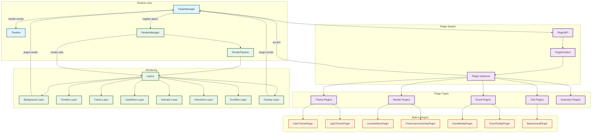

> This section is for developers who want to extend Timeline Canvas, covering lifecycle, APIs, events, and best practices.



This tutorial walks you through building a Timeline Canvas plugin from scratch, including lifecycle, API usage, and best practices.

## 1. Plugin Fundamentals

### 1.1 What is a plugin?

Plugins are independent modules that extend Timeline Canvas. They can:

- Add new render layers
- Listen to and handle events
- Provide custom validation logic
- Extend timeline interactions

### 1.2 Plugin types

```typescript
enum PluginType {
  RENDER = "render", // render plugin
  EVENT_HANDLER = "event_handler", // event handler
  DATA_SOURCE = "data_source", // data source
  THEME = "theme", // theme
  TOOL = "tool", // tool
  EXTENSION = "extension", // extension
}
```

### 1.3 Plugin priority

```typescript
enum PluginPriority {
  LOW = 0, // low priority
  NORMAL = 50, // normal
  HIGH = 100, // high
  CRITICAL = 200, // critical
}
```
