# 快速开始

## 架构概览

```mermaid
graph TB
    %% 应用层
    subgraph "应用层"
        APP[应用程序]
        USER[用户交互]
    end

    %% 核心层
    subgraph "Timeline 核心"
        TL[Timeline<br/>主控制器]

        subgraph "管理器层"
            PM[PluginManager<br/>插件管理]
            RM[RenderManager<br/>渲染管理]
            SM[StateManager<br/>状态管理]
            EM[EventIndexManager<br/>事件索引]
            VM[ViewportManager<br/>视口管理]
            LM[Logger<br/>日志管理]
            EH[ErrorHandler<br/>错误处理]
        end

        subgraph "处理器层"
            MH[MouseHandler<br/>鼠标处理]
            WH[WheelHandler<br/>滚轮处理]
        end

        subgraph "状态模式"
            IS[InteractionState<br/>交互状态]
            IDLE[IdleState<br/>空闲状态]
            DRAG[DraggingState<br/>拖拽状态]
            RESIZE[ResizingState<br/>调整大小]
            SCROLL[ScrollingState<br/>滚动状态]
            INDICATOR[TimeIndicatorDragState<br/>指示器拖拽]
        end
    end

    %% 渲染系统
    subgraph "渲染系统"
        RP[RenderPipeline<br/>渲染管道]

        subgraph "渲染层"
            TIMELINE_R[TimelineRenderer<br/>时间轴]
            TRACKS_R[TracksRenderer<br/>轨道]
            GUIDELINES_R[GuideLinesRenderer<br/>参考线]
            INDICATOR_R[IndicatorRenderer<br/>指示器]
            INTERACTION_R[InteractionRenderer<br/>交互]
            SCROLLBAR_R[ScrollbarRenderer<br/>滚动条]
        end

        subgraph "渲染上下文"
            RC[RenderContext<br/>渲染上下文]
            RT[Renderer Types<br/>渲染器类型]
        end
    end

    %% 插件系统
    subgraph "插件系统"
        PLUGIN_API[PluginAPI<br/>插件接口]
        PLUGIN_CTX[PluginContext<br/>插件上下文]

        subgraph "插件类型"
            THEME_P[主题插件]
            RENDER_P[渲染插件]
            EVENT_P[事件插件]
            TOOL_P[工具插件]
            EXTENSION_P[扩展插件]
        end

        subgraph "内置插件"
            DARK[DarkThemePlugin]
            LIGHT[LightThemePlugin]
            CONTEXT_MENU[ContextMenuPlugin]
            PERFORMANCE[PerformanceOverlayPlugin]
            EVENT_MEDIA[EventMediaPlugin]
            EVENT_TOOLTIP[EventTooltipPlugin]
            MUTEX_GUARD[MutexGuardPlugin]
        end
    end

    %% 数据层
    subgraph "数据层"
        CONFIG[TimelineConfig<br/>配置]
        STATE[TimelineState<br/>状态]
        TYPES[类型定义]
        UTILS[工具函数]
    end

    %% 连接关系
    APP --> TL
    USER --> MH
    USER --> WH

    TL --> PM
    TL --> RM
    TL --> SM
    TL --> EM
    TL --> MH
    TL --> WH

    MH --> IS
    IS --> IDLE
    IS --> DRAG
    IS --> RESIZE
    IS --> SCROLL
    IS --> INDICATOR

    RM --> RP
    RP --> TIMELINE_R
    RP --> TRACKS_R
    RP --> GUIDELINES_R
    RP --> INDICATOR_R
    RP --> INTERACTION_R
    RP --> SCROLLBAR_R

    PM --> PLUGIN_API
    PLUGIN_API --> PLUGIN_CTX
    PLUGIN_CTX --> THEME_P
    PLUGIN_CTX --> RENDER_P
    PLUGIN_CTX --> EVENT_P
    PLUGIN_CTX --> TOOL_P
    PLUGIN_CTX --> EXTENSION_P

    THEME_P --> DARK
    THEME_P --> LIGHT
    RENDER_P --> CONTEXT_MENU
    RENDER_P --> PERFORMANCE
    EVENT_P --> EVENT_MEDIA
    EVENT_P --> EVENT_TOOLTIP
    TOOL_P --> MUTEX_GUARD

    CONFIG --> TL
    STATE --> TL
    TYPES --> TL
    UTILS --> TL

    %% 样式定义
    classDef app fill:#f5f5f5,stroke:#666,stroke-width:1px
    classDef core fill:#e3f2fd,stroke:#1976d2,stroke-width:2px
    classDef manager fill:#e8f5e8,stroke:#388e3c,stroke-width:2px
    classDef handler fill:#fff3e0,stroke:#f57c00,stroke-width:2px
    classDef state fill:#f3e5f5,stroke:#7b1fa2,stroke-width:2px
    classDef render fill:#e1f5fe,stroke:#0288d1,stroke-width:2px
    classDef plugin fill:#fce4ec,stroke:#c2185b,stroke-width:2px
    classDef data fill:#fafafa,stroke:#9e9e9e,stroke-width:1px
    classDef builtin fill:#fff8e1,stroke:#ffa000,stroke-width:2px

    class APP,USER app
    class TL core
    class PM,RM,SM,EM,VM,LM,EH manager
    class MH,WH handler
    class IS,IDLE,DRAG,RESIZE,SCROLL,INDICATOR state
    class RP,TIMELINE_R,TRACKS_R,GUIDELINES_R,INDICATOR_R,INTERACTION_R,SCROLLBAR_R,RC,RT render
    class PLUGIN_API,PLUGIN_CTX,THEME_P,RENDER_P,EVENT_P,TOOL_P,EXTENSION_P plugin
    class CONFIG,STATE,TYPES,UTILS data
    class DARK,LIGHT,CONTEXT_MENU,PERFORMANCE,EVENT_MEDIA,EVENT_TOOLTIP,MUTEX_GUARD builtin
```



## 安装

```bash
npm install timeline-canvas
# 或者
yarn add timeline-canvas
# 或者
pnpm add timeline-canvas
```

## 基础使用

### 1. 创建画布

```html
<canvas id="timelineCanvas" style="width: 100%; height: 600px;"></canvas>
```

### 2. 初始化时间轴（秒制时间系统）

```javascript
import { Timeline } from "timeline-canvas";

const timeline = new Timeline("timelineCanvas", {
  startTime: 0,
  endTime: 3600,
  canvasHeight: 600,
  trackHeight: 46,
  trackMargin: 10,
});
```

### 3. 加载数据（秒制时间）

```javascript
timeline.loadData({
  tracks: [
    {
      events: [
        {
          startTime: 0,
          endTime: 900,
          title: "前端开发",
          description: "完成用户界面开发",
        },
      ],
    },
    {
      events: [
        {
          startTime: 1800,
          endTime: 2700,
          title: "设计评审",
          description: "UI/UX 设计评审会议",
        },
      ],
    },
  ],
});

```

## 在 VS Code 中使用 MCP（可选）

如果你使用 VS Code + Copilot Chat，并希望让 AI 以“工具调用”的方式协助生成插件骨架、做校验或触发 allowlist 脚本，请参考：

- [MCP 服务（Copilot Chat）](/guide/mcp)

### 4. 添加插件

````javascript
import { PerformanceOverlayPlugin, ContextMenuPlugin } from 'timeline-canvas/plugins';

// 添加性能监控插件（部分内置插件可直接传入实例）
timeline.usePlugin(PerformanceOverlayPlugin);

// 添加右键菜单插件（工厂函数形式）
timeline.usePlugin(ContextMenuPlugin({
  items: [
    {
      label: '查看详情',
      onClick: (event) => {
        console.log('查看事件:', event);
      }
    },
    {
      label: '删除事件',
      onClick: (event) => {
        // 使用轨道索引和事件索引删除
        timeline.deleteEvent(event.trackIndex, event.eventIndex);
      }
    }
  ]
}));

````

### 5. 回调参数参考

```typescript
// 事件添加回调数据
interface EventAddData {
  trackIndex: number;
  event: TimelineEvent;
}

// 事件更新回调数据
interface EventUpdateData {
  type?: "resize" | "split";
  trackIndex: number;
  eventIndex: number;
  event: TimelineEvent;
  oldEvent?: TimelineEvent;
  firstEvent?: TimelineEvent; // 仅在 split 类型时存在
  secondEvent?: TimelineEvent; // 仅在 split 类型时存在
}

// 事件点击回调数据
interface EventClickData {
  trackIndex: number;
  eventIndex: number;
  event: TimelineEvent;
  trackName: string;
  formattedTimeRange: string;
}

// 右键菜单回调数据
interface ContextMenuData {
  menuType: string;
  trackIndex: number;
  eventIndex: number;
  event: TimelineEvent;
}
```

## 完整示例（与 Demo 一致的秒制用法）

```html
<!DOCTYPE html>
<html>
<head>
  <title>Timeline Canvas 示例</title>
  <style>
    #timeline-container {
      width: 100%;
      height: 600px;
      border: 1px solid #ccc;
    }
  </style>
</head>
<body>
  <canvas id="timelineCanvas"></canvas>

  <script type="module">
    import { Timeline } from 'timeline-canvas';
    import { PerformanceOverlayPlugin, ContextMenuPlugin } from 'timeline-canvas/plugins';

    const timeline = new Timeline('timelineCanvas', {
      startTime: 0,
      endTime: 3600
    });

    // 加载示例数据（秒制）
    timeline.loadData({
      tracks: [{ events: [{ startTime: 0, endTime: 900, title: '第一阶段开发' }] }]
    });

    // 添加插件
    timeline.usePlugin(PerformanceOverlayPlugin);
    timeline.usePlugin(ContextMenuPlugin());

    // 动态切换主题
    // 初始化为亮色主题
    timeline.usePlugin(LightThemePlugin);
    // 切换到暗色主题
    setTimeout(() => timeline.setTheme('dark'), 1000);
  </script>
</body>
</html>
````
