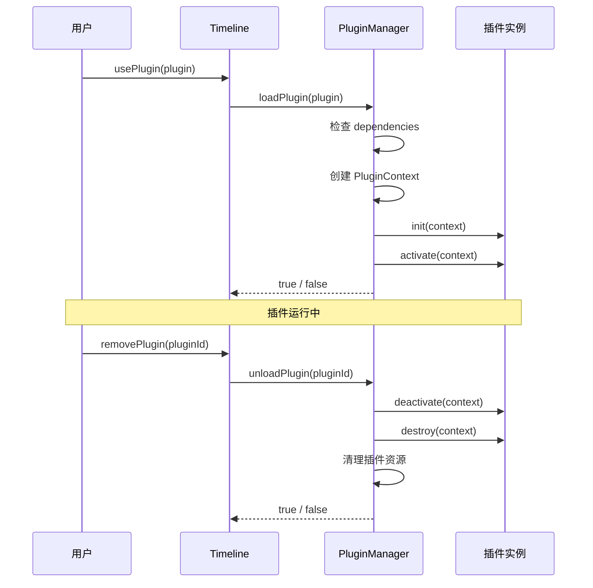

## TimelinePlugin

```ts
interface TimelinePlugin {
  metadata: PluginMetadata;
  init?: (context: PluginContext) => Promise<void> | void;
  activate?: (context: PluginContext) => Promise<void> | void;
  deactivate?: (context: PluginContext) => Promise<void> | void;
  destroy?: (context: PluginContext) => Promise<void> | void;
}
```

## PluginMetadata

```ts
interface PluginMetadata {
  name: string;
  version: string;
  description: string;
  author?: string;
  type: PluginType;
  priority?: PluginPriority;
  dependencies?: string[];
}
```

说明：

- 插件 ID 的格式是 `${name}@${version}`
- `dependencies` 既可以写完整插件 ID，也可以只写插件名
- 当前运行时里，如果不显式设置 `priority`，排序回退值是 `0`

## PluginContext

```ts
interface PluginContext {
  timeline: Timeline;
  config: TimelineConfig;
  state: TimelineState;
  api: PluginAPI;
}
```

## PluginAPI

```ts
interface PluginAPI {
  registerRenderLayer: (layer: RenderLayer) => void;
  unregisterRenderLayer: (name: string) => void;
  registerCoreLayerHook: (hook: CoreLayerHook) => void;
  unregisterCoreLayerHook: (name: string) => void;
  registerEventHandler: (event: string, handler: PluginEventHandler) => void;
  unregisterEventHandler: (event: string, handler: PluginEventHandler) => void;
  showNotification: (
    message: string,
    type?: "info" | "warning" | "error"
  ) => void;
  getData: (key: string) => unknown;
  setData: (key: string, value: unknown) => void;
  setPerformanceProvider: (provider: PerformanceProvider) => void;
  getPerformanceStats: () => Map<string, PerformanceStats>;
  getFPS: () => number;
}
```

### RenderLayer

```ts
interface RenderLayer {
  name: string;
  position: "background" | "overlay";
  render: (
    ctx: CanvasRenderingContext2D,
    canvas: HTMLCanvasElement,
    config: TimelineConfig,
    state: TimelineState
  ) => void;
}
```

### CoreLayerHook

```ts
interface CoreLayerHook {
  name: string;
  target: "tracks" | "timeline" | "guideLines" | "indicator" | "scrollbar" | "interaction";
  handler: (
    ctx: CanvasRenderingContext2D,
    canvas: HTMLCanvasElement,
    config: TimelineConfig,
    state: TimelineState,
    next: () => void
  ) => void;
}
```

说明：

- `registerRenderLayer()` 适合加最底层或最顶层的自定义绘制
- `registerCoreLayerHook()` 适合拦截或包裹核心渲染层
- 调用 `next()` 表示继续执行默认渲染；不调用则表示完全接管该核心层

## 数据存储

每个插件都拥有独立的数据存储区：

```ts
context.api.setData("counter", 0);
context.api.setData("settings", { enabled: true });

const counter = context.api.getData("counter");
const settings = context.api.getData("settings");
```

数据特点：

- 生命周期内持续存在
- 插件卸载时自动清理
- 不同插件之间彼此隔离
