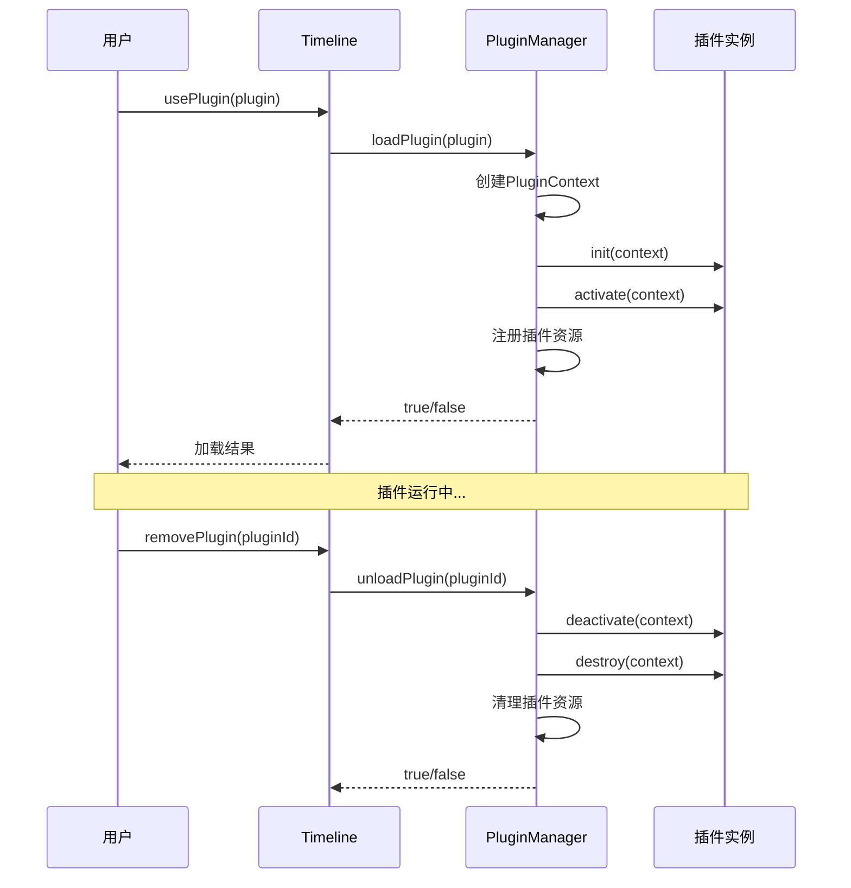

## 插件接口详解

### TimelinePlugin 接口

```typescript
interface TimelinePlugin {
  metadata: PluginMetadata;
  init?: (context: PluginContext) => Promise<void> | void;
  activate?: (context: PluginContext) => Promise<void> | void;
  deactivate?: (context: PluginContext) => Promise<void> | void;
  destroy?: (context: PluginContext) => Promise<void> | void;
}
```

### 插件元数据

```typescript
interface PluginMetadata {
  name: string; // 插件名称（必填）
  version: string; // 版本号（必填）
  description: string; // 描述（必填）
  author?: string; // 作者（可选）
  type: PluginType; // 插件类型（必填）
  priority?: PluginPriority; // 优先级（可选，默认NORMAL）
  dependencies?: string[]; // 依赖插件（可选）
}
```

### 插件上下文

```typescript
interface PluginContext {
  timeline: Timeline; // 时间轴实例
  config: any; // 配置对象
  state: any; // 状态对象
  api: PluginAPI; // API 接口
}
```

### 插件 API

```typescript
interface PluginAPI {
  // 渲染层管理
  registerRenderLayer: (layer: RenderLayer) => void;
  unregisterRenderLayer: (name: string) => void;

  // 事件处理器管理
  registerEventHandler: (event: string, handler: Function) => void;
  unregisterEventHandler: (event: string, handler: Function) => void;

  // 通知和调试
  showNotification: (
    message: string,
    type?: "info" | "warning" | "error"
  ) => void;

  // 数据存储
  getData: (key: string) => any;
  setData: (key: string, value: any) => void;

  // 性能监控
  setPerformanceProvider: (provider: PerformanceProvider) => void;
  getPerformanceStats: () => Map<string, PerformanceStats>;
  getFPS: () => number;
}
```

## 数据存储

### 插件数据存储

```javascript
// 存储数据
context.api.setData("counter", 0);
context.api.setData("settings", { theme: "dark", language: "zh" });

// 获取数据
const counter = context.api.getData("counter");
const settings = context.api.getData("settings");
```

### 数据

- 数据在插件生命周期内持续存在
- 插件卸载时数据自动清理
- 不同插件的数据相互隔离
