Timeline Canvas is a high-performance, plugin-driven Canvas timeline component. It uses a seconds-based relative time model (all times are offsets in seconds from the start).

## Basic Usage

> Minimal runnable flow: create a canvas → initialize `Timeline` → load data → (optional) load plugins.

### 1. Install

```bash
npm install timeline-canvas
# or
yarn add timeline-canvas
# or
pnpm add timeline-canvas
```

### 2. Create a Canvas

```html
<canvas id="timelineCanvas" style="width: 100%; height: 600px;"></canvas>
```

### 3. Initialize the Timeline (Seconds-based)

```ts
import { Timeline } from "timeline-canvas";

const timeline = new Timeline("timelineCanvas", {
  startTime: 0,
  endTime: 3600,
  canvasHeight: 600,
  trackHeight: 46,
  trackMargin: 10,
});
```

### 4. Load Data (Seconds-based)

```ts
timeline.loadData({
  tracks: [
    {
      events: [
        {
          startTime: 0,
          endTime: 900,
          title: "Frontend Development",
          description: "Build the UI",
        },
      ],
    },
    {
      events: [
        {
          startTime: 1800,
          endTime: 2700,
          title: "Design Review",
          description: "UI/UX design review meeting",
        },
      ],
    },
  ],
});
```

### 5. Add Plugins (Optional)

> `usePlugin()` returns `Promise<boolean>` to indicate whether the plugin was loaded successfully.

```ts
import {
  ContextMenuPlugin,
  LightThemePlugin,
  PerformanceOverlayPlugin,
} from "timeline-canvas";

timeline.config.enableContextMenu = true;
timeline.config.contextMenuItems = [
  { type: "detail", name: "View details" },
  { type: "delete", name: "Delete" },
];

await timeline.usePlugin(LightThemePlugin);
await timeline.usePlugin(PerformanceOverlayPlugin);
await timeline.usePlugin(ContextMenuPlugin());
```

## Further Reading

* [Usage & Examples](/timeline-canvas/en/guide/usage.md)
* [Configuration](/timeline-canvas/en/guide/configuration.md)
* [Built-in Plugins](/timeline-canvas/en/plugins/builtin.md)
* [Timeline API](/timeline-canvas/en/api/timeline.md)

## Architecture Overview (Optional)

```mermaid
graph TB
    %% Application
    subgraph "Application"
        APP[Application]
        USER[User Interaction]
    end

    %% Core
    subgraph "Timeline Core"
        TL[Timeline<br/>Main Controller]

        subgraph "Managers"
            PM[PluginManager<br/>Plugins]
            RM[RenderManager<br/>Rendering]
            SM[StateManager<br/>State]
            EM[EventIndexManager<br/>Event Index]
            VM[ViewportManager<br/>Viewport]
            LM[Logger<br/>Logging]
            EH[ErrorHandler<br/>Errors]
        end

        subgraph "Handlers"
            MH[MouseHandler<br/>Mouse]
            WH[WheelHandler<br/>Wheel]
        end

        subgraph "State Machine"
            IS[InteractionState<br/>Interaction]
            IDLE[IdleState<br/>Idle]
            DRAG[DraggingState<br/>Dragging]
            RESIZE[ResizingState<br/>Resizing]
            SCROLL[ScrollingState<br/>Scrolling]
            INDICATOR[TimeIndicatorDragState<br/>Indicator Drag]
        end
    end

    %% Rendering
    subgraph "Rendering"
        RP[RenderPipeline<br/>Pipeline]

        subgraph "Renderers"
            TIMELINE_R[TimelineRenderer<br/>Timeline]
            TRACKS_R[TracksRenderer<br/>Tracks]
            GUIDELINES_R[GuideLinesRenderer<br/>Guides]
            INDICATOR_R[IndicatorRenderer<br/>Indicator]
            INTERACTION_R[InteractionRenderer<br/>Interaction]
            SCROLLBAR_R[ScrollbarRenderer<br/>Scrollbar]
        end

        subgraph "Render Context"
            RC[RenderContext<br/>Context]
            RT[Renderer Types<br/>Types]
        end
    end

    %% Plugins
    subgraph "Plugins"
        PLUGIN_API[PluginAPI<br/>Interface]
        PLUGIN_CTX[PluginContext<br/>Context]

        subgraph "Plugin Types"
            THEME_P[Theme Plugin]
            RENDER_P[Render Plugin]
            EVENT_P[Event Plugin]
            TOOL_P[Tool Plugin]
            EXTENSION_P[Extension Plugin]
        end

        subgraph "Built-in Plugins"
            DARK[DarkThemePlugin]
            LIGHT[LightThemePlugin]
            CONTEXT_MENU[ContextMenuPlugin]
            PERFORMANCE[PerformanceOverlayPlugin]
            EVENT_MEDIA[EventMediaPlugin]
            EVENT_TOOLTIP[EventTooltipPlugin]
            MUTEX_GUARD[MutexGuardPlugin]
        end
    end

    %% Data
    subgraph "Data"
        CONFIG[TimelineConfig<br/>Config]
        STATE[TimelineState<br/>State]
        TYPES[Types]
        UTILS[Utilities]
    end

    %% Relationships
    APP --> TL
    USER --> MH
    USER --> WH

    TL --> PM
    TL --> RM
    TL --> SM
    TL --> EM
    TL --> MH
    TL --> WH

    MH --> IS
    IS --> IDLE
    IS --> DRAG
    IS --> RESIZE
    IS --> SCROLL
    IS --> INDICATOR

    RM --> RP
    RP --> TIMELINE_R
    RP --> TRACKS_R
    RP --> GUIDELINES_R
    RP --> INDICATOR_R
    RP --> INTERACTION_R
    RP --> SCROLLBAR_R

    PM --> PLUGIN_API
    PLUGIN_API --> PLUGIN_CTX
    PLUGIN_CTX --> THEME_P
    PLUGIN_CTX --> RENDER_P
    PLUGIN_CTX --> EVENT_P
    PLUGIN_CTX --> TOOL_P
    PLUGIN_CTX --> EXTENSION_P

    THEME_P --> DARK
    THEME_P --> LIGHT
    RENDER_P --> CONTEXT_MENU
    RENDER_P --> PERFORMANCE
    EVENT_P --> EVENT_MEDIA
    EVENT_P --> EVENT_TOOLTIP
    TOOL_P --> MUTEX_GUARD

    CONFIG --> TL
    STATE --> TL
    TYPES --> TL
    UTILS --> TL

    %% Styles
    classDef app fill:#f5f5f5,stroke:#666,stroke-width:1px
    classDef core fill:#e3f2fd,stroke:#1976d2,stroke-width:2px
    classDef manager fill:#e8f5e8,stroke:#388e3c,stroke-width:2px
    classDef handler fill:#fff3e0,stroke:#f57c00,stroke-width:2px
    classDef state fill:#f3e5f5,stroke:#7b1fa2,stroke-width:2px
    classDef render fill:#e1f5fe,stroke:#0288d1,stroke-width:2px
    classDef plugin fill:#fce4ec,stroke:#c2185b,stroke-width:2px
    classDef data fill:#fafafa,stroke:#9e9e9e,stroke-width:1px
    classDef builtin fill:#fff8e1,stroke:#ffa000,stroke-width:2px

    class APP,USER app
    class TL core
    class PM,RM,SM,EM,VM,LM,EH manager
    class MH,WH handler
    class IS,IDLE,DRAG,RESIZE,SCROLL,INDICATOR state
    class RP,TIMELINE_R,TRACKS_R,GUIDELINES_R,INDICATOR_R,INTERACTION_R,SCROLLBAR_R,RC,RT render
    class PLUGIN_API,PLUGIN_CTX,THEME_P,RENDER_P,EVENT_P,TOOL_P,EXTENSION_P plugin
    class CONFIG,STATE,TYPES,UTILS data
    class DARK,LIGHT,CONTEXT_MENU,PERFORMANCE,EVENT_MEDIA,EVENT_TOOLTIP,MUTEX_GUARD builtin
```



## Using MCP in VS Code (Optional)

If you use VS Code + Copilot Chat and want AI to help via tool calls (e.g., generating plugin scaffolding, running validations, or triggering allowlist scripts), see:

* [MCP Service (Copilot Chat)](/timeline-canvas/en/guide/mcp.md)

## Full Example

```html
<!DOCTYPE html>
<html>
<head>
  <title>Timeline Canvas Example</title>
  <style>
    #timeline-container {
      width: 100%;
      height: 600px;
      border: 1px solid #ccc;
    }
  </style>
</head>
<body>
  <canvas id="timelineCanvas"></canvas>

  <script type="module">
    import { Timeline } from 'timeline-canvas';
    import {
      ContextMenuPlugin,
      LightThemePlugin,
      PerformanceOverlayPlugin,
    } from 'timeline-canvas';

    const timeline = new Timeline('timelineCanvas', {
      startTime: 0,
      endTime: 3600,
      enableContextMenu: true,
      contextMenuItems: [
        { type: 'detail', name: 'View details' },
        { type: 'delete', name: 'Delete' },
      ],
    });

    // Load sample data (seconds-based)
    timeline.loadData({
      tracks: [{ events: [{ startTime: 0, endTime: 900, title: 'Phase 1 Development' }] }]
    });

    // Add plugins
    await timeline.usePlugin(LightThemePlugin);
    await timeline.usePlugin(PerformanceOverlayPlugin);
    await timeline.usePlugin(ContextMenuPlugin());

    // Switch theme at runtime
    // Switch to dark theme
    setTimeout(() => void timeline.setTheme('dark'), 1000);
  </script>
</body>
</html>
```
