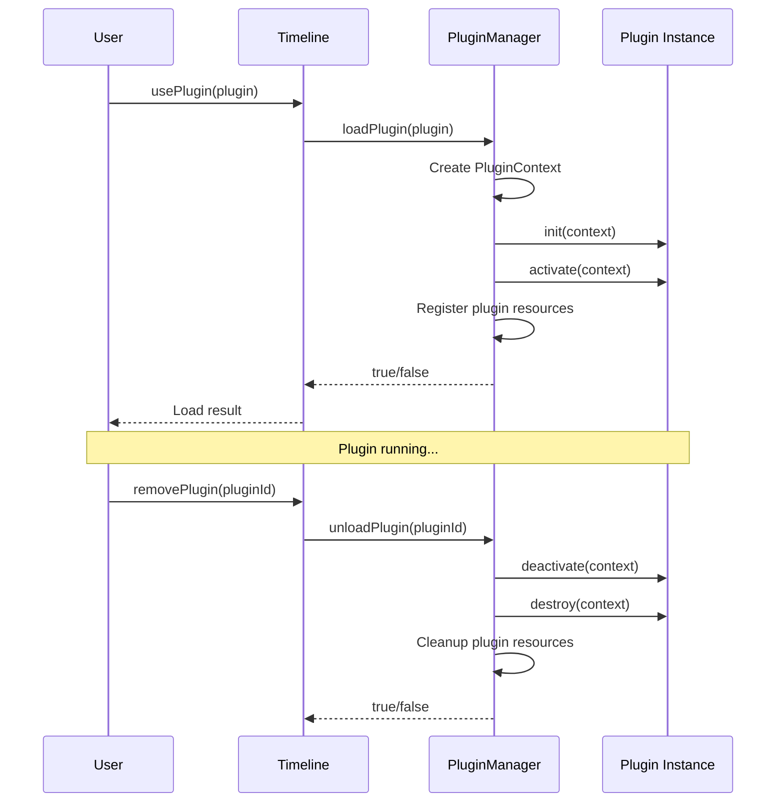

## Plugin Interface

### TimelinePlugin

```typescript
interface TimelinePlugin {
  metadata: PluginMetadata;
  init?: (context: PluginContext) => Promise<void> | void;
  activate?: (context: PluginContext) => Promise<void> | void;
  deactivate?: (context: PluginContext) => Promise<void> | void;
  destroy?: (context: PluginContext) => Promise<void> | void;
}
```

### Plugin metadata

```typescript
interface PluginMetadata {
  name: string; // plugin name (required)
  version: string; // version (required)
  description: string; // description (required)
  author?: string; // author (optional)
  type: PluginType; // plugin type (required)
  priority?: PluginPriority; // priority (optional, default: NORMAL)
  dependencies?: string[]; // dependencies (optional)
}
```

### Plugin context

```typescript
interface PluginContext {
  timeline: Timeline; // timeline instance
  config: any; // config object
  state: any; // state object
  api: PluginAPI; // API surface
}
```

### Plugin API

```typescript
interface PluginAPI {
  // Render layer management
  registerRenderLayer: (layer: RenderLayer) => void;
  unregisterRenderLayer: (name: string) => void;

  // Event handler management
  registerEventHandler: (event: string, handler: Function) => void;
  unregisterEventHandler: (event: string, handler: Function) => void;

  // Notifications and debugging
  showNotification: (
    message: string,
    type?: "info" | "warning" | "error"
  ) => void;

  // Data storage
  getData: (key: string) => any;
  setData: (key: string, value: any) => void;

  // Performance
  setPerformanceProvider: (provider: PerformanceProvider) => void;
  getPerformanceStats: () => Map<string, PerformanceStats>;
  getFPS: () => number;
}
```

## Data Storage

### Plugin data storage

```javascript
// Store data
context.api.setData("counter", 0);
context.api.setData("settings", { theme: "dark", language: "en" });

// Read data
const counter = context.api.getData("counter");
const settings = context.api.getData("settings");
```

### Notes

* Data persists for the plugin’s lifecycle
* Data is cleaned up automatically when the plugin is unloaded
* Data is isolated between plugins
