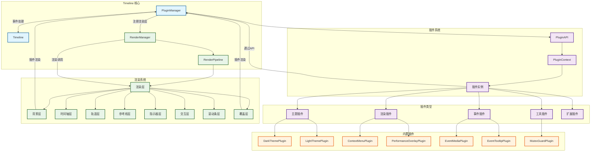
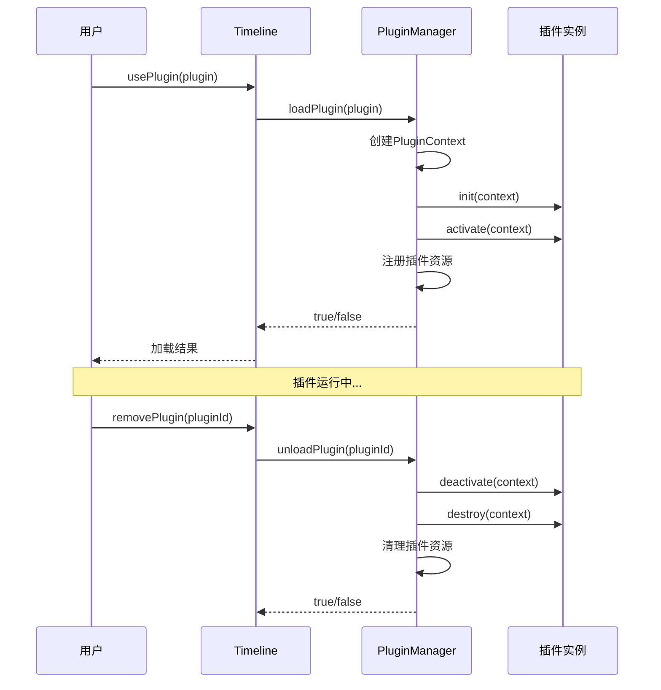

# 时间轴画布插件系统架构

## 系统概览

时间轴画布采用**插件化架构**，通过 PluginManager 统一管理所有插件，支持动态加载、卸载和生命周期管理。系统提供了多种扩展点，包括渲染层、事件处理、数据源、主题等。

## 核心架构图



## 插件生命周期管理



## 核心组件详解

### 1. PluginManager

- **职责**: 插件生命周期管理、资源管理、事件分发
- **核心功能**:
  - 插件加载/卸载
  - 渲染层注册管理
  - 事件处理器管理
  - 插件数据存储
  - 性能监控集成

### 2. PluginContext

```typescript
interface PluginContext {
  timeline: Timeline; // 时间轴实例
  config: TimelineConfig; // 配置对象
  state: TimelineState; // 状态对象
  api: PluginAPI; // 插件API接口
}
```

### 3. PluginAPI

```typescript
interface PluginAPI {
  // 渲染层管理
  registerRenderLayer(layer: RenderLayer): void;
  unregisterRenderLayer(name: string): void;

  // 事件处理
  registerEventHandler(event: string, handler: Function): void;
  unregisterEventHandler(event: string, handler: Function): void;

  // 数据存储
  getData(key: string): any;
  setData(key: string, value: any): void;

  // 通知和性能
  showNotification(message: string, type?: string): void;
  setPerformanceProvider(provider: PerformanceProvider): void;
  getPerformanceStats(): Map<string, PerformanceStats>;
  getFPS(): number;
}
```

## 插件类型系统

### 1. 主题插件 (Theme)

- **作用**: 修改时间轴外观和颜色方案
- **示例**: DarkThemePlugin, LightThemePlugin
- **特点**: 通过修改 config.colors 和注册背景渲染层实现

### 2. 渲染插件 (Render)

- **作用**: 添加自定义渲染层
- **示例**: ContextMenuPlugin, PerformanceOverlayPlugin
- **特点**: 注册到 background 或 overlay 位置

### 3. 事件插件 (EventHandler)

- **作用**: 拦截和处理用户交互事件
- **示例**: EventMediaPlugin, EventTooltipPlugin
- **特点**: 通过 registerEventHandler 注册事件处理器

### 4. 工具插件 (Tool)

- **作用**: 提供特定功能工具
- **示例**: MutexGuardPlugin
- **特点**: 可能涉及状态管理和互斥控制

### 5. 扩展插件 (Extension)

- **作用**: 提供复杂功能扩展
- **示例**: 自定义上下文菜单
- **特点**: 可能组合多种扩展方式

## 渲染系统集成

### 渲染管道架构

```
RenderManager → RenderPipeline → 核心渲染层 + 插件渲染层
```

### 插件渲染层位置

- **background**: 在核心渲染之前执行
- **overlay**: 在核心渲染之后执行

### 渲染执行流程

1. PluginManager.renderBackground() - 插件背景层
2. RenderPipeline.render() - 核心渲染层
3. PluginManager.renderOverlay() - 插件覆盖层

## 事件系统集成

### 事件处理流程

```
用户交互 → Timeline → PluginManager.validateEvent() → 插件验证
用户交互 → Timeline → PluginManager.emitEvent() → 插件处理
```

### 事件类型

- 验证事件: `validate:event:move` 等
- 通知事件: 各种状态变化通知

## 设计特点

### 1. 松耦合设计

- 插件通过标准接口与核心系统交互
- 插件之间相互独立
- 支持热插拔

### 2. 可扩展性

- 多种插件类型支持不同扩展需求
- 渲染层系统支持视觉扩展
- 事件系统支持交互扩展

### 3. 性能优化

- 脏标记渲染优化
- 插件资源自动管理
- 性能监控集成

### 4. 开发者友好

- 清晰的插件接口
- 完整的生命周期管理
- 丰富的内置插件示例

这个架构设计使得时间轴画布具有高度的可扩展性和灵活性，开发者可以通过插件系统轻松添加新功能，而无需修改核心代码。
