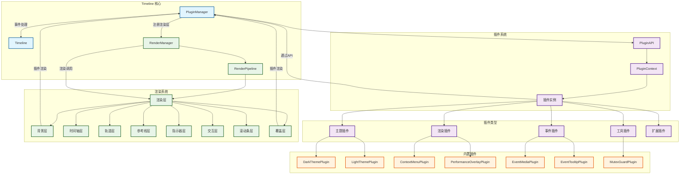

# 插件开发教程



本教程将带你从零开始开发一个 Timeline Canvas 插件，详细介绍插件生命周期、API 使用方法和最佳实践。

## 1. 插件基础概念

### 1.1 什么是插件

插件是扩展 Timeline Canvas 功能的独立模块，可以：

* 添加新的渲染层
* 监听和处理事件
* 提供自定义验证逻辑
* 扩展时间轴的交互能力

### 1.2 插件类型

```typescript
enum PluginType {
  RENDER = "render", // 渲染插件
  EVENT_HANDLER = "event_handler", // 事件处理器
  DATA_SOURCE = "data_source", // 数据源
  THEME = "theme", // 主题
  TOOL = "tool", // 工具
  EXTENSION = "extension", // 扩展
}
```

### 1.3 插件优先级

```typescript
enum PluginPriority {
  LOW = 0, // 低优先级
  NORMAL = 50, // 普通优先级
  HIGH = 100, // 高优先级
  CRITICAL = 200, // 关键优先级
}
```
